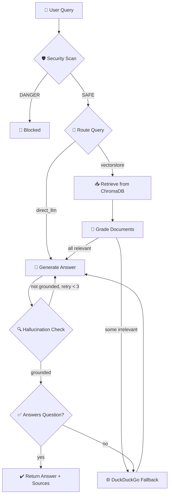
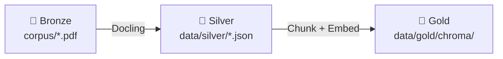

# Architecture Overview

## System Diagram

## Layer Boundaries

| Layer | Module | Responsibility |
|-------|--------|----------------|
| Knowledge | `src/knowledge/` | PDF parsing, chunking, versioning, metadata schemas |
| Retrieval | `src/retrieval/` | Embeddings, ChromaDB, retriever factory |
| LLM Interface | `src/llm_interface/` | ChatOllama, prompts, LCEL chains |
| Orchestration | `src/orchestration/` | AgentState, graph nodes, StateGraph wiring |

## Data Flow (Medallion)

