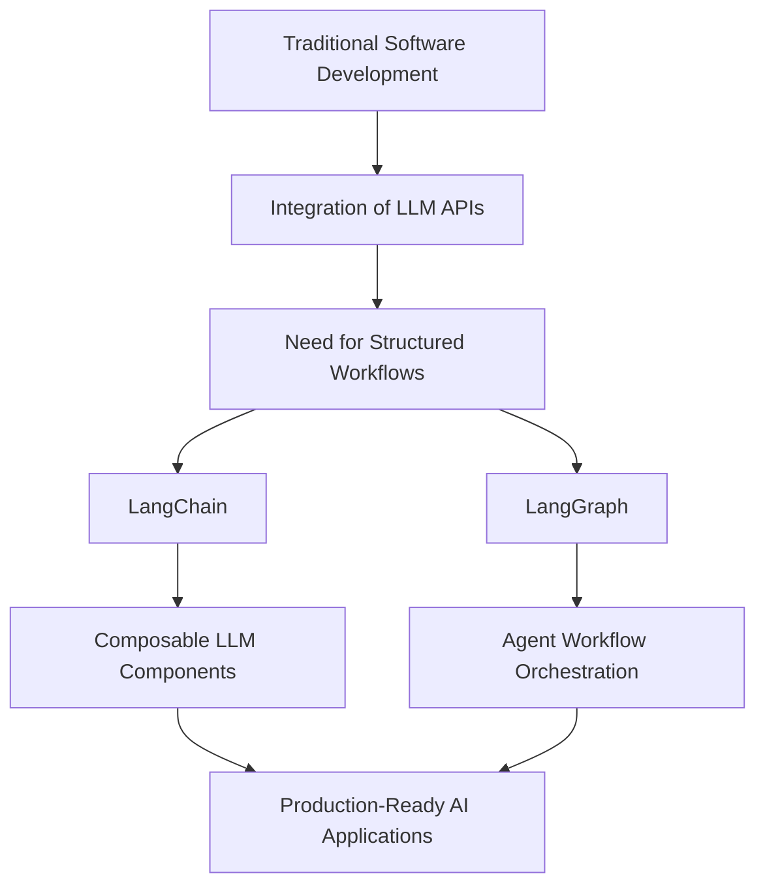

# 1. Introduction

## Key Ideas

This lesson establishes the conceptual foundation for developing applications powered by large language models (LLMs). The focus is on building **developer-oriented AI agents** using **LangChain** and **LangGraph**, frameworks designed to structure, orchestrate, and scale LLM-driven systems.

Modern LLM applications rarely consist of a single prompt-response interaction. Instead, they require coordinated workflows involving prompts, reasoning steps, tool integrations, and data retrieval. Frameworks such as LangChain address this complexity by providing abstractions that allow developers to build modular systems where language models operate as components within larger software architectures.

LangChain provides a structured environment for constructing LLM-powered workflows. It introduces reusable primitives such as prompt templates, chains, tools, and agents. These abstractions enable developers to define how a language model interacts with external systems, processes intermediate reasoning steps, and produces structured outputs. By encapsulating these patterns, LangChain reduces the engineering overhead required to build advanced LLM applications.

LangGraph extends this architecture by introducing **graph-based orchestration**. Instead of defining workflows as linear sequences, applications can be represented as directed graphs in which nodes represent reasoning steps, tool calls, or model interactions. This approach allows developers to construct systems where decision paths, loops, and conditional logic are explicit parts of the architecture. Graph-based orchestration becomes particularly useful when implementing complex agent behavior or multi-step reasoning workflows.

A key theme introduced in this lesson is the transition from traditional machine learning development toward **LLM-centric application engineering**. In classical machine learning pipelines, the primary challenge lies in model training and optimization. In contrast, modern LLM applications rely on pre-trained models and focus instead on **orchestrating interactions between models, data sources, and tools**.

This shift significantly lowers the barrier to entry for developers without deep machine learning expertise. Instead of designing and training models, engineers focus on building systems that coordinate model reasoning, integrate external capabilities, and manage application state. This engineering discipline has led to the emergence of the **AI engineer** role, which blends software engineering principles with LLM system design.

Another central concern addressed in this lesson is **production readiness**. Early LLM experiments often function as prototypes, but real-world systems must satisfy additional requirements such as reliability, security, maintainability, and extensibility. Proper architectural design is therefore essential. Applications must be structured so that components remain modular and composable, allowing systems to evolve without introducing fragile dependencies.

The development of LLM applications therefore resembles traditional software architecture more than experimental machine learning research. Developers design systems composed of multiple interacting components: prompts, reasoning chains, tools, data retrieval layers, and orchestration logic. Frameworks like LangChain and LangGraph provide the infrastructure needed to manage this complexity while keeping systems maintainable and scalable.

## Notes

The LLM ecosystem evolves rapidly. Frameworks, APIs, and best practices continue to change as new capabilities and patterns emerge. Developers must therefore rely on structured abstractions and robust architectural patterns rather than ad-hoc prompt experimentation.

One of the most important architectural principles for LLM systems is **composability**. Composable systems allow individual components—such as prompts, tools, chains, or reasoning steps—to be reused across multiple workflows. This design approach reduces duplication, improves maintainability, and supports the gradual evolution of applications from experimental prototypes into production services.

Modern LLM applications typically incorporate several architectural layers, including reasoning orchestration, tool integration, and knowledge retrieval. These systems often require:

* multi-step reasoning processes
* integration with external APIs or services
* retrieval of contextual knowledge from databases or documents
* management of conversation or application state
* orchestration logic that controls agent behavior

LangChain and LangGraph provide structured mechanisms to implement these capabilities while maintaining clarity in system design.

