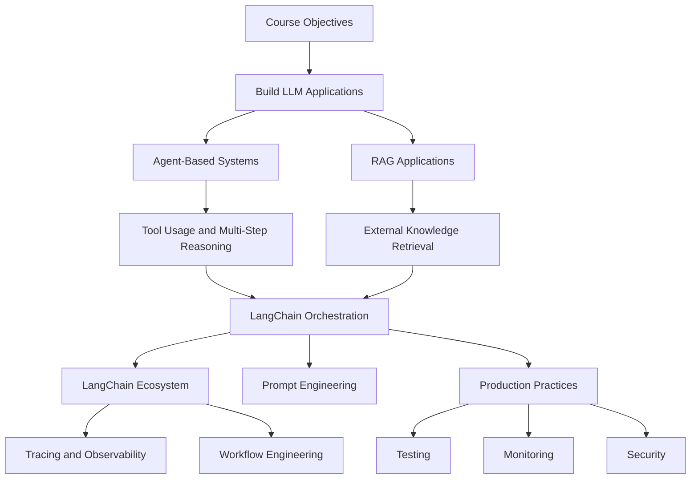

# 2. Objectives

## Key Ideas

This section defines the learning objectives and the practical scope of the course. The primary goal is to provide the knowledge required to design and implement **LLM-powered applications using LangChain**. The emphasis is not only on building functional applications, but on understanding the underlying mechanisms that enable these systems to operate.

Two major categories of LLM applications form the foundation of the course: **agent-based systems** and **retrieval-augmented generation (RAG) applications**. These two paradigms represent the most common architectural approaches when integrating large language models into software systems.

Agent-based systems are designed to enable language models to perform multi-step reasoning and interact with external tools or APIs. Instead of generating a single response, an agent can decide which actions to take, retrieve information, call external services, and iterate until a final answer is produced. This enables LLM applications to perform complex tasks that require planning and tool usage.

Retrieval-augmented generation applications focus on combining language models with external knowledge sources. In this architecture, relevant information is retrieved from a document store, database, or vector index and then provided as context to the language model. This approach improves accuracy, allows systems to use proprietary data, and mitigates limitations related to model hallucination or outdated training data.

The course approaches both architectures from an engineering perspective. Rather than presenting them as black-box frameworks, the internal mechanisms behind these systems are explored in detail. The behavior of LangChain components and their interactions are examined directly, including inspection of source code and internal abstractions. This approach helps build a deeper understanding of how LLM systems function and enables developers to design custom solutions instead of relying solely on prebuilt abstractions.

Another objective is to provide familiarity with the broader **LangChain ecosystem**. Modern LLM applications require more than simple orchestration logic; they also require observability, workflow management, and debugging capabilities. Tools within the ecosystem support these requirements. For example, tracing systems allow developers to inspect the reasoning process of an application, monitor intermediate steps, and diagnose failures in complex workflows. Graph-based workflow orchestration provides structured control over multi-step reasoning and agent execution.

Prompt engineering also plays an important role in the development of LLM applications. Effective prompts influence model reasoning, task execution, and output structure. The course therefore explores both practical prompting techniques and the historical evolution of prompting strategies. Understanding how prompts guide model behavior is essential when building reliable and controllable AI systems.

The course also introduces **production-oriented practices** for LLM systems. Experimental prototypes often work under controlled conditions but may fail when deployed in real environments. To address this, several engineering practices are incorporated throughout the learning process, including testing strategies, logging, monitoring, alerting mechanisms, and security considerations. These topics help ensure that LLM-powered systems remain stable, observable, and maintainable when deployed as production services.

## Notes

The course is designed primarily for individuals with **software engineering or data science backgrounds** who want to transition into building generative AI applications. A formal background in machine learning is not required because modern LLM frameworks abstract most of the complexities involved in model training and optimization.

Instead of focusing on machine learning theory, the learning process centers on **system design and application engineering**. Developers learn how to integrate language models into existing software architectures and how to coordinate model reasoning with external systems.

Because the material focuses heavily on implementation and practical workflows, a basic technical foundation is expected. The main prerequisites include familiarity with Python programming and general software development practices.

Participants should be comfortable with:

* writing and executing Python programs
* defining functions and classes in Python
* basic debugging and code navigation
* using Git for version control
* working with Python virtual environments
* configuring environment variables for application settings

These prerequisites allow the course to focus on the LangChain ecosystem rather than covering general programming fundamentals. The objective is to move directly into the architecture and implementation of LLM systems while maintaining a strong emphasis on practical engineering workflows.

