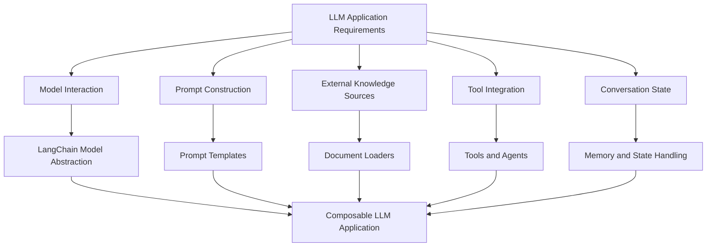

# 1. What is LangChain?

## Key Ideas

LangChain is an **open-source framework designed to simplify the development of applications powered by large language models (LLMs)**. Instead of interacting directly with raw model APIs and manually coordinating all system components, LangChain provides structured abstractions that allow developers to build complex LLM applications using well-defined modules and patterns.

The core purpose of LangChain is to **reduce the engineering complexity involved in building LLM-based systems**. Real-world LLM applications typically involve multiple interacting components: prompts, external data sources, model selection, conversation history, and integrations with external tools or APIs. Managing these components manually requires significant engineering effort. LangChain organizes these responsibilities into reusable abstractions that standardize how developers interact with language models and related services.

One of the key architectural ideas behind LangChain is **model abstraction**. Instead of coupling an application to a specific model provider, LangChain introduces a unified interface for interacting with different language models. Through this abstraction layer, developers can switch between different LLM providers—such as OpenAI, Anthropic, or other model vendors—without rewriting the surrounding application logic. This reduces vendor lock-in and provides flexibility when selecting or replacing models.

Prompt management is another fundamental component of the framework. LLM applications often require dynamic prompts that incorporate user input or contextual information. LangChain provides **prompt templates** that allow developers to define structured prompts and dynamically inject runtime data into them. This approach improves maintainability and composability by separating prompt structure from the data used to populate it.

LLM applications frequently need access to external knowledge sources that were not part of the model’s training data. LangChain addresses this requirement through **document loaders**, which allow applications to ingest data from multiple sources such as PDF files, knowledge bases, document stores, or other structured repositories. These inputs are converted into a unified document format that can be processed consistently across the application. This standardization simplifies downstream processing tasks such as indexing, retrieval, or contextual augmentation.

Another major capability of LangChain is support for **agent-based architectures**. Agents extend the capabilities of language models by enabling them to perform actions through external tools. Instead of producing a single response, an agent can reason through a task, decide which tools to use, invoke them, and incorporate the results into its final output. Examples of tools may include web search, database queries, API calls, or other programmable actions. This architecture enables language models to perform complex workflows that require interaction with external systems.

LangChain provides abstractions such as tools, agent executors, and workflow components that allow developers to define how these interactions occur. When combined with graph-based orchestration systems, such as LangGraph, developers can construct sophisticated workflows where reasoning steps, tool usage, and decision paths are explicitly modeled.

Beyond orchestration and data integration, the LangChain ecosystem also includes infrastructure that supports the **development lifecycle of LLM applications**. Observability tools allow developers to inspect how language models reason through tasks, trace intermediate steps, and debug complex workflows. This capability is critical when building production systems where understanding model behavior and diagnosing failures becomes essential.

In practice, LangChain functions as a **framework for assembling the many moving parts of an LLM application into a coherent architecture**. It enables developers to combine language models, prompts, external knowledge, tool integrations, and workflow logic into modular systems that can scale from simple prototypes to production-ready applications.

## Notes

Developing an LLM-powered application without a framework often involves manually coordinating multiple subsystems. These typically include model APIs, prompt construction, external data retrieval, conversation history management, and tool integration. LangChain reduces this complexity by introducing standardized abstractions for each component.

A central design principle in the framework is **modularity**. Each component—model interaction, prompt generation, document loading, tool execution, and workflow orchestration—is treated as a separate module that can be composed into larger systems. This modular design allows developers to build applications incrementally and replace individual components without restructuring the entire system.

Another important concept is **interface standardization**. By providing consistent interfaces for models, documents, prompts, and tools, LangChain allows developers to focus on system design rather than vendor-specific implementations.

Because the framework is open source, developers can inspect the implementation details of each abstraction. This transparency allows engineers to understand how internal components function and modify or extend them when building specialized systems.

LangChain is therefore not only a convenience layer for interacting with language models, but also a **system architecture framework for designing structured LLM applications**.

