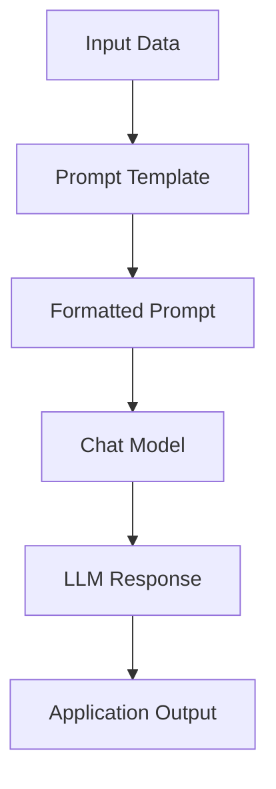

# 2. What Are We Building? LangChain Hello World Chain

## Key Ideas

This section introduces the first practical implementation using LangChain. The objective is to build a minimal but complete **LLM application pipeline**, often referred to as a “Hello World” example. Rather than focusing on theory, the emphasis is on learning the framework through direct implementation.

The example application performs a simple task: it takes a block of information about a specific topic and sends it to a language model, which then generates a summarized response along with additional contextual insights. Although the task itself is simple, the implementation demonstrates the fundamental components that form the foundation of LangChain-based systems.

At a high level, the application pipeline consists of three main steps. First, input data is provided to the system. This input represents raw information that the language model will process. Second, a prompt is constructed that instructs the model on how to interpret and transform the input data. Third, the prompt is sent to a language model which generates the final output.

LangChain structures this workflow through the concept of a **chain**. A chain represents a sequence of operations that transform input into output. Each step in the chain performs a specific function, such as formatting a prompt, invoking a model, or processing the response. By encapsulating these steps within a chain, the application logic becomes easier to compose, reuse, and extend.

Several core LangChain abstractions are introduced through this example.

Prompt templates define the structure of instructions sent to the model. Instead of writing static prompts, developers define templates that can dynamically incorporate runtime data. This allows the application to adapt prompts based on user input or contextual information.

Chat models represent the interface used to communicate with language models. LangChain standardizes how models are invoked, allowing developers to interact with different LLM providers using a consistent interface. This abstraction allows the underlying model to be replaced without rewriting the surrounding application logic.

Chains combine prompts and model calls into a single workflow. The chain manages the flow of data from input to output, ensuring that each component executes in the correct sequence.

Another important aspect introduced in this section is **observability**. When building LLM applications, it is often necessary to inspect how prompts are constructed, how models respond, and how intermediate steps behave. Debugging and tracing tools allow developers to monitor these interactions and diagnose issues during development.

Although the example uses a specific model provider, the architecture is intentionally designed to remain model-agnostic. Any compatible language model can be substituted, including cloud-based models or locally hosted open-weight models. This flexibility allows developers to experiment with different models while maintaining the same application structure.

In addition to cloud-based models, the section also introduces the concept of running models locally. Local inference allows developers to execute open-weight models directly on their own machines. This approach can be useful for experimentation, privacy-sensitive applications, or environments where external API access is restricted.

Overall, the goal of this exercise is to establish the **basic development workflow for LangChain applications**. By constructing a simple chain, developers gain practical exposure to the core abstractions that will be used throughout more advanced examples later in the course.

## Notes

The “Hello World” example represents the smallest meaningful LLM application built with LangChain. Even though the example performs a simple summarization task, it demonstrates the essential architectural pattern used in more complex systems.

The typical flow of a LangChain application can be summarized as:

1. Input data is received from the user or application.
2. A prompt template formats the instructions for the model.
3. The prompt is sent to a chat model.
4. The model generates a response.
5. The result is returned to the user or passed to additional processing steps.

This structure illustrates how LangChain separates concerns between prompt construction, model invocation, and workflow orchestration.

Another important concept introduced here is **model flexibility**. LangChain applications are designed to remain independent of specific model vendors. Developers can switch between different models without significantly altering the system architecture.

Observability and debugging tools also become essential as applications grow in complexity. Tracing allows developers to inspect intermediate operations, track prompt construction, and analyze model responses. This capability becomes especially important when building multi-step workflows or agent-based systems.

The concepts introduced in this section—prompt templates, chat models, chains, and tracing—form the core building blocks that will be expanded upon in subsequent sections.

