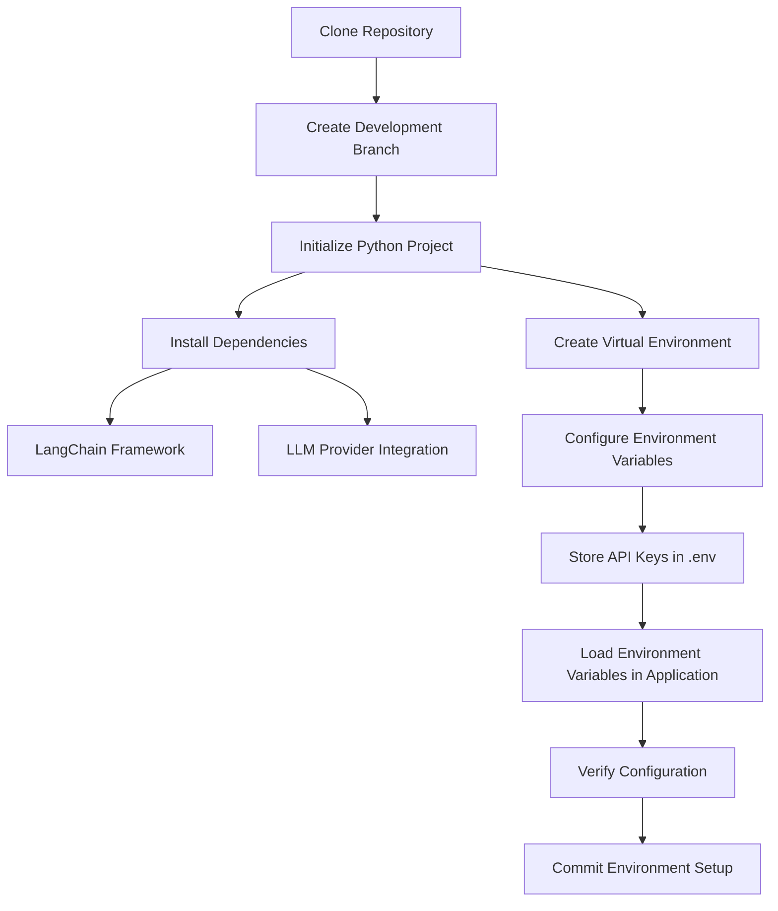

# 3. Project Setup

## Key Ideas

This section establishes the development environment required to build and run LangChain applications. Before implementing any application logic, a properly configured project environment must be created to manage dependencies, isolate runtime configurations, and securely handle credentials used to access external services.

The setup begins by cloning the project repository. The repository acts as the central location for all source code developed throughout the course. Version control allows the project to track changes over time and makes it possible to reproduce the exact code associated with each stage of development. Each lesson corresponds to a specific commit in the repository, enabling developers to reference the exact project state used during implementation.

After cloning the repository, a dedicated development branch is created. This branch isolates the work associated with the first example project and ensures that changes remain organized. Using separate branches for different features or experiments is a common software development practice that helps maintain a clean project history and prevents unrelated changes from interfering with each other.

The project environment itself is initialized using a Python package manager. A package manager is responsible for installing project dependencies, resolving version conflicts, and maintaining a consistent runtime environment. In this setup, the tool used for dependency management is **UV**, a high-performance Python package manager designed to provide fast dependency resolution and environment management.

Initializing the project creates the core project structure, including the main application file and a dependency configuration file. The dependency configuration file defines which libraries the application requires and the versions that should be installed. Managing dependencies in a centralized configuration file ensures that the application can be reproduced reliably on different machines.

Once the project structure is created, the required dependencies are installed. The primary dependency is the LangChain framework itself, which provides the abstractions used to build LLM applications. Additional integration packages are installed to enable communication with specific language model providers. These provider-specific integrations are distributed as separate packages to keep the framework modular and prevent unnecessary dependencies from being installed when they are not required.

Another important dependency introduced during setup is a utility for managing environment variables. Environment variables allow sensitive information—such as API credentials—to be stored outside the application code. Instead of hardcoding secrets directly into source files, the application loads them dynamically from a configuration file during runtime. This approach improves security and prevents sensitive data from being accidentally committed to version control.

To protect confidential information and temporary project artifacts, a `.gitignore` file is added to the repository. This file defines which files and directories should be excluded from version control. Typical exclusions include local virtual environments, compiled files, and configuration files containing API keys. Ignoring these files prevents accidental exposure of sensitive credentials and keeps the repository clean.

Once the environment configuration file is created, API credentials for external services can be added. These credentials are required when the application interacts with cloud-based language models. The environment variable names must follow specific conventions expected by the libraries used within the project. During runtime, these variables are loaded into the application environment so they can be accessed programmatically.

The configuration step concludes with a verification stage. The application loads the environment variables and confirms that the credentials can be accessed by the runtime environment. Successfully retrieving these values indicates that the environment has been configured correctly and that the application can interact with external services.

Finally, the project state is committed to the repository. This commit captures the environment setup and dependency configuration so that the project can be restored or shared with others. Establishing a clean and reproducible development environment ensures that subsequent development tasks—such as building the first LangChain chain—can proceed without configuration issues.

## Notes

A structured development environment is essential when building modern software systems. LLM applications depend on multiple external services, libraries, and runtime configurations. Without proper dependency management and environment isolation, projects quickly become difficult to reproduce or maintain.

Virtual environments are used to isolate project dependencies from the global Python environment. This prevents conflicts between different projects that require different library versions. Each project maintains its own independent environment containing only the packages it requires.

Dependency configuration files serve as a record of the libraries used by the project. These files allow developers to recreate the environment on another machine simply by installing the specified dependencies.

Environment variables provide a secure mechanism for storing configuration data such as API keys, service endpoints, and runtime settings. Storing these values outside the source code ensures that sensitive information does not become part of the repository.

Separating provider-specific integrations into individual packages is another important architectural design choice. This modular approach keeps the core framework lightweight and allows developers to install only the integrations they actually need.

The project setup phase therefore establishes the foundational infrastructure required for building LLM-powered applications. Once the environment is correctly configured, development can proceed with implementing application logic using LangChain.

