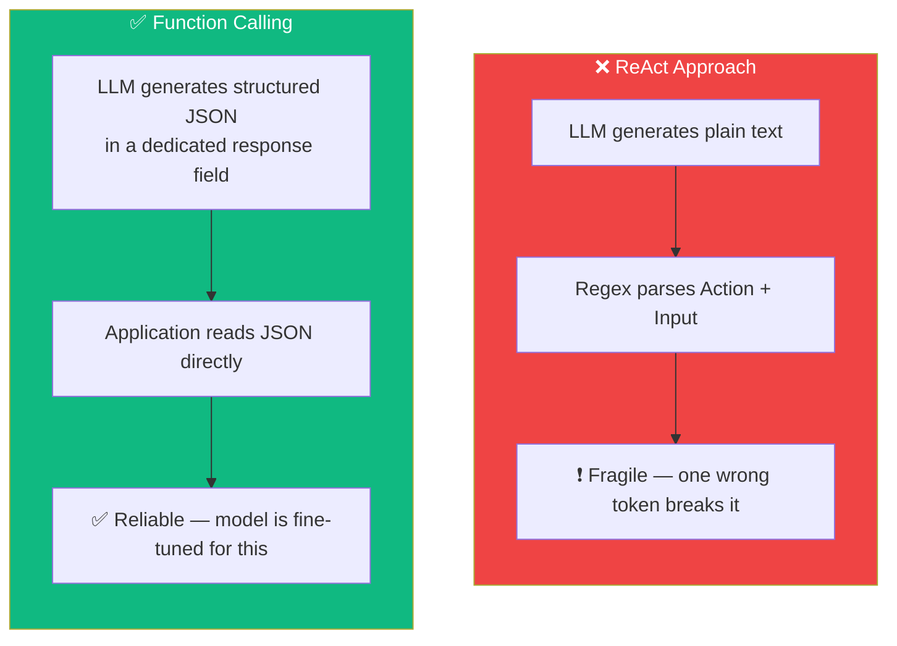
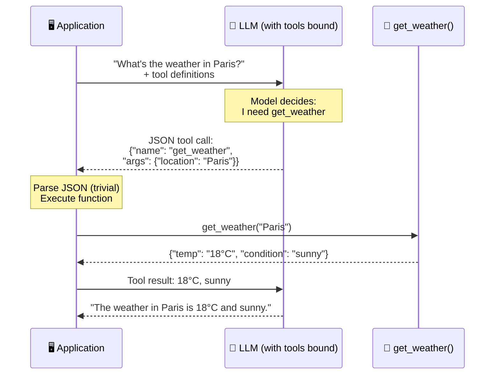
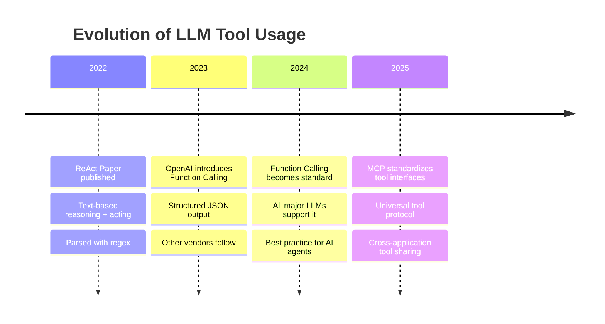

# 05.01 — Introduction to Function Calling

## Overview

This lesson explains **why function calling exists** and why it replaced the ReAct prompt as the standard mechanism for building AI agents. Understanding this evolution is essential because function calling is a foundational concept that appears in every subsequent section of the course — Reflection Agents, Reflexion Agents, Agentic RAG, and MCP all build on it.

---

## The Problem: The ReAct Prompt Is Fragile

In earlier sections of the course, we built AI agents using the **ReAct prompt** — a text-based pattern where the LLM describes its reasoning, selects a tool, and provides arguments, all as plain text:

```
Thought: I need to find the current weather in Paris.
Action: get_current_weather
Action Input: {"location": "Paris", "unit": "celsius"}
Observation: The weather in Paris is 18°C and sunny.
Thought: I now have the answer.
Final Answer: The weather in Paris is 18°C and sunny.
```

LangChain parses this output using **regular expressions** to extract the action name and input. This works — until it doesn't.

### Why It Breaks

The ReAct approach is inherently fragile because:

| Problem | Example | Consequence |
|---|---|---|
| **One wrong token** | LLM outputs `Action:get_weather` (missing space) | Regex fails to parse, entire response is lost |
| **Extra text** | LLM adds commentary before the action | Regex captures wrong content |
| **Inconsistent formatting** | LLM uses `action:` instead of `Action:` | Case-sensitive regex fails |
| **Malformed JSON** | LLM outputs `{location: Paris}` (missing quotes) | JSON parsing fails |
| **Hallucinated tools** | LLM invents `search_google` instead of using `web_search` | Application can't find the function |

The fundamental issue is that we're asking a **statistical text generator** to produce output that perfectly matches a **rigid format**. The LLM has no structural guarantee of compliance — it's just predicting tokens, and a single mispredicted token can break everything.

> [!WARNING]
> In production, ReAct prompt failures are not edge cases — they happen frequently enough to make the approach unreliable for customer-facing applications. A 95% success rate sounds good until you realize it means 1 in 20 user requests crashes.

---

## The Solution: Function Calling

**Function calling** (or **tool calling**) solves this by moving the responsibility from the prompt to the **model itself**. Instead of asking the LLM to format its response as text that we parse with regex, we:

1. **Bind function definitions** to the LLM (name, parameters, descriptions)
2. The LLM decides whether to call a function and produces **structured JSON** in a **dedicated field** of the response
3. The application reads the JSON directly — no regex, no parsing ambiguity



### How It Works at a High Level



The key difference: the tool call appears in a **structured, dedicated field** of the API response — not mixed into the generated text. This makes parsing trivial and reliable.

---

## Why Function Calling Is More Reliable

The reliability improvement isn't just incremental — it's a fundamental architectural difference:

| Aspect | ReAct Prompt | Function Calling |
|---|---|---|
| **Output format** | Free-form text, parsed with regex | Structured JSON in a dedicated API field |
| **Compliance** | LLM "hopes" to match the format | LLM is **fine-tuned** to produce valid JSON schemas |
| **Parsing** | Regex — brittle, error-prone | Native JSON — `json.loads()` |
| **Error rate** | Significant (~5–15% failures with complex tools) | Very low (<1% with modern models) |
| **Who's responsible** | Developer (prompt engineering + regex) | Model vendor (fine-tuning + API design) |

### The Fine-Tuning Difference

Function calling isn't just a prompt trick — the **LLM vendor fine-tunes the model** to:
1. Detect when a function should be called based on the user's request
2. Select the correct function from the available options
3. Extract the right arguments from the user's query
4. Format the response as valid JSON that adheres to the function's schema

This means the model has been specifically trained on millions of examples of correct function calls, making it far more reliable than an untrained model trying to follow a text format.

---

## The Evolution from ReAct to Function Calling



Function calling didn't make the ReAct *concept* obsolete — the idea of reasoning before acting is still valuable. What it replaced is the *implementation* — instead of parsing text with regex, we get structured JSON from the model. Many modern frameworks (including LangGraph) still use ReAct-style reasoning internally but rely on function calling for the actual tool invocation.

---

## Summary

| Concept | Key Takeaway |
|---|---|
| **ReAct prompt** | Cool concept, but fragile in production — regex parsing breaks on malformed text |
| **Function calling** | Production-grade replacement — structured JSON, fine-tuned models, trivial parsing |
| **Why it's better** | Model vendor handles the heavy lifting; output is structured, not free-form text |
| **Industry standard** | All major LLM vendors (OpenAI, Anthropic, Google) support it; nobody uses raw ReAct in production |
| **Terms** | "Function calling" and "tool calling" are interchangeable — same concept, different names |