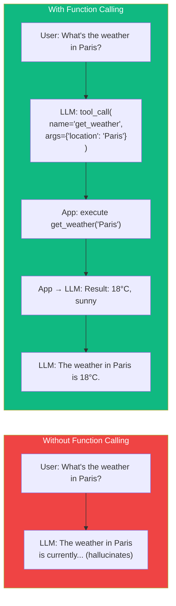
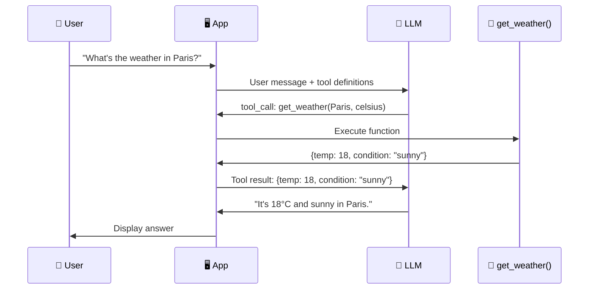
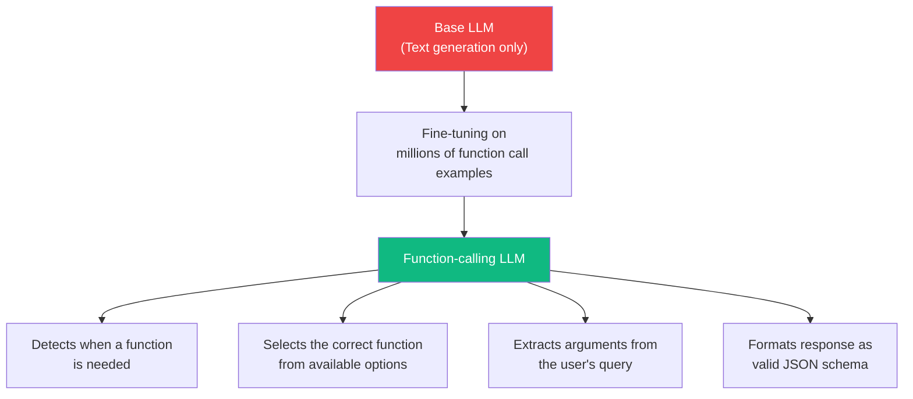
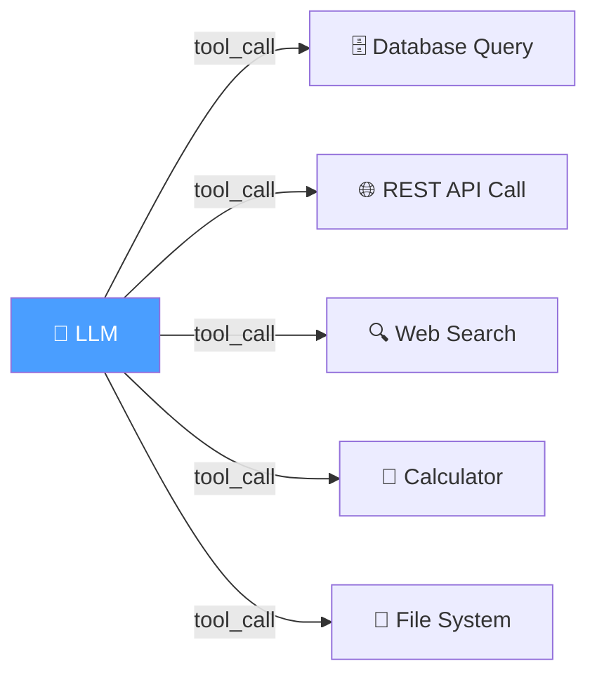
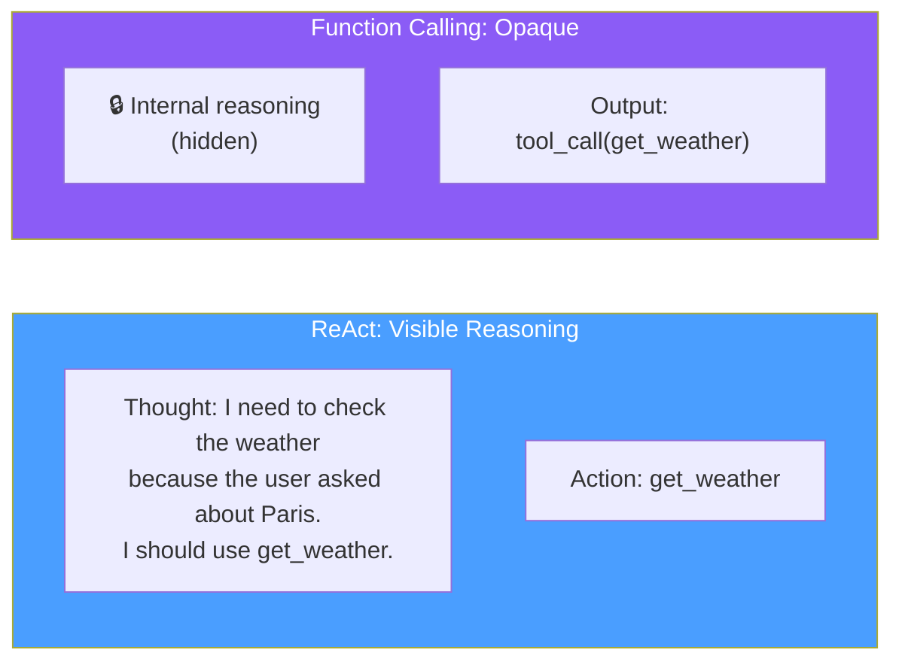

# 05.02 — Understanding Function Calling for LLMs

## Overview

This lesson provides a **deep theoretical understanding** of how function calling works — the mechanics behind the JSON response, how models are fine-tuned to support it, the two distinct use cases (tool integration and structured output), and the advantages and tradeoffs compared to the ReAct approach.

---

## What Is Function Calling?

**Function calling** (or **tool calling**) is an LLM capability where the model produces a **structured function invocation** — specifying which function to call and with what arguments — instead of generating plain text.



### The Key Distinction

Without function calling, the LLM can only **generate text**. If you ask about the weather, it either hallucates an answer from its training data or admits it doesn't know. With function calling, the LLM can say: *"I need to call the `get_weather` function with the argument `Paris`"* — and the application can execute that function and feed the real result back.

---

## How Function Calling Works

### Step 1: Bind Function Definitions

Before sending a request to the LLM, the application provides a list of **function definitions** — describing each available function's name, parameters, and purpose:

```json
{
  "tools": [
    {
      "type": "function",
      "function": {
        "name": "get_current_weather",
        "description": "Get the current weather in a given location",
        "parameters": {
          "type": "object",
          "properties": {
            "location": {
              "type": "string",
              "description": "The city name, e.g., 'Paris'"
            },
            "unit": {
              "type": "string",
              "enum": ["celsius", "fahrenheit"],
              "description": "Temperature unit"
            }
          },
          "required": ["location"]
        }
      }
    }
  ]
}
```

The LLM receives these definitions alongside the user's message. It now "knows" that `get_current_weather` exists and how to call it.

### Step 2: LLM Decides Whether to Call a Function

The fine-tuned model analyzes the user's request and decides:
- **If the request can be answered directly** → generates normal text
- **If a function is needed** → produces a structured tool call

This decision is made internally by the model — you don't need prompt engineering to trigger it.

### Step 3: Application Executes the Function

The application receives the structured tool call, parses the JSON, and executes the corresponding function:

```python
# The LLM response contains:
tool_call = {
    "name": "get_current_weather",
    "arguments": {
        "location": "Paris",
        "unit": "celsius"
    }
}

# Application executes the actual function:
result = get_current_weather(
    location=tool_call["arguments"]["location"],
    unit=tool_call["arguments"]["unit"]
)
# result = {"temp": 18, "condition": "sunny"}
```

### Step 4: Feed Result Back to LLM

The application sends the function result back to the LLM, which then generates the final response using real data:



> [!NOTE]
> The LLM **never executes the function itself**. It only produces the *intent* to call a function. The application is responsible for actual execution. This is a critical security boundary — the LLM can't directly access databases, APIs, or file systems without the application's permission.

---

## The Fine-Tuning Behind Function Calling

Function calling isn't a prompt trick — the LLM has been **specifically fine-tuned** for this capability:



This fine-tuning teaches the model to:
1. **Recognize function-appropriate queries** — "What's the weather?" triggers a function call, "Tell me a joke" doesn't
2. **Match queries to functions** — if 5 tools are available, pick the right one
3. **Extract arguments** — pull "Paris" from "What's the weather in Paris?"
4. **Adhere to schemas** — produce valid JSON that matches the function's parameter definitions

> [!IMPORTANT]
> Not all LLMs support function calling — it requires specific fine-tuning. However, **all major state-of-the-art models** (OpenAI GPT-4/3.5, Anthropic Claude, Google Gemini) support it as of 2024. OpenAI introduced function calling in June 2023, and other vendors quickly followed.

---

## Two Use Cases of Function Calling

Function calling isn't just for calling external tools — it has two distinct applications:

### Use Case 1: External Tool Integration

The primary use case: connecting the LLM to external systems.



**Examples:**
- Search the web for current information (Tavily, Google)
- Query a database for user records
- Call a weather API
- Execute code in a sandbox
- Send an email or create a calendar event

### Use Case 2: Structured Output

A less obvious but equally powerful use case: **forcing the LLM to produce output in a specific format**.

Instead of hoping the LLM returns properly formatted data, you define a function schema that describes your desired output format, and the LLM is forced to fill in those fields:

```python
# Define the schema (Pydantic model)
class MovieReview(BaseModel):
    title: str = Field(description="Movie title")
    rating: float = Field(description="Rating from 1-10")
    summary: str = Field(description="One-sentence summary")
    pros: list[str] = Field(description="List of positive aspects")
    cons: list[str] = Field(description="List of negative aspects")

# Bind as tool → LLM MUST fill all fields
llm.bind_tools([MovieReview], tool_choice="MovieReview")
```

The LLM is now **forced** to produce output that matches this schema. You get a typed, predictable response instead of free-form text.

> [!TIP]
> This is exactly the technique used in the Reflexion Agent (Section 12) — the `AnswerQuestion` and `ReviseAnswer` Pydantic models are bound as tools to force the LLM to produce structured article + critique + search queries.

| Use Case | Goal | Example |
|---|---|---|
| **Tool Integration** | Execute external functions | Call a weather API, search the web, query a database |
| **Structured Output** | Force response format | Extract data into typed fields (name, rating, summary) |

---

## Advantages of Function Calling

### 1. Structured and Reliable Integration

The model's output is **machine-readable JSON** with a specific structure:

```json
{
  "tool_calls": [
    {
      "function": {
        "name": "get_current_weather",
        "arguments": "{\"location\": \"Paris\", \"unit\": \"celsius\"}"
      }
    }
  ]
}
```

Compared to ReAct's text-based output, this is:
- **Trivially parsable** — `json.loads()` instead of regex
- **Schema-validated** — the JSON must match the function definition
- **Unambiguous** — no risk of the function name being mixed with commentary

### 2. Token Efficiency

Function calling **saves tokens** because the LLM doesn't need to produce the chain-of-thought reasoning that the ReAct prompt requires:

| Approach | Token Usage |
|---|---|
| **ReAct prompt** | `Thought: I need to check the weather... Action: get_weather... Action Input: {"location": "Paris"}... Observation: ...` (~100+ tokens of reasoning) |
| **Function calling** | `tool_call: get_weather(location="Paris")` (~20 tokens) |

The reasoning still happens, but it's **internal to the model** — only the final decision (which function, what arguments) is output. This means fewer output tokens, which translates to lower cost and faster responses.

### 3. Vendor-Managed Quality

With the ReAct prompt, **you** are responsible for reliability through prompt engineering. With function calling, the **LLM vendor** (OpenAI, Anthropic, Google) has fine-tuned the model and invested engineering effort into making it reliable. You benefit from their ongoing improvements without changing your code.

---

## The Tradeoff: Opaque Reasoning

Function calling has one notable drawback: **you can't see the LLM's reasoning**.



| Aspect | ReAct | Function Calling |
|---|---|---|
| **Reasoning visibility** | Full chain-of-thought is output | Hidden — only the final decision is visible |
| **Debugging** | Easy — read the thought process | Harder — you see *what* it called but not *why* |
| **Auditing** | Full audit trail | Limited — tool call + arguments only |

**In practice, this tradeoff is worth it.** The reliability improvement (from ~85% to >99%) far outweighs the loss of reasoning visibility. And for debugging, tools like LangSmith provide tracing that compensates for the opaque reasoning.

> [!NOTE]
> Some models combine both approaches — they do chain-of-thought reasoning AND produce structured function calls. OpenAI's reasoning models and Anthropic's extended thinking provide visible reasoning before making tool calls.

---

## Function Calling vs. ReAct — Full Comparison

| Dimension | ReAct Prompt | Function Calling |
|---|---|---|
| **Mechanism** | Text generation + regex parsing | Fine-tuned JSON generation in dedicated field |
| **Reliability** | ~85–95% | >99% with modern models |
| **Parsing** | Regex (brittle) | `json.loads()` (trivial) |
| **Token cost** | High (chain-of-thought output) | Low (only function call output) |
| **Reasoning visibility** | Full chain-of-thought visible | Opaque (internal reasoning) |
| **Who's responsible** | Developer (prompt + regex) | Model vendor (fine-tuning) |
| **Structured output** | Not easily achievable | Native use case |
| **Multi-vendor support** | Any LLM (prompt-based) | Requires fine-tuned model |
| **Production readiness** | Prototype/demo only | Production standard |

---

## Summary

| Concept | Key Takeaway |
|---|---|
| **Definition** | LLM produces structured JSON to invoke external functions, with name and arguments |
| **How it works** | Bind function definitions → LLM decides if/which to call → App executes → Result fed back |
| **Fine-tuning** | Models are specifically trained to detect, select, and format function calls |
| **Use Case 1** | External tool integration (APIs, databases, search engines) |
| **Use Case 2** | Structured output (force response into Pydantic schemas) |
| **Advantages** | Reliable JSON output, token-efficient, vendor-managed quality |
| **Tradeoff** | Opaque reasoning — you see the decision but not the justification |
| **Industry status** | De facto standard since 2023; all production AI agents use function calling |