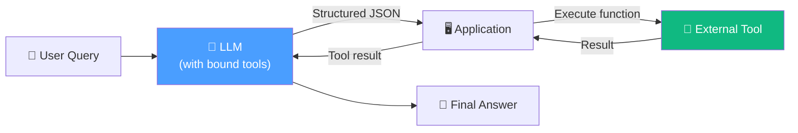

# 05. Function Calling

## Overview

**Function calling** (also called **tool calling**) is the mechanism that allows LLMs to produce structured requests to invoke external functions. It's the production-grade evolution of the ReAct prompt — more reliable, more parsable, and the current industry standard for building AI agents.

## Architecture at a Glance

## Lesson Map

| # | Lesson | Focus |
|---|---|---|
| 1 | [Introduction](01-intro.md) | Why function calling replaced the ReAct prompt |
| 2 | [Understanding Function Calling](02-understanding-function-calling-for-llms.md) | How it works, advantages, tradeoffs, and two use cases |

## Key Concepts

| Concept | Description |
|---|---|
| **Function calling** | LLM produces structured JSON specifying function name + arguments |
| **Tool binding** | Attaching function definitions (name, params, description) to the LLM |
| **ReAct prompt** | The predecessor — text-based reasoning that's parsed with regex (fragile) |
| **Structured output** | Using function calling not for tools, but to enforce response format |
