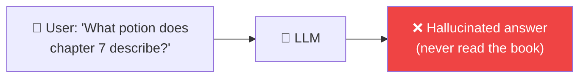
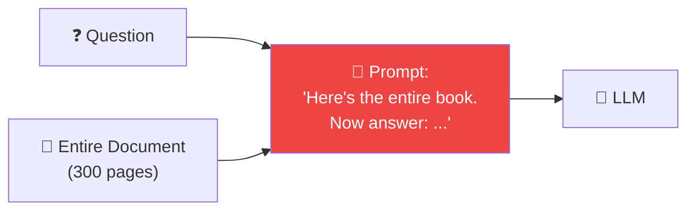
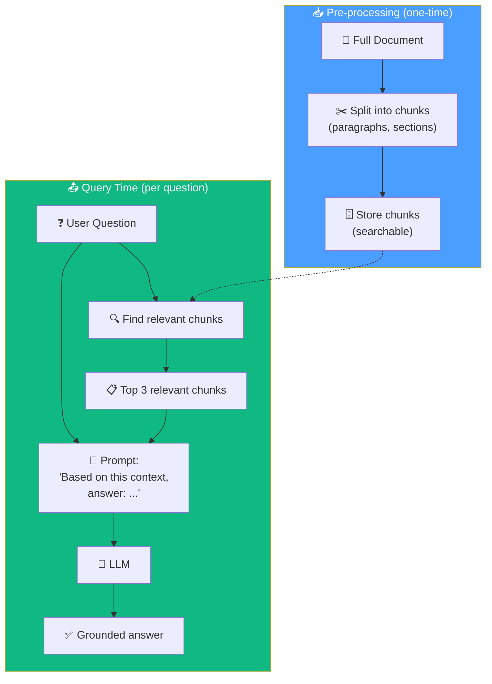
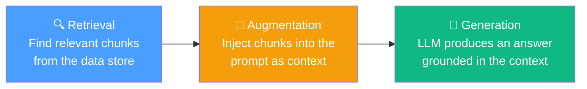

# 06.01 — Introduction to Retrieval-Augmented Generation

## Overview

This lesson introduces the **motivation** behind RAG — why it exists, what problem it solves, and why the naive approach of stuffing entire documents into prompts doesn't work. Understanding this motivation is essential before diving into the implementation.

---

## The Problem: LLMs Can't Access Your Data

LLMs are trained on large public datasets, but they have **no knowledge of private data** — your company's documents, internal knowledge bases, financial reports, or proprietary codebases. When you ask an LLM about information in a private document, it either hallucinates or admits it doesn't know.

**Examples of private data scenarios:**
- A 300-page Harry Potter book — "How do you make this specific potion?"
- A financial contract — "What's the termination clause in section 4.2?"
- An internal knowledge base — "What's our company's refund policy?"
- A code repository — "How does the authentication module work?"

The LLM wasn't trained on any of this. We need a way to **give it the relevant information at query time**.

---

## Solution 1: Stuff Everything (The Naive Approach)

The simplest idea: take the entire document and paste it into the prompt alongside the question.

### Why This Fails

| Problem | Explanation | Impact |
|---|---|---|
| **Token limit** | LLMs have a hard maximum (4K, 128K, even 1M tokens). A 300-page book easily exceeds this. | The API call **fails** — the request is rejected |
| **Needle in a haystack** | Research proves that even with huge context windows, LLMs become less effective at finding specific information in very long prompts. The answer gets "lost" in the noise. | **Worse answer quality** — the LLM misses or misinterprets the relevant passage |
| **Cost** | LLM pricing is per-token. Sending 100K tokens costs ~100x more than sending 1K tokens. | **Unnecessary expense** — you're paying for irrelevant context |
| **Latency** | More tokens = longer processing time. A 100K-token prompt takes significantly longer to process than a 1K-token prompt. | **Slow responses** — unacceptable for user-facing applications |

> [!WARNING]
> Even with modern models that support 1M+ token context windows (like Gemini), the "stuff everything" approach is **still problematic**. The Needle-in-a-Haystack research shows that performance degrades with context length — the model may know the answer is "somewhere in there" but struggle to locate it precisely. More context ≠ better answers.

---

## Solution 2: Retrieve Only What's Relevant (RAG)

Instead of sending the entire document, what if we could:
1. **Pre-process** the document into smaller chunks
2. **Find** only the chunks relevant to the user's question
3. **Send** only those relevant chunks to the LLM

### How RAG Solves All Four Problems

| Problem | How RAG Solves It |
|---|---|
| **Token limit** | Only 3–5 small chunks are sent, well within any token limit |
| **Needle in haystack** | The LLM receives only relevant passages — no noise to search through |
| **Cost** | 1K tokens (3 chunks) instead of 100K tokens (whole doc) → ~100x cheaper |
| **Latency** | Processing 1K tokens is nearly instant; 100K takes seconds |

---

## What "RAG" Actually Means

The name **Retrieval-Augmented Generation** describes the three steps:

| Step | What Happens |
|---|---|
| **Retrieval** | The user's query is used to search for the most relevant document chunks |
| **Augmentation** | The prompt is augmented (enriched) with the retrieved context |
| **Generation** | The LLM generates an answer grounded in the provided context |

---

## The Open Questions

RAG introduces new challenges that the rest of this section addresses:

| Challenge | Question | Covered In |
|---|---|---|
| **Chunking strategy** | How do we split documents? What chunk size? Overlap? | Lessons 04, 05 |
| **Finding relevant chunks** | How do we search for the "most relevant" chunks efficiently? | Lessons 02, 07 |
| **Different document types** | How do we handle PDFs vs. code vs. WhatsApp messages? | Lesson 04 |
| **Relevance quality** | What if the retrieved chunks aren't actually relevant? | Lesson 09 (Agentic RAG teaser) |
| **Scalability** | Does this work with millions of chunks? | Lessons 03, 05 |

---

## Summary

| Concept | Key Takeaway |
|---|---|
| **The problem** | LLMs don't know about private/recent data and can't process very long documents effectively |
| **Naive approach** | Stuffing the whole document into the prompt fails due to token limits, cost, latency, and accuracy |
| **RAG solution** | Split → store → retrieve relevant chunks at query time → augment the prompt → generate |
| **Why it works** | Focused context → better answers, lower cost, faster responses, no token limit issues |
| **Tradeoffs** | Requires pre-processing, chunking strategy decisions, and a search mechanism |