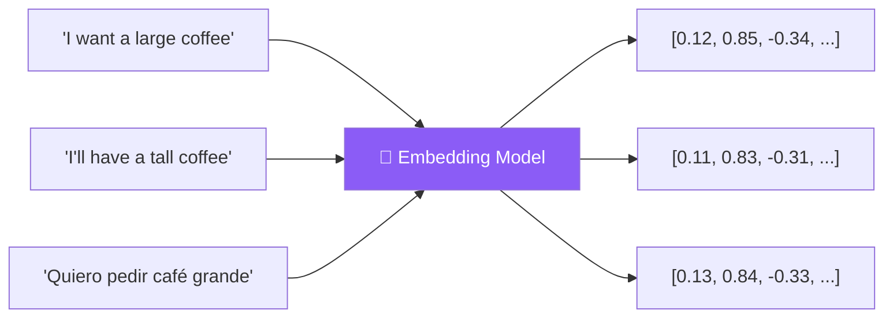
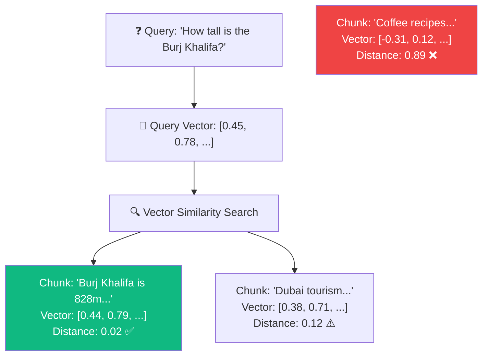
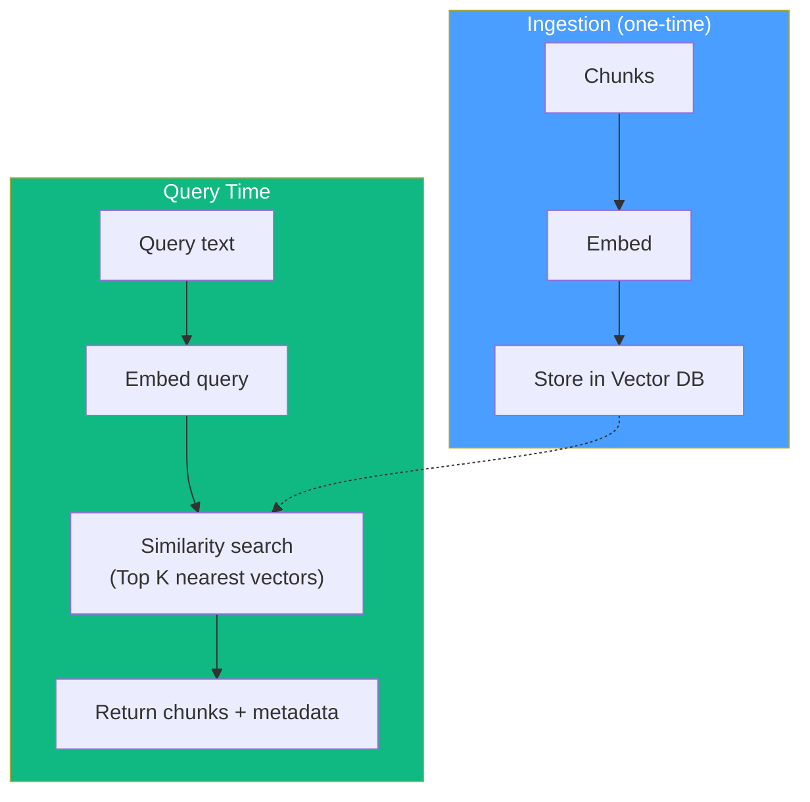
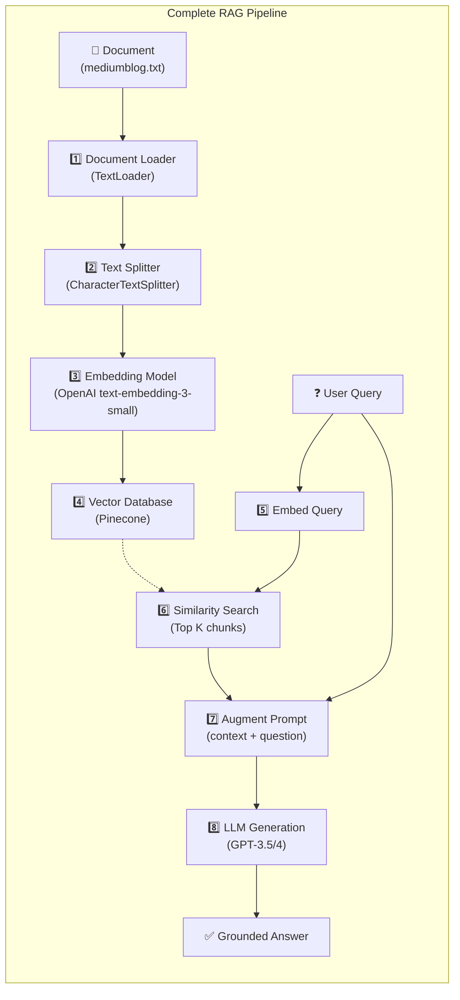

# 06.02 — Introduction to RAG Implementation: Embeddings, Vector Stores & Similarity Search

## Overview

Lesson 01 explained **why** RAG exists. This lesson explains **how** it works — the technical mechanisms that make "finding relevant chunks" possible. We cover four foundational concepts: **document loaders**, **text splitters**, **embeddings**, and **vector databases**.

---

## The Four Building Blocks of RAG


---

## 1. Document Loaders

A **document loader** is a LangChain abstraction for loading data from any source and converting it into a standardized `Document` object.

```python
from langchain_community.document_loaders import TextLoader

loader = TextLoader("./mediumblog.txt")
documents = loader.load()
# documents[0].page_content → "The full text..."
# documents[0].metadata → {"source": "./mediumblog.txt"}
```

### Why It Matters

Data comes in countless formats — text files, PDFs, Google Drive docs, Notion notebooks, WhatsApp exports, YouTube transcripts, Slack messages. The document loader provides a **uniform interface**: regardless of the source, you get a `Document` with `page_content` (the text) and `metadata` (source info, timestamps, etc.).

| Source | Loader | Interface |
|---|---|---|
| Text file | `TextLoader` | `loader.load()` → `Document[]` |
| PDF | `PyPDFLoader` | `loader.load()` → `Document[]` |
| Google Drive | `GoogleDriveLoader` | `loader.load()` → `Document[]` |
| YouTube | `YoutubeLoader` | `loader.load()` → `Document[]` |
| Notion | `NotionDirectoryLoader` | `loader.load()` → `Document[]` |

The interface is always `.load()` → list of `Document` objects. Switching data sources means changing one import and one class name — the rest of the pipeline stays the same.

---

## 2. Text Splitters

Once loaded, documents are typically too large for embedding and retrieval. **Text splitters** break them into smaller, semantically meaningful chunks.

```python
from langchain.text_splitter import CharacterTextSplitter

text_splitter = CharacterTextSplitter(
    chunk_size=1000,       # Max characters per chunk
    chunk_overlap=0,       # No overlap between chunks
    separator="\n\n"       # Split on double newlines
)

chunks = text_splitter.split_documents(documents)
# len(chunks) → 20 (for a typical blog post)
```

### Chunk Size Trade-offs

Choosing the right chunk size is a critical design decision:

| Chunk Size | Advantage | Disadvantage |
|---|---|---|
| **Too small** (100 chars) | Very precise retrieval | Chunks lack context; the LLM can't understand them in isolation |
| **Too large** (10K chars) | Rich context per chunk | May include irrelevant content; wastes tokens; harder to search |
| **Sweet spot** (~500–1500 chars) | Readable, meaningful passages | Requires experimentation per document type |

### Chunk Overlap

The `chunk_overlap` parameter controls how much adjacent chunks share:

```
Chunk 1: [AAAA BBBB CCCC]
Chunk 2:            [CCCC DDDD EEEE]  ← overlapping 'CCCC'
```

Overlap ensures that information split across chunk boundaries isn't lost. Useful when sentences or ideas span the boundary, but increases total chunk count and storage.

> [!TIP]
> **Rule of thumb**: Start with `chunk_size=1000` and `chunk_overlap=200`. Adjust based on your document structure. For code, consider using `RecursiveCharacterTextSplitter` with language support.

---

## 3. Embeddings

**Embeddings** are the magic that makes similarity search possible. An embedding model converts text into a **high-dimensional vector** (a list of numbers) that captures the **semantic meaning** of the text.



### The Key Property: Semantic Similarity → Vector Proximity

In a good embedding model, **texts with similar meaning produce vectors that are close together** in vector space, regardless of the exact words used — or even the language.

| Sentence | Language | Meaning | Vectors |
|---|---|---|---|
| "I want a large coffee" | English | Coffee order | `[0.12, 0.85, -0.34, ...]` |
| "I'll have a tall coffee" | English | Coffee order | `[0.11, 0.83, -0.31, ...]` → **close** |
| "Quiero pedir café grande" | Spanish | Coffee order | `[0.13, 0.84, -0.33, ...]` → **close** |
| "The stock market crashed" | English | Finance | `[-0.67, 0.21, 0.93, ...]` → **far** |

### How Embeddings Enable RAG

This is the crucial insight: if the user asks "How tall is the Burj Khalifa?" and one of our chunks contains the Wikipedia paragraph about the Burj Khalifa's height, then:

1. The question's embedding vector will be **close** to the chunk's embedding vector
2. A **similarity search** in the vector database will return that chunk
3. We inject the chunk into the prompt → the LLM gives an accurate, grounded answer



### Distance Metrics

Vector databases support different ways to measure "closeness":

| Metric | What It Measures | Best For |
|---|---|---|
| **Cosine similarity** | Angle between vectors (direction, not magnitude) | Text similarity — most common default |
| **Euclidean distance** | Straight-line distance in vector space | When magnitude matters |
| **Dot product** | Combination of magnitude and direction | Optimized retrieval in some databases |

> [!NOTE]
> For text embeddings, **cosine similarity** is the standard choice. It captures "are these texts about the same thing?" regardless of length differences.

---

## 4. Vector Databases

A **vector database** is a specialized database designed to:
1. **Store** millions of embedding vectors with their metadata
2. **Search** for the closest vectors to a query vector — extremely fast
3. **Scale** to billions of vectors with sub-second query times



### What's Stored Per Vector

Each entry in a vector database contains:

```json
{
  "id": "chunk_17",
  "values": [0.12, 0.85, -0.34, ...],   // The embedding vector (1536 dimensions)
  "metadata": {
    "text": "The Burj Khalifa, at 828 meters, is the tallest building...",
    "source": "./documents/architecture.txt"
  }
}
```

- **`values`** — the embedding vector (used for similarity search)
- **`metadata.text`** — the original chunk text (returned to the application)
- **`metadata.source`** — where the chunk came from (for citations and traceability)

### Popular Vector Databases

| Database | Type | Free Tier | Notes |
|---|---|---|---|
| **Pinecone** | Managed cloud | ✅ Yes | Used in this course; simple setup |
| **Chroma** | Open source (local) | ✅ Free | Great for development; runs locally |
| **FAISS** | Open source (library) | ✅ Free | Facebook's library; fast but no server |
| **Weaviate** | Open source + managed | ✅ Yes | Full-featured with GraphQL |
| **Qdrant** | Open source + managed | ✅ Yes | Rust-based; high performance |

---

## Putting It All Together: The Complete RAG Pipeline



Steps 1–4 happen **once** (ingestion). Steps 5–8 happen **per query** (retrieval + generation).

---

## Summary

| Concept | What It Does | LangChain Class |
|---|---|---|
| **Document Loader** | Loads data from any source into `Document` objects | `TextLoader`, `PyPDFLoader`, etc. |
| **Text Splitter** | Breaks documents into smaller, searchable chunks | `CharacterTextSplitter` |
| **Embedding Model** | Converts text into numerical vectors capturing meaning | `OpenAIEmbeddings` |
| **Vector Database** | Stores vectors and performs fast similarity search | `PineconeVectorStore` |
| **Similarity Search** | Finds the closest vectors to a query → retrieves relevant chunks | `vectorstore.similarity_search()` |