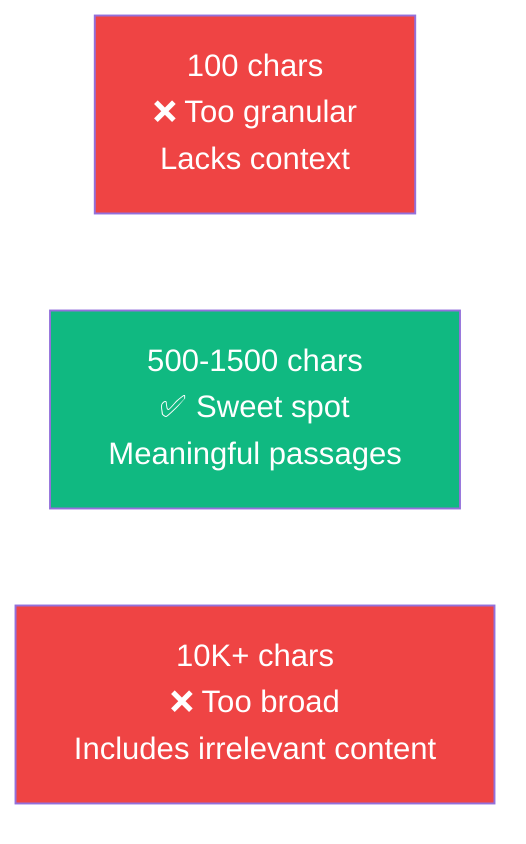

# 06.04 — Medium Analyzer: LangChain Class Review

## Overview

Before writing the ingestion code, this lesson dives into the **LangChain classes** we'll use — examining their source code, understanding their abstractions, and learning why they make RAG pipelines portable across data sources, embedding models, and vector stores.

---

## The Four Classes


---

## 1. TextLoader — Document Loaders

```python
from langchain_community.document_loaders import TextLoader

loader = TextLoader("./mediumblog.txt")
documents = loader.load()
```

### What It Does Under the Hood

The `TextLoader` source code is surprisingly simple:

```python
# Simplified from LangChain source
class TextLoader(BaseLoader):
    def load(self) -> List[Document]:
        with open(self.file_path) as f:
            text = f.read()
        return [Document(
            page_content=text,
            metadata={"source": self.file_path}
        )]
```

That's it — open a file, read the text, wrap it in a `Document` object with metadata. The value isn't in the complexity of `TextLoader` itself — it's in the **uniform interface** it shares with every other loader.

### The Abstraction's Power

Every document loader, regardless of source, implements the same `.load()` method and returns `Document` objects:

```python
# All of these return List[Document] with the same interface:
TextLoader("./file.txt").load()
PyPDFLoader("./report.pdf").load()
WhatsAppChatLoader("./chat.txt").load()
NotionDirectoryLoader("./notion-export").load()
YoutubeLoader.from_youtube_url("https://...").load()
```

### The Document Object

```python
class Document:
    page_content: str     # The actual text content
    metadata: dict        # Source info, timestamps, page numbers, etc.
```

| Field | Purpose | Example |
|---|---|---|
| `page_content` | The text data the LLM will process | `"Pinecone is a vector database..."` |
| `metadata` | Source tracking for citations, filtering, and debugging | `{"source": "./mediumblog.txt"}` |

The `metadata` field is critical for production RAG systems:
- **Citations** — tell the user where the answer came from
- **Filtering** — search only within specific documents or categories
- **Debugging** — trace which chunk produced a particular answer

> [!TIP]
> You can add custom metadata to any document: `doc.metadata["category"] = "finance"`. This enables filtered retrieval — e.g., search only within finance documents.

---

## 2. CharacterTextSplitter — Text Splitters

```python
from langchain.text_splitter import CharacterTextSplitter

text_splitter = CharacterTextSplitter(
    chunk_size=1000,
    chunk_overlap=0,
    separator="\n\n"
)

chunks = text_splitter.split_documents(documents)
```

### Key Parameters

| Parameter | Value | Meaning |
|---|---|---|
| `chunk_size` | `1000` | Maximum characters per chunk |
| `chunk_overlap` | `0` | No shared content between adjacent chunks |
| `separator` | `"\n\n"` | Split on double newlines (paragraph boundaries) |
| `length_function` | `len` (default) | How to measure chunk length (can be custom token counter) |

### Why 1000 Characters?

The chunk size is a **heuristic** — there's no magic number:



**Rule of thumb**: A chunk should be small enough to focus on one topic, but large enough that a human reading it would understand what it's about.

> [!IMPORTANT]
> **"Garbage in, garbage out"** applies — even with million-token context windows. Sending 3 focused, relevant chunks produces better answers than sending 100 unfocused chunks. Chunking quality directly impacts answer quality.

### Why Chunks Might Exceed `chunk_size`

When splitting on `"\n\n"`, if a paragraph is longer than `chunk_size`, the splitter **can't split mid-paragraph** without breaking semantics. LangChain warns you when this happens:

```
WARNING: Created a chunk of size 1247, which is longer than the specified 1000
```

This is expected behavior, not an error. The splitter prioritizes semantic boundaries over strict size limits.

---

## 3. OpenAIEmbeddings — Embedding Models

```python
from langchain_openai import OpenAIEmbeddings

embeddings = OpenAIEmbeddings(model="text-embedding-3-small")
```

### What It Does

The embedding object is a **wrapper around the OpenAI embeddings API**. When called, it sends text to the API and receives back a vector:

```python
# Under the hood:
# POST https://api.openai.com/v1/embeddings
# Body: {"input": "Pinecone is a vector database...", "model": "text-embedding-3-small"}
# Response: {"data": [{"embedding": [0.12, 0.85, -0.34, ...]}]}
```

### The Uniform Interface

Just like document loaders, LangChain provides a uniform interface for embeddings:

```python
# All of these implement the same interface:
OpenAIEmbeddings(model="text-embedding-3-small")
CohereEmbeddings(model="embed-english-v3.0")
HuggingFaceEmbeddings(model_name="all-MiniLM-L6-v2")
```

Switching embedding providers means changing one line of code — the rest of the pipeline stays the same.

### Embedding Model Comparison

| Model | Provider | Dimensions | Cost | Quality |
|---|---|---|---|---|
| `text-embedding-3-small` | OpenAI | 512–1536 | Very cheap | Good |
| `text-embedding-3-large` | OpenAI | 256–3072 | Moderate | Better |
| `text-embedding-ada-002` | OpenAI | 1536 | 98% cheaper than legacy | Legacy but still popular |
| `embed-english-v3.0` | Cohere | 1024 | Competitive | Good |
| `all-MiniLM-L6-v2` | HuggingFace | 384 | Free (local) | Decent for prototyping |

> [!NOTE]
> When embedding large datasets (millions of chunks), **cost matters significantly**. `text-embedding-3-small` is the sweet spot — good quality at very low cost. For maximum quality, use `text-embedding-3-large`.

---

## 4. PineconeVectorStore — Vector Databases

```python
from langchain_pinecone import PineconeVectorStore

vectorstore = PineconeVectorStore.from_documents(
    documents=chunks,
    embedding=embeddings,
    index_name=os.environ["INDEX_NAME"]
)
```

### What It Does

`from_documents()` performs the entire ingestion in one call:
1. Iterates through all document chunks
2. Embeds each chunk using the provided embedding model
3. Stores the vectors + metadata in the Pinecone index

### The Uniform Interface

```python
# All vector stores share the same interface:
PineconeVectorStore.from_documents(docs, embeddings, index_name="...")
ChromaVectorStore.from_documents(docs, embeddings, collection_name="...")
FAISSVectorStore.from_documents(docs, embeddings)
```

Switching vector databases means changing one import and one class name.

### What Gets Stored

For each chunk, Pinecone stores:

| Field | Example | Purpose |
|---|---|---|
| **Vector** | `[0.12, 0.85, -0.34, ...]` (1536 floats) | Similarity search |
| **Text** | `"Pinecone is a managed vector database..."` | Returned with search results |
| **Source** | `"./mediumblog.txt"` | Citation and traceability |

---

## Summary of Imports

```python
# ingestion.py
from langchain_community.document_loaders import TextLoader       # Load data
from langchain.text_splitter import CharacterTextSplitter          # Split into chunks
from langchain_openai import OpenAIEmbeddings                      # Convert to vectors
from langchain_pinecone import PineconeVectorStore                 # Store vectors
```

| Class | Abstraction | Key Method |
|---|---|---|
| `TextLoader` | Data source → `Document` | `.load()` |
| `CharacterTextSplitter` | `Document` → `Chunk[]` | `.split_documents()` |
| `OpenAIEmbeddings` | Text → Vector | `.embed_query()` / `.embed_documents()` |
| `PineconeVectorStore` | Chunks → Stored Vectors | `.from_documents()` |