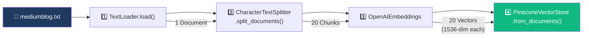
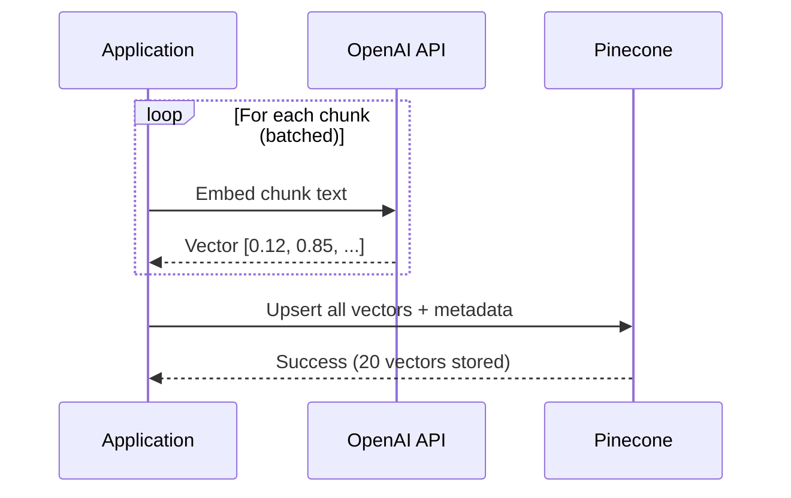
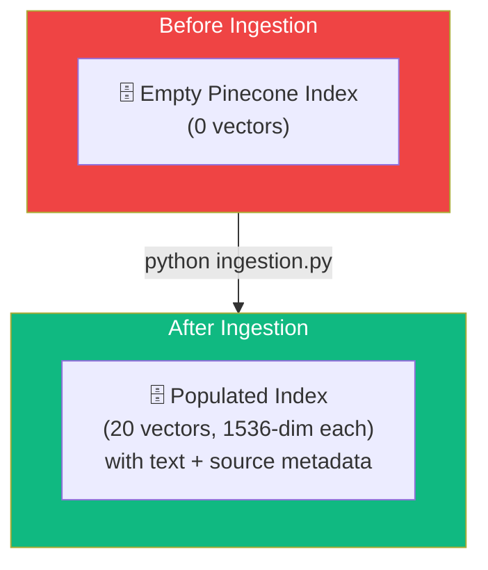

# 06.05 — Medium Analyzer: Ingestion Implementation

## Overview

This lesson implements the **complete ingestion pipeline** — loading the Medium blog from a text file, splitting it into chunks, embedding each chunk, and storing the vectors in Pinecone. The entire pipeline runs in just a few lines of LangChain code, but understanding what each line does is critical for debugging and production usage.

---

## The Ingestion Pipeline



---

## Step 1: Load the Document

```python
loader = TextLoader("./mediumblog.txt")
document = loader.load()
```

After loading:
- `document` is a **list** containing one `Document` object
- `document[0].page_content` contains the full article text
- `document[0].metadata` → `{"source": "./mediumblog.txt"}`

> [!TIP]
> **Encoding issues**: Some operating systems may throw a `UnicodeDecodeError`. Fix with:
> ```python
> TextLoader("./mediumblog.txt", encoding="utf-8")
> # or
> TextLoader("./mediumblog.txt", autodetect_encoding=True)
> ```

---

## Step 2: Split into Chunks

```python
text_splitter = CharacterTextSplitter(
    chunk_size=1000,
    chunk_overlap=0
)

chunks = text_splitter.split_documents(document)
print(f"Created {len(chunks)} chunks")   # → 20 chunks
```

### What Happens Under the Hood

1. The splitter walks through the text, looking for the separator (`"\n\n"` by default)
2. It groups text between separators until close to `chunk_size`
3. Each group becomes a new `Document` with the same metadata as the original
4. The `page_content` is the chunk's text; the `metadata` retains the source

### Examining the Chunks

```python
# Each chunk is a Document:
chunks[0].page_content    # First ~1000 chars of the article
chunks[0].metadata        # {"source": "./mediumblog.txt"}
len(chunks)               # 20 chunks for a typical blog post
```

**Important observations:**
- Chunks are still `Document` objects — same type as the input
- Each chunk inherits the metadata from the parent document
- Some chunks may exceed `chunk_size` if a paragraph is longer than the limit (LangChain warns about this)

### The "Readable Chunk" Test

> **Rule of thumb**: Read the content of each chunk. Does it make sense as a standalone passage? If a human can understand the chunk's topic, it's a good chunk size. If it's just a sentence fragment, the chunks are too small. If it covers 3 unrelated topics, they're too large.

---

## Step 3: Initialize the Embedding Model

```python
embeddings = OpenAIEmbeddings(model="text-embedding-3-small")
```

The embedding model is initialized but doesn't run yet — it's passed to the vector store, which calls it during ingestion.

> [!NOTE]
> The default model is `text-embedding-ada-002`. The newer `text-embedding-3-small` offers better quality per dollar. Either works — just ensure the Pinecone index dimensions match (1536 for both at full dimensionality).

---

## Step 4: Embed and Store in Pinecone

```python
print(f"Ingesting {len(chunks)} chunks...")

vectorstore = PineconeVectorStore.from_documents(
    documents=chunks,
    embedding=embeddings,
    index_name=os.environ["INDEX_NAME"]
)

print("Ingestion complete!")
```

### What `from_documents()` Does



1. **Iterates** through all chunks
2. **Embeds** each chunk by calling the OpenAI embeddings API (batched for efficiency)
3. **Upserts** all vectors into the Pinecone index with metadata (text + source)

### Built-In Production Features

LangChain's `from_documents()` includes:
- **Batching** — sends chunks in batches to avoid rate limits
- **Threading** — can use concurrent IO for faster ingestion
- **Rate limit handling** — retries with backoff when API limits are hit
- **Async support** — `from_documents()` has an async variant for non-blocking ingestion

### Verifying in Pinecone Dashboard

After running the ingestion, go to the Pinecone dashboard:
- The index should show **20 vectors** (or however many chunks were created)
- Click a vector to see its stored data:
  - **text** — the chunk's `page_content`
  - **source** — the file path from `metadata`
  - **vector values** — the 1536-dimensional embedding

---

## The Complete `ingestion.py`

```python
import os
from dotenv import load_dotenv
from langchain_community.document_loaders import TextLoader
from langchain.text_splitter import CharacterTextSplitter
from langchain_openai import OpenAIEmbeddings
from langchain_pinecone import PineconeVectorStore

load_dotenv()

if __name__ == "__main__":
    print("Ingestion...")

    # 1. Load the document
    loader = TextLoader("./mediumblog.txt")
    document = loader.load()

    print(f"Loaded {len(document)} document(s)")

    # 2. Split into chunks
    text_splitter = CharacterTextSplitter(
        chunk_size=1000,
        chunk_overlap=0
    )
    chunks = text_splitter.split_documents(document)

    print(f"Split into {len(chunks)} chunks")

    # 3. Initialize embeddings
    embeddings = OpenAIEmbeddings(model="text-embedding-3-small")

    # 4. Embed and store in Pinecone
    print(f"Ingesting {len(chunks)} chunks into Pinecone...")

    PineconeVectorStore.from_documents(
        documents=chunks,
        embedding=embeddings,
        index_name=os.environ["INDEX_NAME"]
    )

    print("Ingestion complete!")
```

---

## What We Just Built



The ingestion pipeline is a **one-time process**. Once the vectors are stored, we can query them from the retrieval pipeline (next lessons) without re-running ingestion.

---

## Summary

| Step | Code | Result |
|---|---|---|
| **Load** | `TextLoader("./mediumblog.txt").load()` | 1 Document object |
| **Split** | `CharacterTextSplitter(1000, 0).split_documents(doc)` | 20 Document chunks |
| **Embed + Store** | `PineconeVectorStore.from_documents(chunks, embeddings, index)` | 20 vectors in Pinecone |

| Concept | Key Insight |
|---|---|
| **Encoding** | Use `encoding="utf-8"` if you get `UnicodeDecodeError` |
| **Chunk size** | 1000 chars is a heuristic — adjust per document type |
| **Oversized chunks** | Expected when paragraphs exceed `chunk_size` |
| **Batch ingestion** | LangChain handles batching, threading, and rate limits |
| **One-time** | Ingestion runs once; retrieval queries the stored vectors |