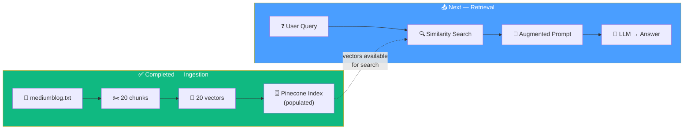

# 06.06 — Recap: From Ingestion to Retrieval

## Overview

This is a transition point between the two halves of the RAG pipeline. The **ingestion pipeline** (lessons 03–05) is complete — our document is chunked, embedded, and stored in Pinecone. Now we move to the **retrieval pipeline** — taking user queries, finding relevant chunks, and generating grounded answers.

---

## What We've Built So Far

---

## What's Coming Next

The retrieval pipeline converts a user's question into a grounded answer:

| Step | What Happens | Tool |
|---|---|---|
| **1. Embed query** | The user's question is converted to a vector | `OpenAIEmbeddings` |
| **2. Similarity search** | The query vector is compared against all stored vectors; top K nearest chunks are returned | `PineconeVectorStore.as_retriever()` |
| **3. Augment prompt** | The retrieved chunks are injected as context alongside the original question | `ChatPromptTemplate` |
| **4. Generate answer** | The LLM produces an answer grounded in the retrieved context | `ChatOpenAI` |

We'll implement this in two ways:
1. **Naive approach** (Lesson 07) — manual step-by-step, no LCEL
2. **LCEL-based chain** (Lesson 08) — composable, traceable, production-ready
