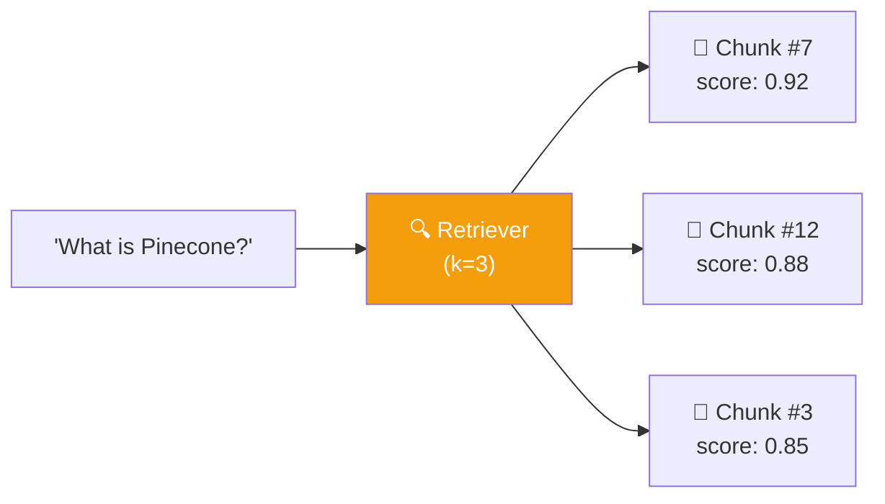
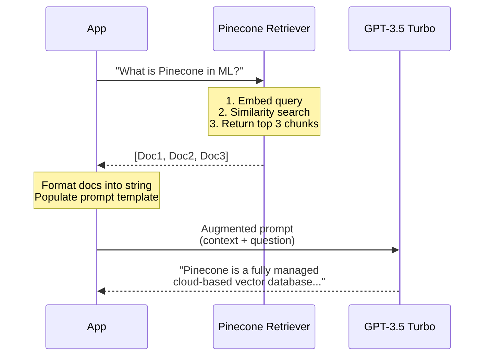

# 06.07 — Medium Analyzer: Naive Retrieval

## Overview

This lesson implements the **retrieval pipeline** — the second half of RAG. We take the user's question, search Pinecone for relevant chunks, inject them into the prompt, and have the LLM generate a grounded answer. We start with a **naive, step-by-step implementation** (no LCEL) to understand exactly what happens at each stage before moving to the elegant chain-based approach in Lesson 08.

---

## The Goal: Answer Questions About the Blog

We ingested a Medium article about vector databases in Lesson 05. Now we want to ask questions about it and get accurate, grounded answers.

**Test query:** *"What is Pinecone in machine learning?"*

---

## First: Without RAG (Baseline)

```python
from langchain_openai import ChatOpenAI
from langchain_core.messages import HumanMessage

llm = ChatOpenAI(model="gpt-3.5-turbo")
result = llm.invoke([HumanMessage(content="What is Pinecone in machine learning?")])
print(result.content)
```

**Output:** *"A pinecone algorithm is a method used in machine learning to search for the best configuration hyperparameters..."*

❌ **Wrong answer.** GPT-3.5 (training data cutoff) doesn't strongly associate "Pinecone" with the vector database. It hallucinates about a "pinecone algorithm." This is exactly the problem RAG solves — grounding the LLM's answer in actual data.

> [!NOTE]
> GPT-4o and later models know about Pinecone because their training data is more recent. But the principle holds: for private/niche/recent data, the LLM needs external context.

---

## Setting Up the Retrieval Components

```python
import os
from dotenv import load_dotenv
from langchain_core.prompts import ChatPromptTemplate
from langchain_core.messages import HumanMessage
from langchain_openai import ChatOpenAI, OpenAIEmbeddings
from langchain_pinecone import PineconeVectorStore

load_dotenv()

# Initialize components
embeddings = OpenAIEmbeddings(model="text-embedding-3-small")
llm = ChatOpenAI(model="gpt-3.5-turbo")

# Connect to existing Pinecone index (already populated by ingestion)
vectorstore = PineconeVectorStore(
    index_name=os.environ["INDEX_NAME"],
    embedding=embeddings
)

# Create a retriever (top 3 most relevant chunks)
retriever = vectorstore.as_retriever(
    search_kwargs={"k": 3}
)
```

### The Retriever Object

`vectorstore.as_retriever()` converts the vector store into a **LangChain Retriever** — an object with an `.invoke()` method that:
1. Takes a query string
2. Embeds it using the same embedding model
3. Performs similarity search in Pinecone
4. Returns the top K most relevant `Document` objects



### The Prompt Template

```python
prompt_template = ChatPromptTemplate.from_template(
    """Answer the question based only on the following context:

{context}

Question: {question}

Provide a detailed answer."""
)
```

This is the **augmented prompt** — it has two placeholders:
- `{context}` — where the retrieved chunks will be inserted
- `{question}` — the original user query

### The Format Function

```python
def format_docs(docs):
    return "\n\n".join(doc.page_content for doc in docs)
```

Takes a list of `Document` objects and concatenates their text content into a single string, separated by double newlines. This formatted string is what gets injected into the `{context}` placeholder.

---

## The Naive Implementation

```python
def retrieve_without_lcel(query: str) -> str:
    """Simple retrieval: manually retrieve, format, and generate."""

    # Step 1: Retrieve relevant documents
    documents = retriever.invoke(query)
    # → List of 3 Documents (the most relevant chunks)

    # Step 2: Format documents into a context string
    context = format_docs(documents)
    # → "Pinecone is a managed vector database...\n\n..."

    # Step 3: Create the augmented prompt
    messages = prompt_template.format_messages(
        context=context,
        question=query
    )
    # → [HumanMessage(content="Answer based on...\n\nContext:...\nQuestion:...")]

    # Step 4: Send to LLM
    response = llm.invoke(messages)

    # Step 5: Return the answer
    return response.content
```

### Step-by-Step Flow



### Running It

```python
if __name__ == "__main__":
    query = "What is Pinecone in machine learning?"

    # Without RAG (baseline)
    raw = llm.invoke([HumanMessage(content=query)])
    print(f"Without RAG: {raw.content}")

    # With RAG
    result = retrieve_without_lcel(query)
    print(f"With RAG: {result}")
```

**Output with RAG:** *"Pinecone is a fully managed cloud-based vector database specifically designed for businesses and organizations looking to build and deploy large-scale machine learning applications..."*

✅ **Correct answer**, grounded in the actual Medium article we ingested.

---

## Examining the Steps in Debug

### Step 1 — Retrieved Documents

```python
documents = retriever.invoke(query)
# len(documents) → 3
# documents[0].page_content → "Pinecone is a managed vector database..."
# documents[0].metadata → {"source": "./mediumblog.txt"}
```

The retriever returns the **3 most semantically similar** chunks. Each is a `Document` with the chunk text and source metadata.

### Step 2 — Formatted Context

```python
context = format_docs(documents)
# → "Pinecone is a managed vector database...\n\n
#    Vector embeddings are representations...\n\n
#    The key advantage of Pinecone is..."
```

A single string with all 3 chunks, separated by double newlines.

### Step 3 — Augmented Prompt

```python
messages = prompt_template.format_messages(context=context, question=query)
# messages[0].content →
#   "Answer the question based only on the following context:
#    
#    Pinecone is a managed vector database...
#    Vector embeddings are representations...
#    The key advantage of Pinecone is...
#    
#    Question: What is Pinecone in machine learning?
#    
#    Provide a detailed answer."
```

---

## LangSmith Trace Analysis

Because the naive implementation uses **individual component calls** (not a chain), the LangSmith trace shows **separate, disconnected entries**:

```
📊 Trace 1: VectorStoreRetriever
├── Input: "What is Pinecone in machine learning?"
└── Output: [Doc1, Doc2, Doc3]

📊 Trace 2: ChatOpenAI (separate trace!)
├── Input: Augmented prompt
└── Output: "Pinecone is a fully managed..."
```

This is the **main disadvantage** of the naive approach — the components aren't linked in a single trace. Debugging requires manually matching trace entries.

---

## Limitations of the Naive Approach

| Limitation | Problem |
|---|---|
| **No streaming** | Must wait for the full response; can't stream tokens to the user |
| **No async** | Blocks the thread during retrieval and LLM call |
| **No composability** | Can't easily pipe this into other chains or add middleware |
| **Poor tracing** | Components appear as separate LangSmith traces |
| **Manual wiring** | Every step must be manually connected — error-prone |

These limitations are all solved by the **LCEL-based approach** in Lesson 08.

---

## Summary

| Step | Code | What Happens |
|---|---|---|
| **Initialize** | `vectorstore.as_retriever(k=3)` | Creates a retriever that returns top 3 chunks |
| **Retrieve** | `retriever.invoke(query)` | Embeds query → similarity search → returns Documents |
| **Format** | `format_docs(documents)` | Joins chunk texts into one context string |
| **Augment** | `prompt_template.format_messages(context, question)` | Inserts context + question into prompt |
| **Generate** | `llm.invoke(messages)` | LLM produces answer grounded in context |

| Key Insight | Detail |
|---|---|
| **RAG works** | Same model (GPT-3.5) gives wrong answer without RAG, correct answer with RAG |
| **Naive = clear** | Easy to understand what happens at each step |
| **Naive = limited** | No streaming, no async, poor tracing, manual wiring |
| **Next step** | Lesson 08 rebuilds this with LCEL for a production-ready chain |