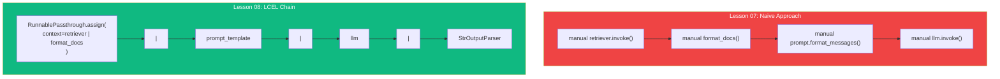
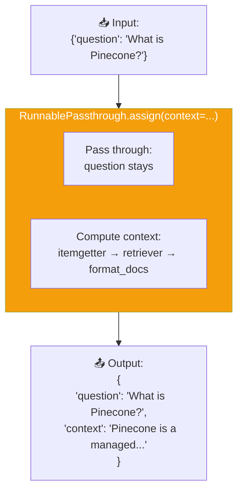
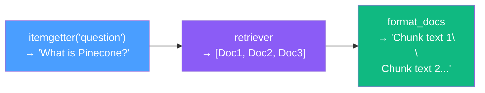

# 06.08 — Medium Analyzer: LCEL-Based RAG Chain

## Overview

This lesson rebuilds the naive retrieval pipeline from Lesson 07 using **LangChain Expression Language (LCEL)**. The result is a **composable, traceable, streamable chain** that performs the same RAG retrieval — but with full LangSmith observability, streaming support, async capabilities, and clean composability. This is the **production-ready** approach.

---

## Why LCEL?

| Capability | Naive (Lesson 07) | LCEL (This Lesson) |
|---|---|---|
| **Streaming** | ❌ No | ✅ Yes — `chain.stream()` |
| **Async** | ❌ No | ✅ Yes — `chain.ainvoke()` |
| **Batch processing** | ❌ Manual | ✅ Yes — `chain.batch()` |
| **LangSmith tracing** | ⚠️ Disconnected traces | ✅ Single unified trace |
| **Composability** | ❌ Standalone function | ✅ Pipe into other chains |
| **Type safety** | ❌ Manual | ✅ Runnable interface |

---

## The Same Result, Better Architecture

Both implementations take the same input and produce the same output. The difference is **how** they're structured:



---

## New Imports

```python
from langchain_core.output_parsers import StrOutputParser
from langchain_core.runnables import RunnablePassthrough
from operator import itemgetter
```

| Import | Purpose |
|---|---|
| `StrOutputParser` | Extracts `.content` from the LLM's `AIMessage` → returns a plain string |
| `RunnablePassthrough` | Passes input through unchanged; `.assign()` adds computed fields to the output dict |
| `itemgetter` | Python utility that extracts a key from a dict — cleaner than `lambda x: x["key"]` |

---

## Building the LCEL Chain

```python
def create_retrieval_chain():
    """Create a composable RAG chain using LCEL."""

    retrieval_chain = (
        RunnablePassthrough.assign(
            context=itemgetter("question") | retriever | format_docs
        )
        | prompt_template
        | llm
        | StrOutputParser()
    )

    return retrieval_chain
```

### This Is the Tricky Part

The chain above is compact but dense. Let's break it down step by step.

---

## Step-by-Step Breakdown

### The Input

When we invoke the chain, the input is a dictionary:

```python
{"question": "What is Pinecone in machine learning?"}
```

### Stage 1: `RunnablePassthrough.assign(context=...)`

This is the most complex part. `RunnablePassthrough.assign()` does two things simultaneously:

1. **Passes the input through** unchanged (the `{"question": "..."}` dict)
2. **Adds a new key** (`context`) to the output by running a sub-chain



**Input:** `{"question": "What is Pinecone?"}`  
**Output:** `{"question": "What is Pinecone?", "context": "Pinecone is a managed vector..."}`

### The Sub-Chain: `itemgetter("question") | retriever | format_docs`

This sub-chain runs inside the `assign()`:



1. **`itemgetter("question")`** — extracts the `"question"` value from the input dict → `"What is Pinecone?"`
2. **`retriever`** — embeds the string, searches Pinecone → `[Doc1, Doc2, Doc3]`
3. **`format_docs`** — concatenates document texts → `"Chunk 1 text\n\nChunk 2 text\n\nChunk 3 text"`

> [!NOTE]
> `format_docs` is a regular Python function, not a LangChain Runnable. When used in an LCEL pipe, LangChain **automatically wraps it** in a `RunnableLambda` — so it gains `.invoke()`, `.stream()`, and `.ainvoke()` for free.

### Stage 2: `| prompt_template`

Receives the dict `{"question": "...", "context": "..."}` and populates the prompt template:

```
Answer the question based only on the following context:

Pinecone is a managed vector database...
Chunk 2 text...
Chunk 3 text...

Question: What is Pinecone in machine learning?

Provide a detailed answer.
```

### Stage 3: `| llm`

Sends the populated prompt to GPT-3.5 Turbo → receives an `AIMessage`.

### Stage 4: `| StrOutputParser()`

Extracts `AIMessage.content` → returns a plain string (the answer text).

---

## Invoking the Chain

```python
if __name__ == "__main__":
    chain = create_retrieval_chain()

    result = chain.invoke({"question": "What is Pinecone in machine learning?"})
    print(result)
    # → "Pinecone is a fully managed cloud-based vector database..."
```

The result is identical to the naive implementation — but the chain is now a **Runnable** with full capabilities:

```python
# Streaming (token by token)
for chunk in chain.stream({"question": "What is Pinecone?"}):
    print(chunk, end="", flush=True)

# Async
result = await chain.ainvoke({"question": "What is Pinecone?"})

# Batch
results = chain.batch([
    {"question": "What is Pinecone?"},
    {"question": "How do embeddings work?"}
])
```

---

## LangSmith Trace: The Key Advantage

With the naive approach, traces were disconnected. With LCEL, **everything appears in one unified trace**:

```
📊 RunnableSequence (8.2s)
├── 📥 Input: {"question": "What is Pinecone in ML?"}
├── 🔧 RunnablePassthrough.assign
│   ├── 🔎 itemgetter → "What is Pinecone in ML?"
│   ├── 🔍 VectorStoreRetriever (1.2s)
│   │   ├── Input: "What is Pinecone in ML?"
│   │   └── Output: [Doc1, Doc2, Doc3]
│   └── 🔧 format_docs → "Pinecone is a managed..."
├── 📝 ChatPromptTemplate
│   ├── Input: {"question": "...", "context": "..."}
│   └── Output: [HumanMessage with augmented prompt]
├── 🤖 ChatOpenAI (6.5s)
│   ├── Input: Augmented prompt
│   └── Output: AIMessage("Pinecone is a fully managed...")
├── 📤 StrOutputParser → "Pinecone is a fully managed..."
└── 📤 Final Output: "Pinecone is a fully managed..."
```

Every step is **visible**, **timed**, and **linked**. You can see:
- What the retriever returned (and how long it took)
- The exact prompt that was sent to the LLM
- The LLM's response and timing
- Where bottlenecks are (retrieval? LLM? formatting?)

---

## Comparing Naive vs. LCEL Side-by-Side

| Naive Step | LCEL Equivalent |
|---|---|
| `docs = retriever.invoke(query)` | `itemgetter("question") \| retriever` (inside assign) |
| `context = format_docs(docs)` | `\| format_docs` (inside assign) |
| `messages = prompt.format_messages(...)` | `\| prompt_template` (accepts dict with both keys) |
| `response = llm.invoke(messages)` | `\| llm` |
| `return response.content` | `\| StrOutputParser()` |

---

## Summary

| Concept | What We Learned |
|---|---|
| **`RunnablePassthrough.assign()`** | Passes input through while adding new computed keys to the dict |
| **`itemgetter("question")`** | Extracts a specific key from the input dict — cleaner than lambda |
| **Auto-wrapping** | Regular Python functions are automatically wrapped as `RunnableLambda` in LCEL pipes |
| **Unified trace** | All steps appear in one LangSmith trace — crucial for debugging |
| **Streaming / Async / Batch** | Free capabilities from the Runnable interface |
| **Same result, better architecture** | LCEL produces identical answers but with production-ready infrastructure |
