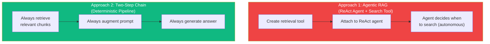
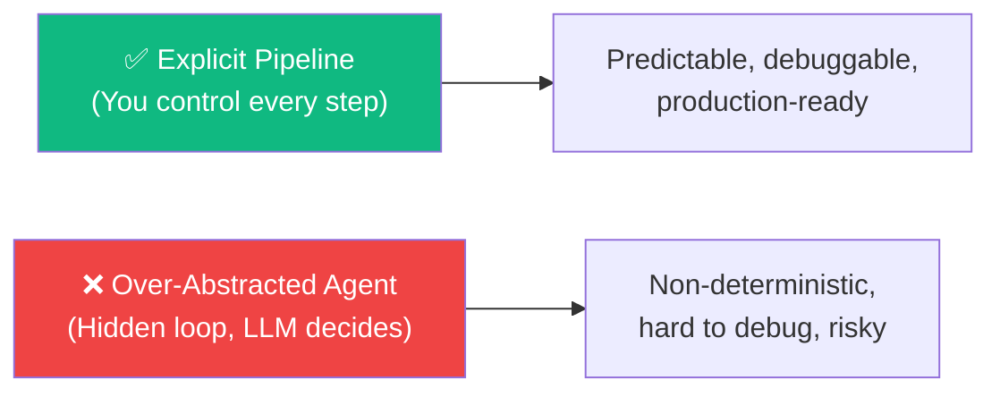
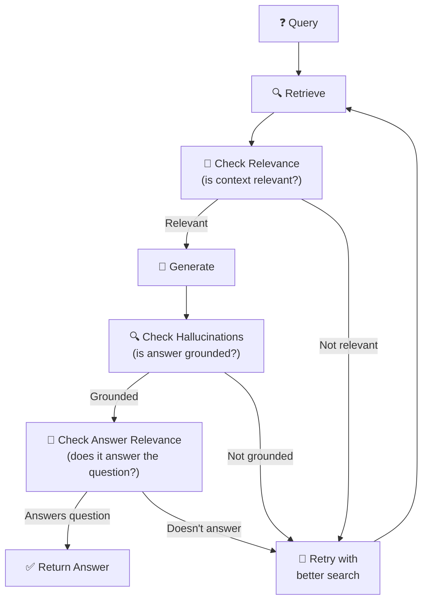

# 06.09 — LangChain RAG Documentation: Critical Analysis

## Overview

This lesson steps back from implementation to **critically examine LangChain's official RAG documentation**. The instructor identifies strengths and weaknesses in LangChain's recommended approaches, explains why the documentation's "agentic RAG" pattern is problematic for production, and highlights which patterns are worth adopting.

---

## LangChain's Two RAG Approaches

LangChain's documentation presents two main patterns for building RAG applications. Both have significant tradeoffs:



---

## Approach 1: Agentic RAG (Problematic)

LangChain's documentation shows wrapping the similarity search as a **tool** and giving it to a **ReAct agent**:

```python
# LangChain docs approach (simplified)
@tool
def retrieve_context(query: str) -> str:
    docs = vectorstore.similarity_search(query)
    return format_docs(docs)

agent = create_react_agent(
    llm, 
    tools=[retrieve_context],
    prompt="You have access to a tool that retrieves context..."
)
```

### Why This Is Problematic for Production

| Problem | Explanation |
|---|---|
| **LLM decides when to search** | The agent might skip searching when it should, or search unnecessarily |
| **Two inference calls** | One call to decide + generate the tool call, another to produce the answer → double the latency and cost |
| **Manipulation risk** | A ReAct agent is autonomous — it can be jailbroken to answer off-topic questions, bypass guardrails, or behave unexpectedly |
| **Non-deterministic** | The same query might trigger different behavior each time — the agent may or may not call the tool |
| **Hidden complexity** | `create_react_agent` abstracts away a loop that may change between LangChain versions |

> [!WARNING]
> **In production customer-facing applications, you almost never want the LLM to decide whether to search.** If you're building a customer support bot that should answer from your knowledge base, you always want to search. Leaving this decision to the agent adds unnecessary risk.

### When It Might Be Acceptable

The agentic approach has one legitimate use case: when the LLM should handle **multiple types of queries**, some requiring retrieval and some not (e.g., greetings, follow-ups). But even then, a deterministic router is more reliable than giving the agent full autonomy.

---

## Approach 2: Two-Step Chain (What We Built)

The second approach in LangChain's docs matches what we implemented in Lessons 07–08:

```python
# Always search, always augment, always generate
chain = (
    RunnablePassthrough.assign(
        context=itemgetter("question") | retriever | format_docs
    )
    | prompt_template
    | llm
    | StrOutputParser()
)
```

### Advantages

| Advantage | Detail |
|---|---|
| **Deterministic** | Always retrieves, always augments, always generates — no surprises |
| **Single inference call** | One LLM call (not two) → lower cost and latency |
| **Predictable behavior** | Same input always produces the same pipeline behavior |
| **Full control** | You see and control every step |
| **Traceable** | Clean LangSmith trace with all steps visible |

### LangChain's Acknowledged Tradeoffs

Even LangChain's documentation acknowledges the tradeoffs:

| Factor | Agentic RAG | Two-Step Chain |
|---|---|---|
| **Control** | Low — LLM decides | High — always retrieves |
| **Inference calls** | 2 per query | 1 per query |
| **Cost** | Higher | Lower |
| **Latency** | Higher | Lower |
| **Flexibility** | More — can skip search | Less — always searches |
| **Reliability** | Lower — non-deterministic | Higher — predictable |

---

## The Real Problem with the Documentation

The documentation's Approach 1 uses `create_react_agent` which:

1. **Runs in a loop** — the agent can make multiple iterations
2. **Abstracts away behavior** — you can't easily see what the agent is doing
3. **Changes between versions** — internal implementation may shift, breaking your app
4. **Over-abstracts** — too much magic for something that should be explicit



---

## What IS Worth Adopting from the Docs

### Custom RAG Agent via LangGraph

LangChain's documentation includes a **"Custom RAG Agent under LangGraph"** section — and this one is excellent:



This architecture:
- Is **based on research papers**
- Uses **explicit nodes and edges** (LangGraph)
- Has **hallucination checking** and **relevance checking**
- Is **deterministic** in its control flow (edges, not agent decisions)
- Is covered in depth in the **Agentic RAG section** (Section 13) of this course

---

## Summary

| Pattern | Verdict | Why |
|---|---|---|
| **Agentic RAG** (ReAct agent + tool) | ⚠️ Avoid for production | Non-deterministic, double cost, manipulation risk, over-abstracted |
| **Two-Step Chain** (LCEL) | ✅ Use this | Deterministic, single call, full control, traceable |
| **Custom RAG Agent** (LangGraph) | ✅ Use for advanced cases | Research-backed, explicit nodes, hallucination checks |

| Key Takeaway | Detail |
|---|---|
| **Don't let the LLM decide when to search** | If your app needs retrieval, always retrieve |
| **Explicit > Abstract** | Control every step of the pipeline; avoid hidden loops |
| **Two inference calls ≠ one** | Agentic RAG costs twice as much per query |
| **LangGraph is the real answer** | For complex RAG with quality checking, use LangGraph (Section 13) |
