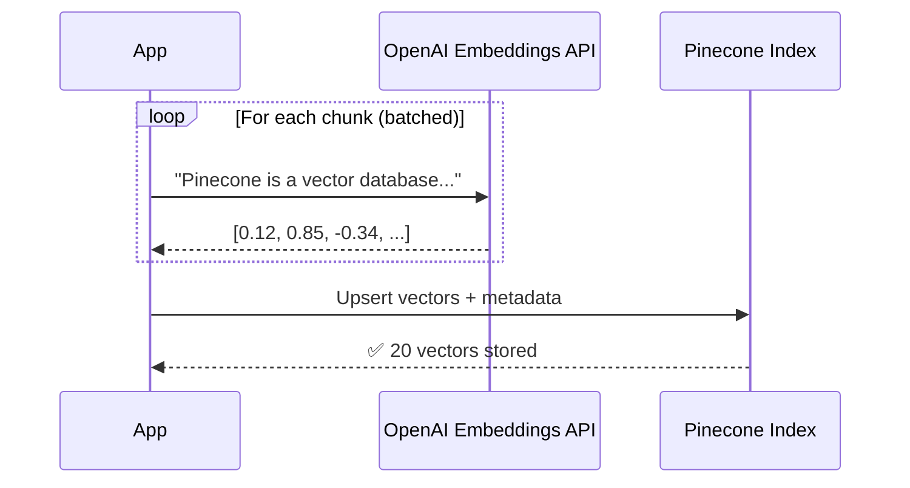
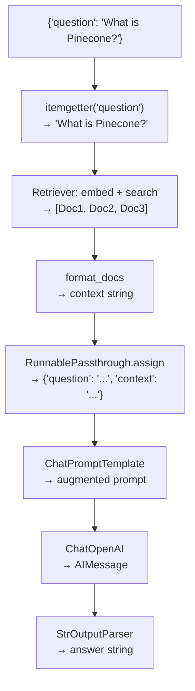

# 06.10 — RAG Implementation with Vector Stores: Quiz & Review

## Overview

This quiz covers the complete RAG pipeline — from ingestion (loading, splitting, embedding, storing) to retrieval (searching, augmenting, generating). Each question tests a core concept from the section.

---

## Question 1: CharacterTextSplitter

**Q:** What is the primary purpose of `CharacterTextSplitter` with `chunk_size=1000` and `chunk_overlap=0` in the RAG pipeline?

**A:** To break large documents into smaller, semantically meaningful chunks for embedding and retrieval.

**Deep Explanation:**

Documents are typically too large to embed as a single vector — a 300-page book would produce one massive, unfocused vector that can't be meaningfully compared to short user queries. The text splitter divides the document into smaller chunks (~1000 characters each) so that each chunk represents a **focused, searchable unit of information**.


With `chunk_overlap=0`, adjacent chunks don't share content. This is simpler but risks losing information split across chunk boundaries. For production, `chunk_overlap=100-200` is often recommended to preserve context continuity.

---

## Question 2: OpenAIEmbeddings

**Q:** In the context of RAG ingestion, what role do `OpenAIEmbeddings` serve?

**A:** They convert text chunks into high-dimensional vector representations that capture semantic meaning.

**Deep Explanation:**

Embeddings are the bridge between **text** (what humans understand) and **vectors** (what machines can search). The embedding model transforms each chunk into a list of 1536 numbers such that semantically similar texts produce similar vectors:

```python
embeddings = OpenAIEmbeddings(model="text-embedding-3-small")

# "Pinecone is a vector database" → [0.12, 0.85, -0.34, ...] (1536 floats)
# "Vector databases store embeddings" → [0.11, 0.83, -0.31, ...] (similar!)
# "The weather is sunny today" → [-0.67, 0.21, 0.93, ...] (very different!)
```

Without embeddings, there's no way to perform **semantic** search. Keyword search would miss synonyms, paraphrases, and related concepts.

---

## Question 3: PineconeVectorStore.from_documents()

**Q:** What happens when you call `PineconeVectorStore.from_documents(docs, embeddings, index_name="rag-index")`?

**A:** It embeds each document chunk using the provided embedding model, then stores both the vectors and their metadata (text + source) in the Pinecone index.

**Deep Explanation:**

This single call orchestrates the entire storage pipeline:



LangChain handles batching (to avoid rate limits), threading (for parallel embedding), and error handling behind this simple API.

---

## Question 4: vectorstore.as_retriever()

**Q:** What is the purpose of `vectorstore.as_retriever()` in the retrieval chain?

**A:** It converts the vector store into a Retriever interface — a LangChain Runnable with `.invoke()` that accepts a query string and returns the most similar document chunks.

**Deep Explanation:**

A vector store knows how to **store and search**. A retriever wraps it in the **Runnable interface** needed for LCEL chains:

```python
retriever = vectorstore.as_retriever(search_kwargs={"k": 3})

# Now it's a Runnable — can be used in LCEL pipes:
docs = retriever.invoke("What is Pinecone?")   # → [Doc1, Doc2, Doc3]
```

The `k=3` parameter says: return the **3 most semantically similar** chunks. Under the hood, the retriever embeds the query, performs cosine similarity search in Pinecone, and returns the top results.

---

## Question 5: The RAG Prompt

**Q:** How does the augmented prompt combine context and question?

**A:** The prompt template has two placeholders — `{context}` (filled with retrieved chunks) and `{question}` (filled with the user's query). The LLM is instructed to answer **only** based on the provided context.

**Deep Explanation:**

```python
prompt_template = ChatPromptTemplate.from_template("""
Answer the question based only on the following context:

{context}

Question: {question}

Provide a detailed answer.
""")
```

The phrase **"based only on the following context"** is critical — it tells the LLM to ground its answer in the retrieved chunks rather than its training data. This prevents hallucination and ensures the answer comes from your actual documents.

---

## Question 6: Invoking the Retrieval Chain

**Q:** In the retrieval chain, what happens when you invoke with `{"question": query}`?

**A:** The query is embedded into a vector, similar document chunks are retrieved from Pinecone, the prompt is augmented with the chunks as context, and the LLM generates a grounded answer.

**Deep Explanation (LCEL flow):**



---

## Question 7: Environment Variables

**Q:** Why is the environment variable `INDEX_NAME` used instead of hardcoding the Pinecone index name?

**A:** It allows flexible deployment across different environments (dev, staging, production) without changing code.

**Deep Explanation:**

```bash
# Development
INDEX_NAME=rag-dev-index

# Staging
INDEX_NAME=rag-staging-index

# Production
INDEX_NAME=rag-prod-index
```

The same application code works in all environments. This is a **12-factor app** best practice. For `PINECONE_API_KEY` specifically, LangChain's Pinecone integration auto-detects this exact variable name — using a different name would break the auto-detection.