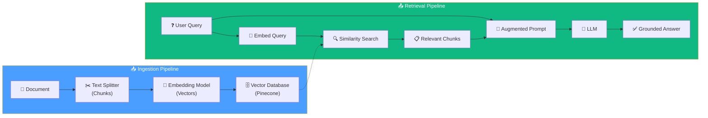

# 06. The Essentials of RAG — Embeddings, Vector Databases, Retrieval

## Overview

**Retrieval-Augmented Generation (RAG)** is the foundational technique for letting LLMs answer questions about data they weren't trained on. Instead of stuffing the entire document into the prompt, RAG retrieves only the **most relevant chunks** and injects them as context — solving token limits, cost, latency, and accuracy problems in one stroke.

This section covers the **complete RAG pipeline**: from the conceptual motivation, through data ingestion (chunking + embedding + vector storage), to retrieval (similarity search + prompt augmentation + LLM generation).

## Architecture at a Glance

## Lesson Map

| # | Lesson | Focus |
|---|---|---|
| 1 | [Introduction to RAG](01-introduction-to-retrieval-augmentation-generation.md) | Why RAG exists — motivation, the naive approach vs. chunked retrieval |
| 2 | [RAG Implementation Concepts](02-introduction-to-rag-implementation.md) | Embeddings, vector spaces, similarity search, vector databases |
| 3 | [Boilerplate Setup](03-medium-analyzer-boilerplate-setup.md) | Project init, dependencies, Pinecone index creation, environment variables |
| 4 | [LangChain Classes](04-medium-analyzer-class-review.md) | Document loaders, text splitters, embeddings, vector stores — class review |
| 5 | [Ingestion Implementation](05-medium-analyzer-ingestion-implementation.md) | End-to-end ingestion: load → split → embed → store in Pinecone |
| 6 | [Recap & Transition](06-recap.md) | Bridging ingestion to retrieval |
| 7 | [Naive Retrieval](07-medium-analyzer-naive-retrieval.md) | Manual retrieval pipeline — step-by-step without LCEL |
| 8 | [LCEL-Based RAG Chain](08-medium-analyzer-2-step-rag.md) | LangChain Expression Language — composable, traceable retrieval chain |
| 9 | [LangChain RAG Docs Review](09-langchain-rag-documentation.md) | Critical analysis of LangChain's official RAG documentation |
| 10 | [Quiz](10-rag-implementation-with-vector-stores-quiz.md) | Knowledge check — 7 questions covering the full pipeline |

## Key Technologies

| Technology | Role |
|---|---|
| **LangChain** | Document loaders, text splitters, embeddings interface, LCEL chains |
| **OpenAI Embeddings** | `text-embedding-3-small` — converts text to 1536-dimensional vectors |
| **Pinecone** | Managed cloud vector database — stores and searches embeddings |
| **OpenAI GPT-3.5/4** | LLM for generating answers from retrieved context |
| **LangSmith** | Tracing and observability for the full RAG pipeline |
