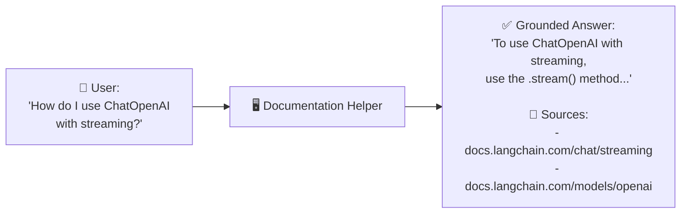
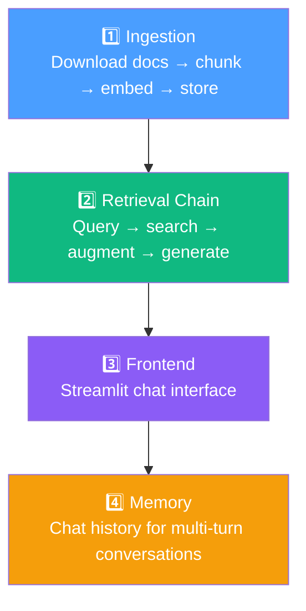

# 07.01 — What Are We Building?

## Overview

This lesson introduces the **Documentation Helper** project — a full-stack RAG application that lets users ask natural language questions about a package's documentation and receive accurate, grounded answers with source citations. We're building this **end-to-end**: the ingestion pipeline, the retrieval chain, and a chat-based frontend.

---

## The Project: Documentation Helper

The application takes any package's documentation (in this case, the **LangChain documentation**), ingests it into a vector store, and enables question-answering over it — with source citations so the user knows exactly where the answer came from.

---

## The Four Parts

The project is built in four phases:

| Phase | What We Build | Key Technologies |
|---|---|---|
| **Ingestion** | Download the LangChain docs, chunk every page, embed with OpenAI, store in Pinecone | Tavily Crawl, RecursiveCharacterTextSplitter, OpenAIEmbeddings, PineconeVectorStore |
| **Retrieval** | Create a LangGraph agent with a retrieval tool that searches the vector store | `create_agent`, `@tool`, `as_retriever`, `initChatModel` |
| **Frontend** | Build a chat interface where users type questions and see answers with sources | Streamlit, session state, chat messages, source expanders |
| **Memory** | Add conversation memory so the chat can reference previous questions | Streamlit session state |

---

## What Makes This Different from Section 06

| Aspect | Section 06 (RAG Essentials) | Section 07 (Documentation Helper) |
|---|---|---|
| **Data source** | Single text file (one blog post) | Entire website (hundreds of pages) |
| **Crawling** | Manual file copy | Automated web crawling (Tavily) |
| **Scale** | ~20 chunks | ~6,500 chunks |
| **Retrieval** | LCEL chain (deterministic) | LangGraph agent with tool (agentic) |
| **Frontend** | None (CLI only) | Streamlit chat UI with sources |
| **Rate limiting** | Not an issue | Critical — concurrent batch processing |

---

## Topics Covered

This section dives deep into production-relevant topics:

- **Web crawling** — automated documentation scraping with Tavily
- **Concurrent processing** — async batch extraction and indexing
- **Rate limiting** — handling API throttling with retry strategies
- **Text splitting** — RecursiveCharacterTextSplitter for semantic chunking
- **Agent-based retrieval** — LangGraph agent with a custom retrieval tool
- **Content vs artifact** — separating LLM context from application data
- **Streamlit** — Python-based rapid UI prototyping
- **Production patterns** — analysis of Chat LangChain (LangChain's own production RAG app)
- **RAG architectures** — two-step, agentic, and hybrid approaches

---

## Summary

We're building a **Documentation Helper** that:
1. **Crawls** the LangChain documentation website automatically
2. **Ingests** it into a searchable vector store (Pinecone)
3. **Answers** questions using a LangGraph agent with a retrieval tool
4. **Cites** sources so users can verify the answer
5. Runs in a **Streamlit chat interface** for easy testing and QA