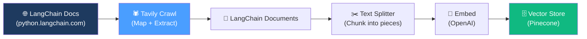

# 07.04 — Ingestion Pipeline Introduction

## Overview

Before diving into code, this lesson provides the **architectural overview** of the ingestion pipeline — the steps we'll implement over the next several lessons to transform a live documentation website into a searchable vector store.

---

## The Pipeline at a Glance

---

## Why Tavily?

In earlier versions of this course, documentation crawling was done **manually** — writing custom scripts to scrape HTML, handle pagination, deal with bot protection, manage dynamic rendering, etc. This was:

- **Error-prone** — different machines behaved differently
- **Fragile** — site structure changes broke the scripts
- **Time-consuming** — debugging crawling issues took hours

**Tavily** (previously Firecrawl was also considered) provides a **managed crawling API** that handles all of this complexity:

| Feature | Manual Approach | Tavily |
|---|---|---|
| Bot protection | 🔧 Handle yourself | ✅ Built-in |
| Dynamic rendering | 🔧 Headless browser setup | ✅ Automatic |
| Rate limiting | 🔧 Custom backoff logic | ✅ Managed |
| Concurrent extraction | 🔧 Threading code | ✅ API-level parallelism |
| Table/embed extraction | 🔧 Custom parsers | ✅ Advanced mode |
| Setup time | Hours | Minutes |

> [!TIP]
> **General principle**: If crawling isn't your core business logic, offload it to a third-party that specializes in it. This frees you to focus on the RAG pipeline itself.

### Tavily's Free Tier

Tavily offers a generous free tier that's more than sufficient for this project and course.

---

## What's Coming Next

| Lesson | What We Build |
|---|---|
| **05** | Initialize all imports, embedding model, vector store, SSL config |
| **06** | Crawl the documentation using `TavilyCrawl` (one-call approach) |
| **07–08** | (Optional) Manual crawling with `TavilyMap` + `TavilyExtract` for more control |
| **09** | Recap transition to chunking |
| **10** | Chunk documents with `RecursiveCharacterTextSplitter` |
| **11** | Batch-index chunks into Pinecone concurrently |

The heavy lifting is shared between **Tavily** (crawling) and **LangChain** (chunking, embedding, indexing). Our job is to orchestrate them correctly.