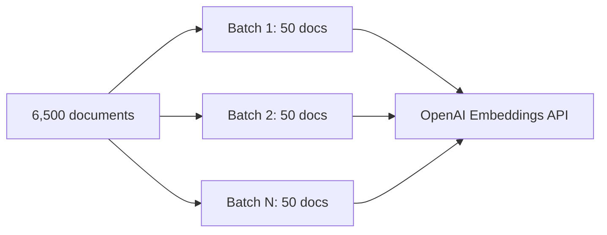

# 07.05 — Imports & Initialization

## Overview

This lesson defines all the imports, configurations, and object initializations needed for the ingestion pipeline. We set up the embedding model (with rate limiting parameters), the vector store, SSL context, and Tavily crawling clients. Understanding **why** each parameter exists — especially rate limiting and batch sizing — is critical for production RAG applications.

---

## The Complete Import Block

```python
import os
import ssl
import asyncio
from typing import List

import certifi
from dotenv import load_dotenv

# LangChain core
from langchain.text_splitter import RecursiveCharacterTextSplitter
from langchain_community.vectorstores import Chroma          # Local alternative
from langchain_pinecone import PineconeVectorStore            # Cloud vector store
from langchain_core.documents import Document
from langchain_openai import OpenAIEmbeddings

# Tavily (crawling)
from langchain_tavily import TavilyCrawl, TavilyExtract, TavilyMap

# Project utilities
from logger import log_info, log_success, log_error, log_warning, log_header

load_dotenv()
```

### Import Purpose Table

| Import | Purpose |
|---|---|
| `os` | Access environment variables |
| `ssl` / `certifi` | Create valid SSL context for HTTP requests |
| `asyncio` | Run concurrent async operations |
| `RecursiveCharacterTextSplitter` | Semantic-aware text chunking |
| `Chroma` | Local open-source vector store (alternative) |
| `PineconeVectorStore` | Cloud-managed vector store |
| `Document` | LangChain's core text+metadata abstraction |
| `OpenAIEmbeddings` | Text → vector conversion |
| `TavilyCrawl` / `TavilyMap` / `TavilyExtract` | Web crawling and content extraction |
| `logger.*` | Color-coded logging utilities (pre-built in `logger.py`) |

---

## SSL Configuration

```python
ssl_context = ssl.create_default_context(cafile=certifi.where())
```

This creates an SSL context with a valid certificate bundle. It's **defensive programming** — without it, you may encounter `SSLCertificateError` on some systems, especially when making many concurrent HTTP requests.

> [!WARNING]
> If you're on a **corporate VPN**, you may still get certificate errors even with this setup. Temporarily disable the VPN to make the crawling requests.

---

## Embedding Model Initialization

```python
embeddings = OpenAIEmbeddings(
    model="text-embedding-3-small",
    show_progress_bar=True,
    chunk_size=50,
    retry_min_seconds=10,
)
```

### Parameter Deep Dive

| Parameter | Value | Why |
|---|---|---|
| `model` | `text-embedding-3-small` | Good quality at low cost; must match Pinecone dimensions (1536) |
| `show_progress_bar` | `True` | Visual indication during large batch processing |
| `chunk_size` | `50` | Max documents embedded per API request — controls rate limiting |
| `retry_min_seconds` | `10` | Minimum wait before retrying after a failed (rate-limited) request |

### Understanding `chunk_size` (Embedding Batch Size)

This is **not** the text splitter's chunk size — it's how many documents are sent to OpenAI's embedding API **per request**:



| Value | Effect |
|---|---|
| **Too high** (1000) | Hit rate limits → `429 Too Many Requests` errors |
| **Too low** (1) | Excessively slow — one API call per document |
| **Sweet spot** (~50) | Balanced throughput without triggering rate limits |

### Understanding `retry_min_seconds`

When embedding at scale, you **will** get rate-limited (error code `429`). LangChain automatically retries failed requests — `retry_min_seconds` sets the minimum wait:

```
ERROR: 429 Rate limit exceeded. Retry after 194ms.
→ Wait at least 10 seconds...
→ Retry batch...
→ ✅ Success
```

| Value | Tradeoff |
|---|---|
| **Too short** (1s) | Retries too quickly → gets rate-limited again |
| **Too long** (60s) | Safe but slow — takes ages to process large datasets |
| **Moderate** (10s) | Heuristic that usually clears the rate limit window |

> [!IMPORTANT]
> **Rate limiting is universal** in production GenAI applications. Every cloud API (OpenAI, Cohere, Pinecone, etc.) has token-per-minute or request-per-minute limits. Understanding retry strategies is essential production knowledge. Common algorithms include **token bucket**, **leaky bucket**, and **exponential backoff**.

---

## Vector Store Initialization

### Option A: Pinecone (Cloud-Managed) — Recommended

```python
vectorstore = PineconeVectorStore(
    index_name="langchain-docs-2025",
    embedding=embeddings,
)
```

### Option B: ChromaDB (Local) — Alternative

```python
vectorstore = Chroma(
    persist_directory="./chroma_db",
    embedding_function=embeddings,
)
```

| Feature | Pinecone | ChromaDB |
|---|---|---|
| **Type** | Cloud-managed | Local (SQLite-based) |
| **Persistence** | Cloud — survives machine restarts | Local directory — `./chroma_db/` |
| **Free tier** | ✅ Yes | ✅ Free (open source) |
| **Scaling** | Handles millions of vectors | Better for development/prototyping |
| **Setup** | Requires API key + index creation | Zero setup — just point to a directory |

> [!TIP]
> Use **ChromaDB** for local development and fast iteration. Switch to **Pinecone** when you need cloud persistence, team access, or production scale.

---

## Tavily Client Initialization

```python
crawl = TavilyCrawl()       # One-call crawling (recommended)
extract = TavilyExtract()   # Manual content extraction
map_client = TavilyMap()    # URL discovery / sitemap
```

| Client | Purpose | When to Use |
|---|---|---|
| `TavilyCrawl` | One-call: map + extract + filter automatically | **Default choice** — simplest approach |
| `TavilyMap` | Discover all URLs on a site (sitemap) | When you need URL-level control |
| `TavilyExtract` | Extract content from specific URLs | When you need per-URL customization |

---

## Summary

| Component | Configuration | Key Insight |
|---|---|---|
| **Embeddings** | `chunk_size=50`, `retry_min_seconds=10` | Rate limiting is the main constraint at scale |
| **Vector store** | Pinecone (cloud) or ChromaDB (local) | Same LangChain interface — swap with one line |
| **SSL** | `certifi` for valid certificates | Defensive programming against cert errors |
| **Tavily** | `TavilyCrawl` (+ optional Map/Extract) | Offload crawling complexity to a specialist |