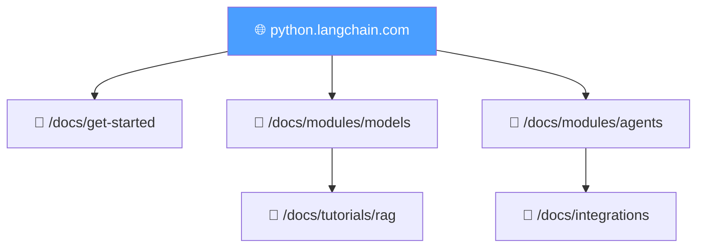
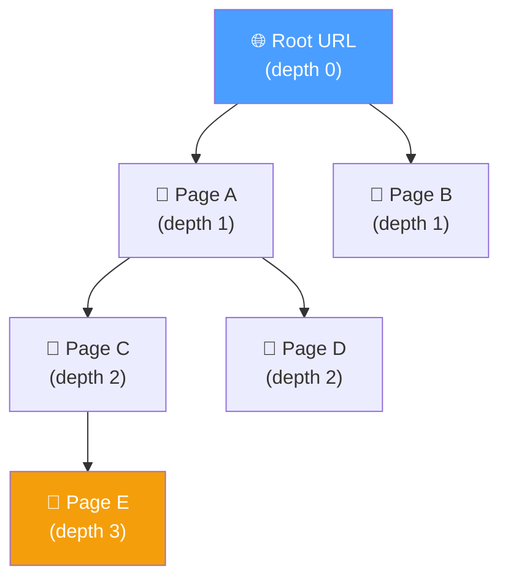
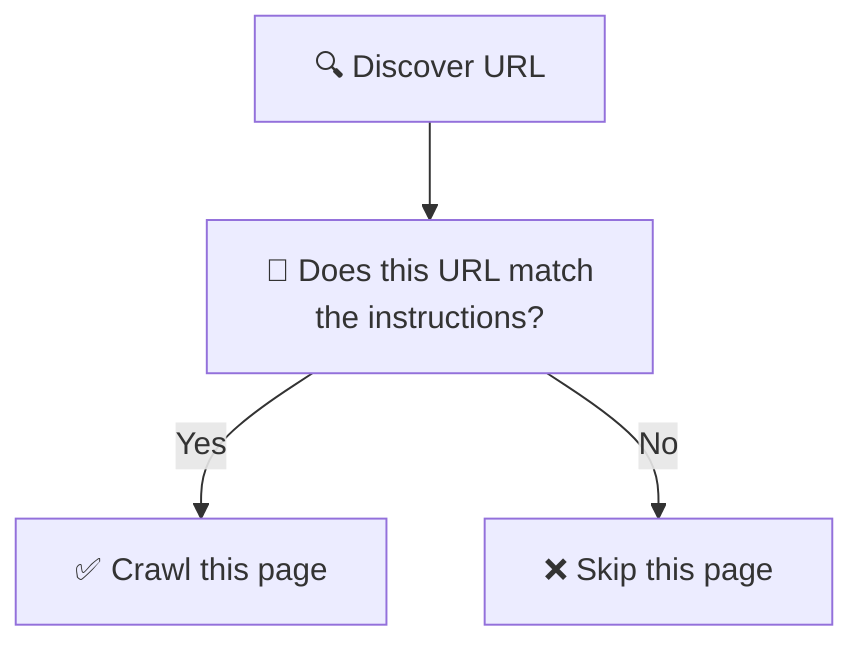

# 07.06 — Tavily Crawl: Automated Documentation Crawling

## Overview

This lesson demonstrates the simplest approach to crawling a documentation website: **TavilyCrawl** — a single API call that automatically maps, filters, and extracts content from an entire site. We explore the key parameters (`max_depth`, `extract_depth`, `instructions`) and see how to convert crawled results into LangChain `Document` objects for downstream processing.

---

## What Is Web Crawling?

**Web crawling** is the automated process of browsing a website by following hyperlinks — discovering pages, extracting content, and moving deeper into the site structure. For RAG applications, crawling is how we acquire the source data.



---

## Using TavilyCrawl

```python
async def main():
    log_header("Documentation Ingestion Pipeline")
    log_info("Using TavilyCrawl to start crawling python.langchain.com")

    result = crawl.invoke({
        "url": "https://python.langchain.com",
        "max_depth": 5,
        "extract_depth": "advanced",
    })
```

### The `max_depth` Parameter

`max_depth` controls **how far from the root URL** the crawler explores:

| max_depth | Pages Found | Time | Use Case |
|---|---|---|---|
| `1` | ~18 | <1 second | Quick test — top-level pages only |
| `2` | ~75 | Few seconds | Moderate coverage |
| `5` (max) | ~251 | ~26 seconds | Full documentation crawl |



> [!TIP]
> **Best practice**: Start with `max_depth=1` or `2` for fast iteration. Only increase after reviewing the results and confirming you need deeper pages. Higher depth can be **exponentially slower** depending on the site's topology.

### The `extract_depth` Parameter

| Value | Behavior |
|---|---|
| `"basic"` | Standard text extraction — fast |
| `"advanced"` | Extracts tables, embedded content, code blocks — more thorough but higher latency |

For documentation sites with code examples and tables, **always use `"advanced"`**.

---

## The `instructions` Parameter: Intelligent Filtering

The most powerful parameter — provide **natural language instructions** that guide the crawler on which pages to scrape:

```python
result = crawl.invoke({
    "url": "https://python.langchain.com",
    "max_depth": 5,
    "extract_depth": "advanced",
    "instructions": "Search for content on AI agents",
})
```

**Without instructions**: 251 pages (everything)  
**With instructions**: 23 pages (only agent-related documentation)

### How Instructions Work



Instructions act as a **URL-level filter** during the mapping phase. The crawler decides for each discovered URL whether to extract its content based on the instruction.

> [!IMPORTANT]
> **Write instructions as filtering criteria**, not questions. The instructions help Tavily decide *which pages to crawl*, not *what to extract from those pages*.
> 
> ✅ Good: `"Content about AI agents and autonomous systems"`  
> ❌ Bad: `"What are AI agents?"`

### Instructions + max_depth Synergy

With instructions active, you can safely use **higher `max_depth`** because the crawler skips irrelevant pages. The filtering offsets the depth increase.

---

## Converting Results to LangChain Documents

The crawl result is a dictionary with a `results` key containing a list of scraped pages:

```python
# Result structure:
# {
#     "base_url": "https://python.langchain.com",
#     "results": [
#         {"url": "https://...", "raw_content": "Page text..."},
#         {"url": "https://...", "raw_content": "Page text..."},
#         ...
#     ]
# }

# Convert to LangChain Documents
all_docs = [
    Document(
        page_content=result["raw_content"],
        metadata={"source": result["url"]}
    )
    for result in result["results"]
]
```

### Why the `metadata.source` Field Matters

| Purpose | How Source URL Is Used |
|---|---|
| **Citations** | Show users where the answer came from |
| **Trust** | Users can click the link and verify the answer |
| **Debugging** | Trace which chunk produced a wrong answer |
| **Filtering** | Search only within specific sections of the docs |

---

## Summary

| Feature | Value | Effect |
|---|---|---|
| **`max_depth`** | 1–5 | Controls how deep the crawler explores; higher = more pages but slower |
| **`extract_depth`** | `"advanced"` | Extracts tables, code blocks, and embedded content |
| **`instructions`** | Natural language | Filters pages by topic — reduces noise, enables higher depth |
| **Output** | `List[Document]` | Each page → one Document with `page_content` + `metadata.source` |

| Key Insight | Detail |
|---|---|
| **Start shallow** | Use `max_depth=1` for fast iteration; increase only when needed |
| **Instructions as filters** | They decide which URLs to crawl, not what to extract |
| **Always save source** | The `metadata.source` URL enables citations and debugging |
| **One-call simplicity** | `TavilyCrawl` combines mapping + filtering + extraction in one call |