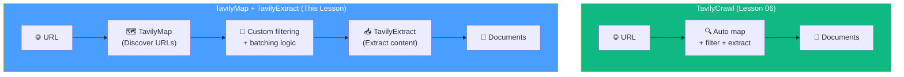

# 07.07 — TavilyMap & TavilyExtract: Manual Two-Step Crawling

## Overview

While `TavilyCrawl` (Lesson 06) handles everything in one call, sometimes you need **more granular control** over the crawling process. `TavilyMap` and `TavilyExtract` split crawling into two explicit steps: first **discover all URLs** (map), then **extract content from selected URLs** (extract). This lesson covers when and why you'd use this approach.

---

## TavilyCrawl vs TavilyMap + TavilyExtract



| Approach | Control | Complexity | Best For |
|---|---|---|---|
| **TavilyCrawl** | Low — Tavily decides everything | Simple — one call | Most use cases |
| **Map + Extract** | High — you control URL selection, batching, filtering | More code | Custom filtering, specific page selection |

---

## Step 1: TavilyMap — Discover URLs

```python
sitemap = map_client.invoke({
    "url": "https://python.langchain.com",
})

urls = sitemap["results"]
print(f"Discovered {len(urls)} URLs")
# → Discovered 500 URLs
```

`TavilyMap` returns a list of **all discoverable URLs** on the site. It doesn't extract any content — just builds the sitemap.

### What You Can Do With the URL List

- **Filter** by pattern: only URLs containing `/agents/`, `/tutorials/`, etc.
- **Exclude** certain sections: skip `/blog/`, `/changelog/`, etc.
- **Prioritize**: process the most important pages first
- **Batch**: group URLs for concurrent extraction

---

## Step 2: TavilyExtract — Extract Content

```python
# Extract content from specific URLs
result = extract.invoke({
    "urls": ["https://python.langchain.com/docs/get-started", ...]
})

# Each result has: {"url": "...", "raw_content": "..."}
```

`TavilyExtract` accepts a **list of URLs** and returns the extracted content for each. It supports batch processing — you can send multiple URLs in a single API call.

### Batch Processing Strategy

```python
def chunk_urls(urls: list, chunk_size: int = 20) -> list:
    """Split URL list into batches."""
    return [urls[i:i + chunk_size] for i in range(0, len(urls), chunk_size)]

batches = chunk_urls(urls, chunk_size=20)
# 500 URLs → 25 batches of 20 URLs each
```

> [!NOTE]
> Don't make the batch size too large — the API has limits on how many URLs it can process per request. `20` is a safe starting point.

---

## When to Use Map + Extract

| Scenario | Use TavilyCrawl | Use Map + Extract |
|---|---|---|
| "Give me everything from this site" | ✅ | ❌ Overkill |
| "I need only the `/tutorials/` section" | ⚠️ Use instructions | ✅ Filter URLs after mapping |
| "I want to process URLs in custom order" | ❌ Can't control | ✅ Full control |
| "I need to resume after a failure" | ❌ Start over | ✅ Skip already-processed URLs |
| "I want to add custom metadata per section" | ❌ No control | ✅ Add metadata based on URL path |

---

## Summary

| Component | Purpose | Key Insight |
|---|---|---|
| **TavilyMap** | Discover all URLs on a site | Returns URLs only — no content extraction |
| **TavilyExtract** | Extract content from specific URLs | Accepts URL lists — supports batch processing |
| **When to combine** | Need custom filtering, batching, or URL-level control | More code, but more flexibility |
| **Default recommendation** | Use `TavilyCrawl` unless you specifically need more control | Simpler is better for most use cases |
