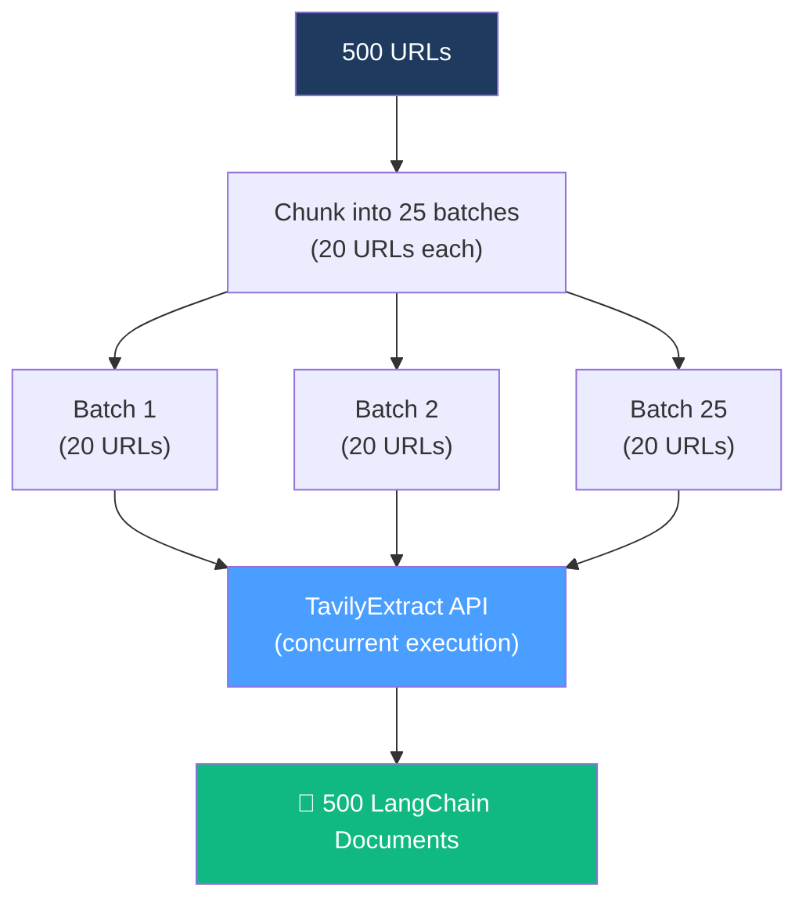
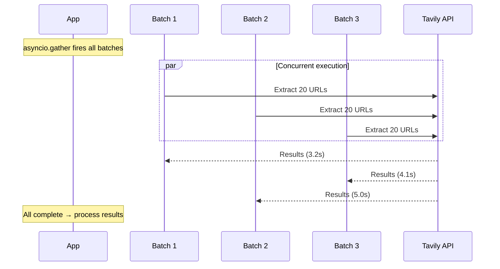
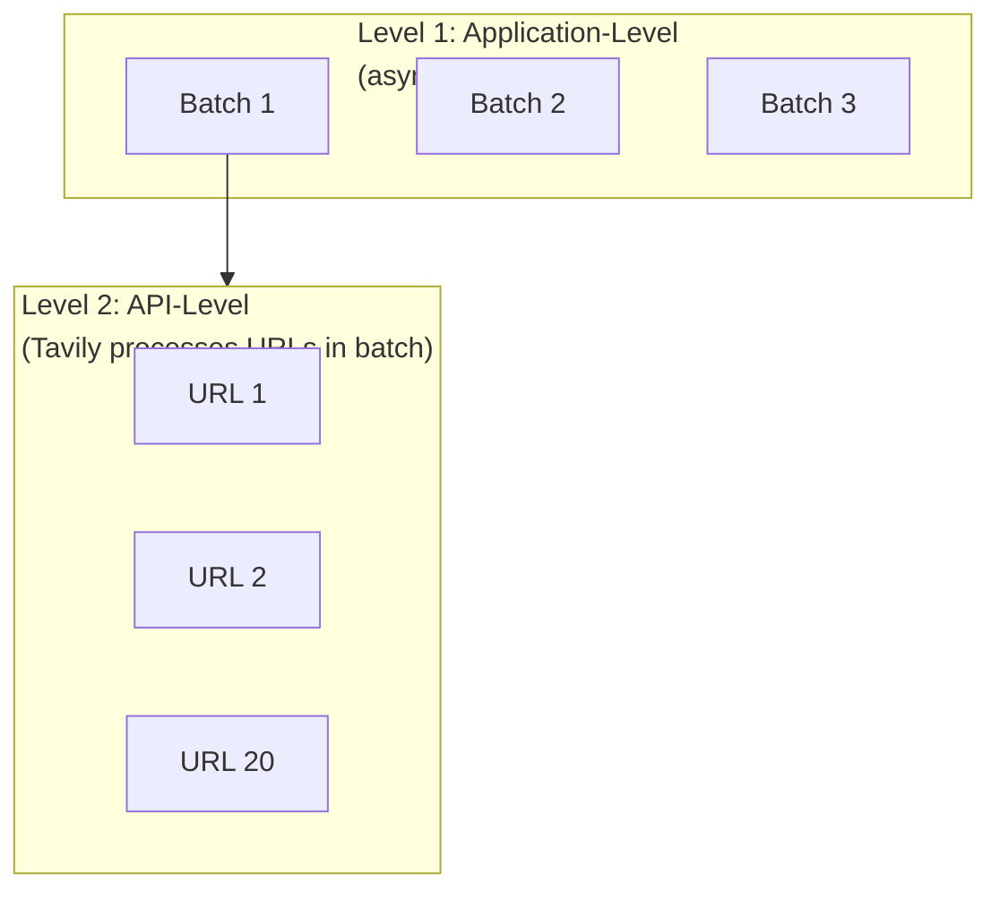

# 07.08 — Crawling Deep Dive: Concurrent Batch Extraction

## Overview

This lesson (optional but valuable) implements a **production-grade crawling pipeline** using `TavilyMap` + `TavilyExtract` with concurrent batch processing, error handling, and detailed logging. It demonstrates two levels of parallelism — API-level batch processing and application-level async concurrency — patterns that are essential for any large-scale data ingestion.

---

## The Challenge: 500 URLs to Extract

After mapping the LangChain documentation with `TavilyMap`, we have ~500 URLs. Extracting them one by one would be painfully slow. We need:

1. **Batch processing** — send multiple URLs per API call
2. **Concurrent execution** — fire multiple batches simultaneously
3. **Error handling** — gracefully handle failures without losing successful results



---

## Step 1: URL Batching

```python
def chunk_urls(urls: list, chunk_size: int = 20) -> list:
    """Split a flat list of URLs into batches.
    
    Args:
        urls: List of URL strings
        chunk_size: Max URLs per batch
    
    Returns:
        List[List[str]]: List of batches, each containing chunk_size URLs
    """
    return [urls[i:i + chunk_size] for i in range(0, len(urls), chunk_size)]
```

Usage:
```python
url_batches = chunk_urls(sitemap["results"], chunk_size=20)
log_info(f"Created {len(url_batches)} batches")
# → Created 25 batches
```

---

## Step 2: Single Batch Extraction

```python
async def extract_batch(batch: list, batch_number: int) -> dict:
    """Extract content from a single batch of URLs.
    
    Args:
        batch: List of URLs to extract
        batch_number: Batch identifier for logging
    
    Returns:
        dict: Extraction results, or raises on failure
    """
    log_info(f"Processing batch {batch_number} ({len(batch)} URLs)")
    
    try:
        result = await extract.ainvoke({"urls": batch})
        log_success(f"Batch {batch_number}: extracted {len(result)} pages")
        return result
    except Exception as e:
        log_error(f"Batch {batch_number} failed: {e}")
        raise
```

### Key Design Decisions

| Decision | Why |
|---|---|
| `ainvoke` (async) | Non-blocking — allows concurrent execution of multiple batches |
| `batch_number` param | Observability — pinpoint exactly which batch failed |
| Re-raise exceptions | Let the caller (`asyncio.gather`) decide how to handle failures |

---

## Step 3: Concurrent Extraction

```python
async def async_extract(url_batches: list) -> list:
    """Concurrently extract content from all URL batches.
    
    Uses asyncio.gather to fire all batches simultaneously.
    Returns a flat list of LangChain Documents.
    """
    log_header("Starting concurrent extraction")

    # Create coroutines (not yet executing)
    tasks = [
        extract_batch(batch, batch_num)
        for batch_num, batch in enumerate(url_batches)
    ]

    # Execute all concurrently — wait for all to complete
    results = await asyncio.gather(*tasks, return_exceptions=True)

    # Process results
    all_pages = []
    failed_batches = 0

    for result in results:
        if isinstance(result, Exception):
            log_error(f"Batch failed: {result}")
            failed_batches += 1
        else:
            # Convert each page to a LangChain Document
            for page in result:
                all_pages.append(
                    Document(
                        page_content=page["raw_content"],
                        metadata={"source": page["url"]}
                    )
                )

    log_success(f"Extracted {len(all_pages)} pages ({failed_batches} batches failed)")
    return all_pages
```

### Understanding `asyncio.gather`



| Concept | Detail |
|---|---|
| **Coroutine creation** | `extract_batch(batch, num)` creates a coroutine — it doesn't execute yet |
| **`asyncio.gather`** | Takes all coroutines and executes them concurrently |
| **`return_exceptions=True`** | Failed batches return `Exception` objects instead of crashing the entire gather |
| **First-come, first-served** | Results arrive in arbitrary order — the first batch to finish is processed first |

### Two Levels of Parallelism



1. **Application level**: We fire multiple batches concurrently using `asyncio.gather`
2. **API level**: Each batch contains multiple URLs that Tavily processes in parallel internally

---

## Step 4: Main Pipeline

```python
async def main():
    log_header("Documentation Ingestion Pipeline")

    # 1. Map the documentation
    log_info("Mapping documentation structure...")
    sitemap = map_client.invoke({"url": "https://python.langchain.com"})
    log_success(f"Discovered {len(sitemap['results'])} URLs")

    # 2. Batch the URLs
    url_batches = chunk_urls(sitemap["results"], chunk_size=20)
    log_info(f"Created {len(url_batches)} batches")

    # 3. Concurrently extract all content
    all_docs = await async_extract(url_batches)
    log_success(f"Total documents: {len(all_docs)}")

if __name__ == "__main__":
    asyncio.run(main())
```

---

## Error Handling Patterns

### What Can Go Wrong

| Error | Cause | Handling |
|---|---|---|
| **Rate limiting (429)** | Too many concurrent requests | `return_exceptions=True` + retry logic |
| **Invalid URL** | URL deleted or moved | Skip — `page_content` will be "Page not found" |
| **Timeout** | Network issues or slow page | Tavily handles retries internally |
| **SSL error** | Certificate issues (especially VPN) | Use `certifi` SSL context |

### Graceful Degradation

The `return_exceptions=True` pattern means:
- **Failed batches** are logged and counted but don't crash the pipeline
- **Successful batches** are processed normally
- The final count tells you how many succeeded vs failed
- You can re-run failed batches later if needed

---

## Summary

| Concept | Implementation | Key Insight |
|---|---|---|
| **URL batching** | `chunk_urls(urls, 20)` | Don't send too many URLs per request |
| **Async extraction** | `await extract.ainvoke()` | Non-blocking IO — perfect for API calls |
| **Concurrency** | `asyncio.gather(*tasks)` | All batches run simultaneously |
| **Error handling** | `return_exceptions=True` | Failed batches don't crash the pipeline |
| **Document conversion** | `Document(page_content, metadata)` | Always preserve the source URL |

| Production Pattern | Why It Matters |
|---|---|
| **Batch processing** | Reduces API calls; respects rate limits |
| **Concurrent execution** | Dramatically faster than sequential processing |
| **Graceful degradation** | Partial failures don't lose successful results |
| **Observability** | Batch numbers in logs → pinpoint failures instantly |