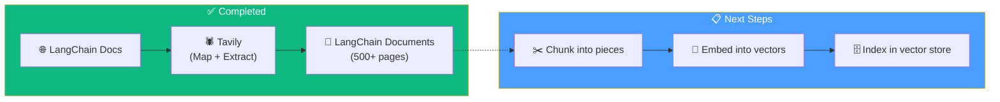

# 07.09 — Recap: From Crawling to Indexing

## Overview

We've completed the hardest part of the pipeline — **getting the data**. In production RAG applications, data acquisition is typically the most error-prone and time-consuming phase. Now we transition to preparing the data for the vector store.

---

## What We've Done

---

## What's Coming Next

| Step | What Happens | Lesson |
|---|---|---|
| **Chunking** | Split large documents into smaller, searchable pieces (4000 chars, 200 overlap) | 10 |
| **Batch indexing** | Embed chunks and store vectors in Pinecone — concurrently, with rate limit handling | 11 |

The API-heavy crawling phase is behind us. The remaining ingestion steps are computationally simpler but involve important design decisions (chunk size, overlap, batch sizing) that directly impact retrieval quality.