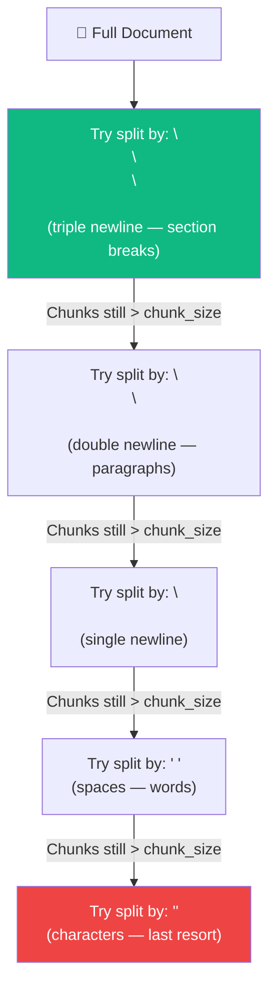
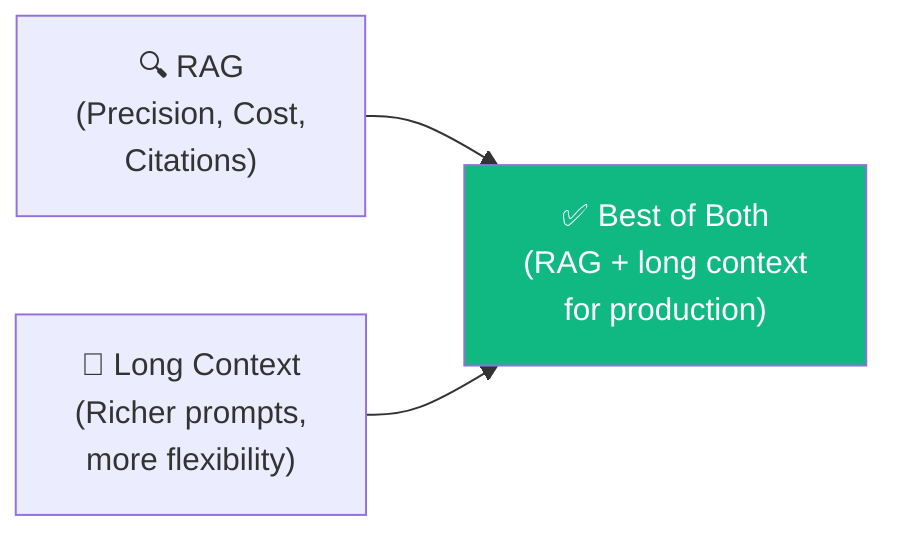

# 07.10 — Chunking with RecursiveCharacterTextSplitter

## Overview

With 500+ documents loaded, we now **chunk them into smaller pieces** for embedding and retrieval. This lesson uses `RecursiveCharacterTextSplitter` — LangChain's most intelligent text splitter — and discusses the broader question: **is RAG dead in the age of million-token context windows?**

---

## The Chunking Code

```python
text_splitter = RecursiveCharacterTextSplitter(
    chunk_size=4000,
    chunk_overlap=200,
)

split_docs = text_splitter.split_documents(all_docs)
log_success(f"Split into {len(split_docs)} chunks")
# → Split into ~6,500 chunks
```

That's it — three lines of code. LangChain does the heavy lifting. But the parameters matter enormously.

---

## RecursiveCharacterTextSplitter — How It Works

Unlike `CharacterTextSplitter` (which splits on a single separator), the **Recursive** variant tries multiple separators **in priority order**:



The **recursive** part: it tries the most semantic separator first (section breaks), and only falls back to less meaningful separators if chunks are still too large. This preserves document structure far better than naive splitting.

---

## Parameter Choices

### chunk_size = 4000

| Value | Tradeoff |
|---|---|
| **Too small** (200) | Chunks lack context — the LLM can't understand them alone |
| **Too large** (20,000) | May include irrelevant content; wastes tokens in the prompt |
| **4000** | Good balance for documentation — typically captures a complete class/function doc |

### chunk_overlap = 200

```
Chunk 1: [AAAA BBBB CCCC DDDD]
Chunk 2:                [DDDD EEEE FFFF GGGG]
                         ↑ Overlap (200 chars)
```

Overlap ensures that information split across chunk boundaries isn't lost. With `200` characters of overlap, if a sentence straddles two chunks, both chunks contain it.

---

## Is RAG Dead? (The Million-Token Question)

With models like Gemini 2.5 supporting **2 million input tokens** and Anthropic supporting **1 million**, a common question arises: *why not just stuff the entire documentation into the prompt?*

### Why RAG Is Not Dead — It's Evolving

| Argument | Explanation |
|---|---|
| **Cost efficiency** | Embedding the full LangChain docs (~6,500 chunks × 4,000 chars ≈ 26M chars) as input tokens on every query would be incredibly expensive. RAG retrieves only ~4 relevant chunks. |
| **Precision & noise reduction** | RAG filters to only the most relevant chunks, reducing hallucinations and positional biases that occur with very long contexts |
| **Intelligent reordering** | Retrieval with relevance ranking improves answer quality while using fewer tokens |
| **Source citations** | RAG gives you **source traceability** — know exactly which document the answer came from. Critical for regulated environments |
| **Speed** | Processing 4K tokens is near-instant; processing 26M tokens takes significant time |

### The Correct Perspective

> [!IMPORTANT]
> Larger context windows don't kill RAG — they **amplify it**. Long context models are **complementary** to RAG. They handle richer prompt sequences, but RAG provides the **precision, cost efficiency, and citability** that production applications require.



---

## Summary

| Concept | Key Insight |
|---|---|
| **RecursiveCharacterTextSplitter** | Tries semantic separators first, falls back to less meaningful ones |
| **chunk_size=4000** | Captures complete documentation sections without being too broad |
| **chunk_overlap=200** | Preserves context across chunk boundaries |
| **Not a silver bullet** | Many advanced strategies exist (semantic chunking, small-to-big, etc.) |
| **RAG is not dead** | It's evolving — provides precision, cost savings, and citations that long context can't |