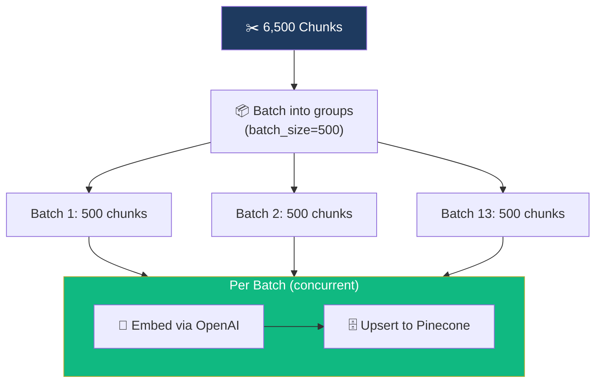
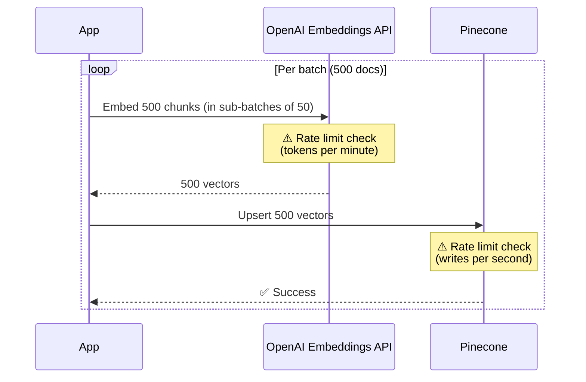
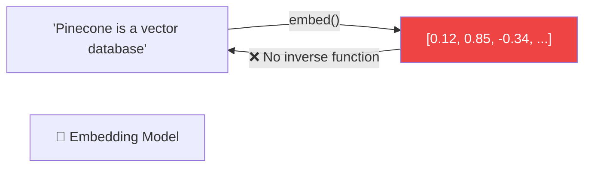

# 07.11 — Batch Indexing: Concurrent Vector Store Ingestion

## Overview

With ~6,500 document chunks ready, we need to **embed each chunk and store it in the vector store**. This lesson implements concurrent batch indexing — the same `asyncio.gather` pattern used for crawling, but now applied to embedding and storing vectors. We also explore rate limiting in practice and demonstrate switching between Pinecone and ChromaDB.

---

## The Indexing Architecture



---

## Implementation

### The Batch Indexing Function

```python
async def index_documents_async(documents: List[Document], batch_size: int):
    """Embed and index documents into the vector store in concurrent batches."""
    log_header("Vector Storage Phase")
    log_info(f"Indexing {len(documents)} documents")

    # Split into batches
    batches = [
        documents[i:i + batch_size] 
        for i in range(0, len(documents), batch_size)
    ]
    log_info(f"Created {len(batches)} batches")

    async def add_batch(batch: List[Document], batch_number: int) -> bool:
        """Add a single batch to the vector store."""
        try:
            await vectorstore.aadd_documents(batch)
            log_success(f"Batch {batch_number}: indexed {len(batch)} docs")
            return True
        except Exception as e:
            log_error(f"Batch {batch_number} failed: {e}")
            return False

    # Fire all batches concurrently
    tasks = [
        add_batch(batch, num) 
        for num, batch in enumerate(batches)
    ]
    results = await asyncio.gather(*tasks)

    # Report results
    successful = sum(results)
    if successful == len(batches):
        log_success(f"All {len(batches)} batches indexed successfully!")
    else:
        log_warning(f"{successful}/{len(batches)} batches succeeded")
```

### Key Design Patterns

| Pattern | Implementation | Why |
|---|---|---|
| **Batching** | Split 6,500 docs into groups of 500 | Avoid overwhelming the embedding API |
| **Async execution** | `vectorstore.aadd_documents()` | Non-blocking IO for API calls |
| **Concurrent processing** | `asyncio.gather(*tasks)` | All batches run simultaneously |
| **Boolean tracking** | Each batch returns `True`/`False` | Count successes vs failures |
| **Batch numbering** | `enumerate(batches)` | Identify failed batches in logs |

---

## Calling from Main

```python
async def main():
    # ... crawling and chunking from previous lessons ...

    # Index into vector store
    await index_documents_async(
        documents=split_docs,
        batch_size=500
    )

    # Summary stats
    log_header("Pipeline Complete")
    log_info(f"URLs crawled: {len(sitemap['results'])}")
    log_info(f"Documents chunked: {len(split_docs)}")
    log_success("Ingestion pipeline finished!")
```

---

## Understanding the Rate Limiting Chain

When `aadd_documents` runs, it triggers a chain of API calls that can each be rate-limited:



### Where Rate Limits Hit

| Component | Limit Type | What Triggers It |
|---|---|---|
| **OpenAI Embeddings** | Tokens per minute (TPM) | Embedding too many chunks too fast |
| **Pinecone** | Writes per second | Upserting too many vectors too fast |

### The `retry_min_seconds` Effect

Without `retry_min_seconds=10` on the embeddings model:

```
❌ Batch 3 failed: 429 Rate limit exceeded
❌ Batch 7 failed: 429 Rate limit exceeded  
❌ Batch 11 failed: 429 Rate limit exceeded
⚠️ 10/13 batches succeeded
```

With `retry_min_seconds=10`:
```
✅ All 13 batches indexed successfully!
```

The retry mechanism waits long enough for the rate limit window to reset before retrying.

---

## Batch Size Tradeoffs

| Batch Size | Effect | Recommendation |
|---|---|---|
| **Too large** (5000) | Hits embedding rate limits; single failure loses many docs | ❌ |
| **Too small** (10) | Too many API calls; slow overall | ❌ |
| **500** | Good balance — manageable batches, tolerable failure granularity | ✅ |

> [!TIP]
> The optimal batch size depends on your **embedding API tier** (higher tiers have higher rate limits) and your **vector store's write capacity**. Start with 500 and adjust based on error logs.

---

## Switching to ChromaDB

Swapping from Pinecone to ChromaDB is a **one-line change** thanks to LangChain's uniform interface:

```python
# Pinecone (cloud)
vectorstore = PineconeVectorStore(
    index_name="langchain-docs-2025", embedding=embeddings
)

# ChromaDB (local) — swap this one line
vectorstore = Chroma(
    persist_directory="./chroma_db", embedding_function=embeddings
)
```

Everything else — `aadd_documents()`, `as_retriever()`, `similarity_search()` — works identically.

### ChromaDB Storage

ChromaDB uses **SQLite** under the hood and persists to the `./chroma_db/` directory:

```
chroma_db/
├── chroma.sqlite3    ← Vector data + metadata
└── ...
```

---

## One-Way Embeddings: A Critical Concept

> [!IMPORTANT]
> The embedding function is a **one-way function** — there is no inverse. You cannot reconstruct text from its vector. This is why vector stores always save the **original text** alongside the vector. When you retrieve a result, you get the text from the metadata, not by "decoding" the vector.



---

## Verifying in Pinecone

After running the pipeline, check the Pinecone dashboard:

- **Record count** should match the number of chunks (~6,500)
- Click any record to inspect:
  - **Vector values** — the embedding (1536 floats)
  - **text** — original chunk content
  - **source** — URL of the documentation page

---

## Summary

| Step | Code | Result |
|---|---|---|
| **Batch** | `docs[i:i+500]` | 13 batches of 500 chunks |
| **Embed + Store** | `await vectorstore.aadd_documents(batch)` | Concurrent embedding + upserting |
| **Track results** | `asyncio.gather(*tasks)` → count `True`/`False` | Know which batches succeeded |
| **Handle rate limits** | `retry_min_seconds=10` on embeddings | Auto-retry after rate limit errors |
| **Verify** | Pinecone dashboard | ~6,500 records with text + source metadata |