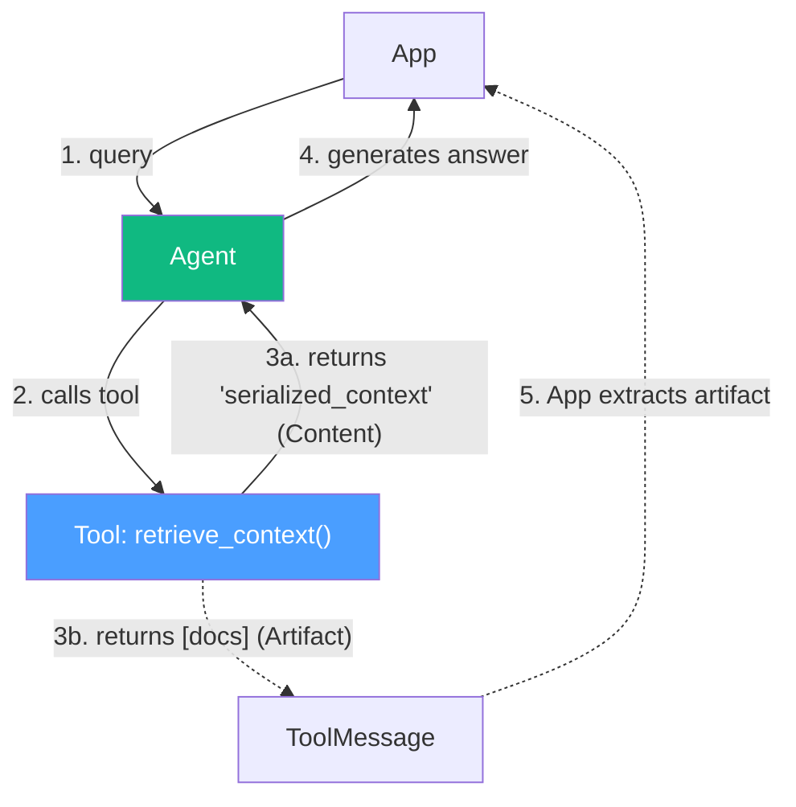

# 07.12 — Retrieval Agent Implementation

## Overview

With our vector store populated, we now move to the **Retrieval** phase. Instead of a deterministic LCEL chain, we are going to build a **RAG Agent**. We will create an AI agent equipped with a `retrieve_context` tool, allowing the LLM to decide *when* and *what* to search for based on the user's query.

We will also introduce `init_chat_model` for easy LLM initialization and explore the `content_and_artifact` response format for tools.

---

## 1. Imports and Initialization

```python
import os
from typing import Any, Dict
from dotenv import load_dotenv

from langchain_core.messages import ToolMessage
from langchain_core.tools import tool
from langchain.chat_models import init_chat_model
from langchain_openai import OpenAIEmbeddings
from langchain_pinecone import PineconeVectorStore
from langgraph.prebuilt import create_agent

load_dotenv()

# 1. Initialize Embeddings (Must match the ingested vectors!)
embeddings = OpenAIEmbeddings(model="text-embedding-3-small")

# 2. Initialize Vector Store
vectorstore = PineconeVectorStore(
    index_name="langchain-docs-2025",
    embedding=embeddings
)

# 3. Initialize Chat Model
llm = init_chat_model("gpt-4o-mini", model_provider="openai")
```

### The `init_chat_model` Convenience Function

`init_chat_model` is a very convenient factory function. Instead of importing specific classes (like `ChatOpenAI` or `ChatAnthropic`), you pass a model string and provider:

```python
# OpenAI
llm = init_chat_model("gpt-4o-mini", model_provider="openai")

# Google Gemini (if we wanted to switch)
llm = init_chat_model("gemini-2.5-flash", model_provider="google_genai")
```

This makes swapping underlying models extremely simple without changing imports.

---

## 2. The Retrieval Tool

We define a tool that the agent can call to search our Pinecone index.

```python
@tool(response_format="content_and_artifact")
def retrieve_context(query: str):
    """Retrieve relevant documentation to help answer user queries about LangChain."""
    
    # 1. Perform similarity search finding top 4 chunks
    retriever = vectorstore.as_retriever(search_kwargs={"k": 4})
    retrieved_docs = retriever.invoke(query)
    
    # 2. Serialize the documents into a string for the LLM prompt
    serialized_context = ""
    for doc in retrieved_docs:
        source = doc.metadata.get("source", "Unknown")
        content = doc.page_content
        serialized_context += f"Source: {source}\nContent: {content}\n\n"
        
    # 3. Return both the string (Content) and the raw objects (Artifact)
    return serialized_context, retrieved_docs
```

### The `content_and_artifact` Paradigm

By default, an `@tool` returns only one value (the string given to the LLM). Setting `response_format="content_and_artifact"` allows the tool to return a **tuple of two values**:

1. **Content**: The formatted string `serialized_context`. This is what is actually injected into the LLM's prompt.
2. **Artifact**: The raw python objects `retrieved_docs` (List of LangChain Documents). This is **not** sent to the LLM. It is retained in the application state.

**Why do this?**
We need the raw `Document` objects in our frontend application so we can render beautiful clickable source links. If we only returned the string to the LLM, we would lose the python objects and have to parse the string to find the URLs. The `artifact` lets us smuggle state through the agent.

---

## 3. The Agent Wrapper

We wrap the agent execution in a function that takes a query and returns both the answer and the sources.

```python
def run_llm(query: str) -> Dict[str, Any]:
    """Run the RAG retrieval pipeline to answer a question."""
    
    system_prompt = """You are a helpful AI assistant that answers questions about LangChain documentation.
    You have access to a tool that retrieves relevant documentation.
    Use the tool to find relevant information before answering questions.
    Always cite the sources you use in your answers.
    If you cannot find the answer in the retrieved documentation, say so."""
    
    # 1. Create the Agent using LangGraph prebuilt
    agent = create_agent(
        llm, 
        tools=[retrieve_context], 
        system_message=system_prompt
    )
    
    # 2. Invoke the Agent
    messages = [{"role": "user", "content": query}]
    response = agent.invoke({"messages": messages})
    
    # 3. Extract the final answer
    final_message = response["messages"][-1]
    answer = final_message.content
    
    # 4. Extract the artifacts (source documents) from the ToolMessages
    context_docs = []
    for msg in response["messages"]:
        if isinstance(msg, ToolMessage) and msg.artifact:
            # The artifact is our list of retrieved_docs
            context_docs.extend(msg.artifact)
            
    return {
        "answer": answer,
        "context": context_docs
    }
```

### The Artifact Extraction Logic



Notice how we loop through the returned `response["messages"]`. We look for any `ToolMessage` that has an `.artifact` property. This is how we extract those raw `Document` objects that the tool saved for us!

## Summary

| Concept | Explanation |
|---|---|
| **Agentic RAG** | Instead of a hardcoded pipeline, an Agent is given a retrieval tool and decides how/when to use it. |
| `init_chat_model` | A standard factory function to easily initialize LLMs across different providers. |
| `content_and_artifact` | A tool configuration that lets it return a string to the LLM (content) while saving python objects for the application (artifact). |
| **Trust and Explainability** | Extracting the artifacts allows us to show the user exactly which documents the LLM used to generate the answer. |
