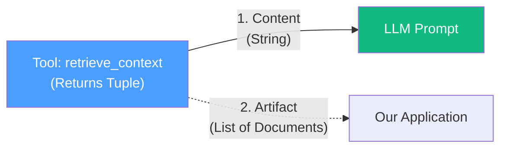
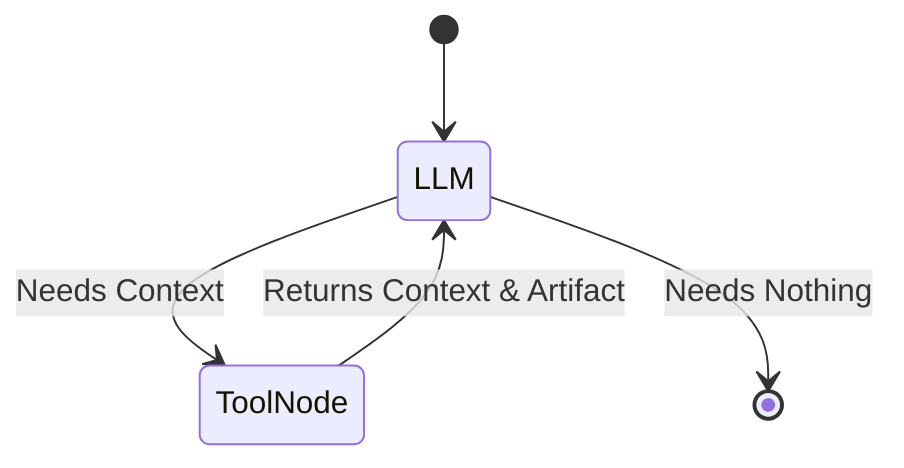

# 07.13 — Run, Debug, and Trace RAG Agent

## Overview

In this lesson, we run the RAG agent we just built and debug its execution line-by-line. We inspect the LangGraph `response` object to understand exactly how the `content_and_artifact` feature works in practice. Then, we use LangSmith to trace the pipeline, proving how observability builds trust in Agentic RAG systems.

---

## 1. Running the Agent

Let's run our `run_llm` function with a query:

```python
if __name__ == "__main__":
    result = run_llm("what are deep agents?")
    print(result["answer"])
```

**Output:**
```
Deep agent is a term LangChain coined for agents that can handle complex open-ended tasks over longer time horizons.
```

The agent successfully answered the question using our retrieved context! Let's debug `result` to see exactly what happened.

---

## 2. Debugging `content_and_artifact`

When we inspect the raw `response["messages"]` dictionary from our LangGraph execution:

1. **UserMessage:**
   - Content: "what are deep agents?"
2. **AIMessage (Tool Call):**
   - Content: ""
   - Tool Calls: `retrieve_context` (Query="LangChain's deep agents definition")
   - *Notice how the LLM optimized the query! It searched for a definition instead of the exact user question.*
3. **ToolMessage:**
   - Content: `Source: https://python.langchain.com...\nContent: Deep agents are...`
   - Artifact: `[Document(page_content="...", metadata={"source": "..."})]`
4. **AIMessage (Final Answer):**
   - Content: "Deep agent is a term..."

### The Powerful Distinction



If we only passed the string to the LLM, we would be forced to **regex-parse the string** in our application to find the `Source: URLs` for our UI. With the `artifact`, we have the actual `langchain_core.documents.Document` python objects safely tucked away in the `ToolMessage`.

We extract them like this:

```python
for msg in response["messages"]:
    if isinstance(msg, ToolMessage) and hasattr(msg, "artifact") and msg.artifact:
        context_docs.extend(msg.artifact)
```

---

## 3. Tracing with LangSmith

If we open our LangSmith dashboard and view the trace for "what are deep agents?", we see the full graph execution:

 *(Representative)*

### Tracing the `as_retriever` Advantage

In Lesson 12, we used `vectorstore.as_retriever()`. Let's compare this to using the raw vectorstore:

| Approach | Code | LangSmith Trace UI |
|---|---|---|
| **Raw store** | `vectorstore.similarity_search(query)` | Basic tool call. No special UI treatment. |
| **Retriever** | `retriever = vectorstore.as_retriever()`<br>`retriever.invoke(query)` | Deep integration. Shows beautiful document previews and highlights the retrieval phase natively. |

Always use `.as_retriever()` when building RAG pipes in LangChain. It hooks into LangSmith's built-in RAG tracing features seamlessly.

---

## 4. The Agent State

Because `create_agent` runs a prebuilt LangGraph under the hood, the entire conversation is a **Graph State**. This state includes all the intermediate messages (ToolCalls and ToolMessages).



We aren't defining these nodes manually yet (we will later in the course!), but understanding that the agent loops until it has enough context to answer the user is fundamental to Agentic RAG.

---

## Summary

| Concept | Explanation |
|---|---|
| **Query Optimization** | The LLM isn't forced to search the vector store with the user's exact string; it synthesizes a better search query. |
| **ToolMessage** | Contains the `content` sent to the LLM and the `artifact` hidden for the application developer. |
| **`as_retriever()`** | Offers vastly superior tracing capabilities in LangSmith compared to raw similarity searches. |
| **Trust through UI** | By preserving the source URLs in the artifacts, we can build UIs that allow users to verify the LLM's claims. |