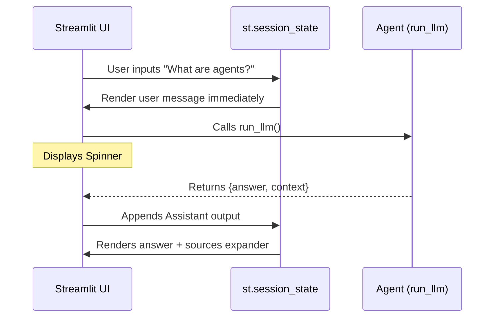

# 07.14 — Frontend with Streamlit

## Overview

We have a working RAG agent capable of answering questions about LangChain by consulting the retrieved documentation. In this lesson, we build a **Streamlit** user interface to interact with our agent. We'll explore `st.session_state` for conversation memory, rendering user and agent chat messages, and handling source citations using UI expanders.

Streamlit is an open-source Python library for creating rapid web apps, especially for AI prototypes.

---

## 1. Setup & Boilerplate

Create `main.py`:

```python
import streamlit as st
from backend.core import run_llm

st.set_page_config(page_title="LangChain Documentation Helper", layout="wide")
st.title("LangChain Documentation Helper")
```

**Running the app:**
```bash
uv run streamlit run main.py
```
This opens a browser tab with your empty application. It runs with hot-reloading enabled by default.

---

## 2. Managing Conversation Memory

Streamlit reruns the *entire script* top-to-bottom every time the user interacts with a widget. To persist data across these reruns, we use `st.session_state`.

```python
# Initialize session state for messages if it doesn't exist
if "messages" not in st.session_state:
    st.session_state["messages"] = [
        {
            "role": "assistant", 
            "content": "Ask me anything about LangChain docs. I'll retrieve relevant context and cite sources.", 
            "sources": []
        }
    ]
```

### The Sidebar Reset Button

We add a sidebar button to quickly clear the chat history, wiping the `session_state`.

```python
with st.sidebar:
    st.subheader("Session")
    if st.button("Clear chat", use_container_width=True):
        if "messages" in st.session_state:
            st.session_state.pop("messages")
        st.rerun()  # Force the UI to refresh
```

---

## 3. Rendering the Chat History

We loop through our stored messages and render them using `st.chat_message`.

```python
for message in st.session_state["messages"]:
    with st.chat_message(message["role"]):
        st.markdown(message["content"])
        
        # Render sources in an expander if they exist
        if message.get("sources"):
            with st.expander("Sources"):
                for source in message["sources"]:
                    st.markdown(f"- {source}")
```

### Formatting the Sources

We need a helper function to safely extract the URLs from the `LangChain Documents` returned as `artifacts` by our backend.

```python
def format_sources(context_docs: list) -> list:
    """Extract URLs from Document metadata safely."""
    sources = []
    for doc in context_docs:
        if hasattr(doc, "metadata") and "source" in doc.metadata:
            sources.append(doc.metadata["source"])
    # Removing duplicates (Optional)
    return list(set(sources))
```

---

## 4. Capturing User Input & Querying the Agent

We place a chat input box at the bottom (`st.chat_input`), append the user's prompt to state, and call our `run_llm` backend agent inside a try/except block.

```python
if prompt := st.chat_input("Ask a question about LangChain"):
    
    # 1. Print and save User Message
    st.session_state["messages"].append({"role": "user", "content": prompt})
    with st.chat_message("user"):
        st.markdown(prompt)

    # 2. Print Assistant Message Container
    with st.chat_message("assistant"):
        try:
            # Show a spinner while the agent runs
            with st.spinner("Retrieving docs and generating answer..."):
                result = run_llm(prompt)
                
            answer = result.get("answer", "No answer returned.")
            raw_docs = result.get("context", [])
            sources = format_sources(raw_docs)
            
            # Display answer
            st.markdown(answer)
            
            # Display sources
            if sources:
                with st.expander("Sources"):
                    for source in sources:
                        st.markdown(f"- {source}")

            # 3. Save Assistant Message
            st.session_state["messages"].append({
                "role": "assistant",
                "content": answer,
                "sources": sources
            })

        except Exception as e:
            st.error(f"Error during RAG execution: {e}")
```

### The Render Loop Explained



---

## 5. Explaining Trust (Generative UI)

While this UI effectively answers questions, it is a "black box." The user types a question, waits 5 seconds, and gets an answer. They don't know that the agent decided to use a search tool.

**Generative UI** is the practice of streaming *agent state* to the frontend. E.g., showing:
- "Thinking..."
- "Searching documentation for 'deep agents'..."
- "Found 4 documents..."
- Generating answer...

Instead of a single loading spinner. We will cover Generative UI deeply later in the course (using Next.js and TypeScript).

## Summary

| Streamlit Concept | Use Case in RAG |
|---|---|
| `st.session_state` | Stores conversation history required for multi-turn chats because Streamlit reruns scripts repeatedly. |
| `st.chat_message` | Renders human vs assistant avatars dynamically. |
| `st.expander` | Hides the source citations until clicked. Preserves UI cleanliness. |
| `st.chat_input` | The bottom input box that assigns to `prompt := ...` |
| `st.spinner` | Basic UI feedback while the LLM runs synchronously. |