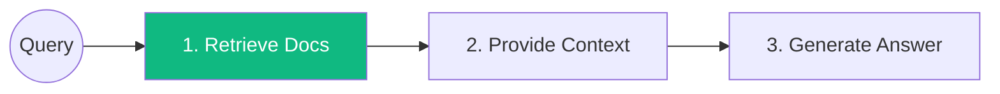
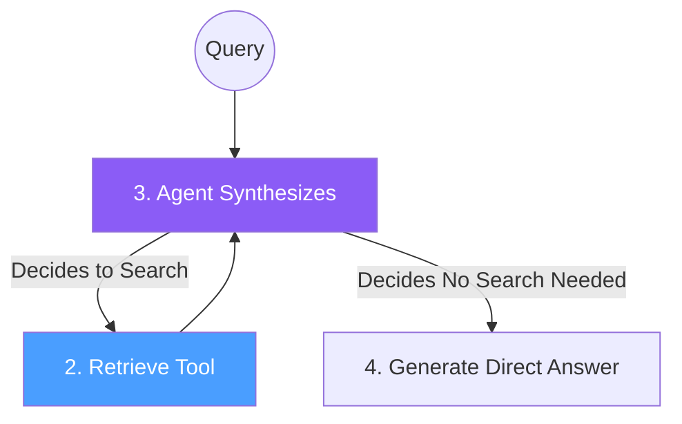

# 07.16 — RAG Architecture: The Final Verdict

## Overview

Throughout this course, we've built distinct types of Retrieval-Augmented Generation (RAG) applications. We've explored "Two-Step RAG" (LCEL) and "Agentic RAG" (the RAG Agent we just built). In this final lesson of the section, we compare these approaches, evaluate their strengths and weaknesses, and introduce the concept of "Hybrid RAG" — the architecture predominantly used in enterprise production systems.

---

## 1. Two-Step RAG (LCEL)

This is the deterministic approach we implemented in Section 06 using LangChain Expression Language (LCEL).



### Characteristics
- **Execution:** Linear and predictable. Retrieval **always** happens before generation.
- **Latency:** extremely fast (only one LLM generation).
- **Control:** High control over prompt engineering and formatting.
- **Flexibility:** Low. If the query is unrelated to the knowledge base (e.g., "Hi"), the system still performs an unnecessary vector search.

**Verdict:** Excellent for highly constrained environments where every query *requires* context (e.g., searching a specific document or answering a FAQ).

---

## 2. Agentic RAG (The RAG Agent)

This is the approach we implemented in this section using `create_agent` and setting retrieval as a `@tool`.



### Characteristics
- **Execution:** Non-deterministic. The LLM decides *if*, *when*, and *what* to retrieve.
- **Latency:** Slower. The LLM must first generate a tool call, wait for the tool to execute, and then generate the final answer. Multiple LLM calls take time.
- **Control:** Low. The system is entirely dependent on the LLM's reasoning capabilities.
- **Flexibility:** Extremely high. It can answer "Hi" immediately, but format complex sub-queries for difficult questions.

**Verdict:** Often an **overkill** for simple Q&A over documents. Giving an LLM complete freedom over retrieval can lead to inconsistent behavior in production.

---

## 3. Hybrid RAG (The Production Standard)

Which approach is better? The answer is "it depends," but production systems typically fall somewhere in the middle: **Hybrid RAG**. This is an architecture built with tools like **LangGraph**, combining the predictability of LCEL with the intelligence of Agents.

```mermaid
flowchart TD
    Q((User Query)) --> EVAL{1. Query Routing}
    
    EVAL -->|"Needs Math"| MATH[Calculator Tool]
    EVAL -->|"Needs Search"| ENHANCE[2. Query Enrichment]
    EVAL -->|"Conversational"| CHAT[Direct Answer]

    ENHANCE --> RETRIEVE[3. Vector Store Search]
    RETRIEVE --> FILTER[4. Document Validation\n(Are docs relevant?)]
    
    FILTER -->|"Yes"| GEN[5. Final Generation]
    FILTER -->|"No"| REWRITE[Rewrite Query and Retry]

    style EVAL fill:#4a9eff,color:#fff
    style FILTER fill:#f59e0b,color:#fff
```

### Why Hybrid RAG Wins

By explicitly defining intermediate steps (nodes in a graph), we regain control while keeping the cognitive power of the LLM applied exactly where needed:

| Step | Purpose |
|---|---|
| **Query Routing** | Direct simple questions ("Hi") away from the costly vector store. |
| **Query Enrichment** | An LLM rewrites "Who made it?" to "Who created LangChain?" *before* searching the database. |
| **Document Validation** | An LLM quickly reads the retrieved documents and discards irrelevant ones to prevent hallucination. |
| **Answer Validation** | Post-generation checks verify the answer directly addresses the user's initial prompt. |

**Verdict:** The hybrid approach is the gold standard for enterprise RAG applications. We will spend a significant portion of the upcoming **LangGraph** section learning how to build these exact hybrid pipelines from the ground up!

---

## Final Section Conclusion

Congratulations! Over these 16 lessons, you've completely mastered the data ingestion pipeline, built a powerful Pinecone vector index on a complex dataset (the LangChain documentation), explored agentic retrieval patterns, and deployed a functional frontend UI.

You now possess the foundational engineering skills required to build robust Generative AI systems. Our journey continues with mastering complex multi-agent orchestrations. Let's go!