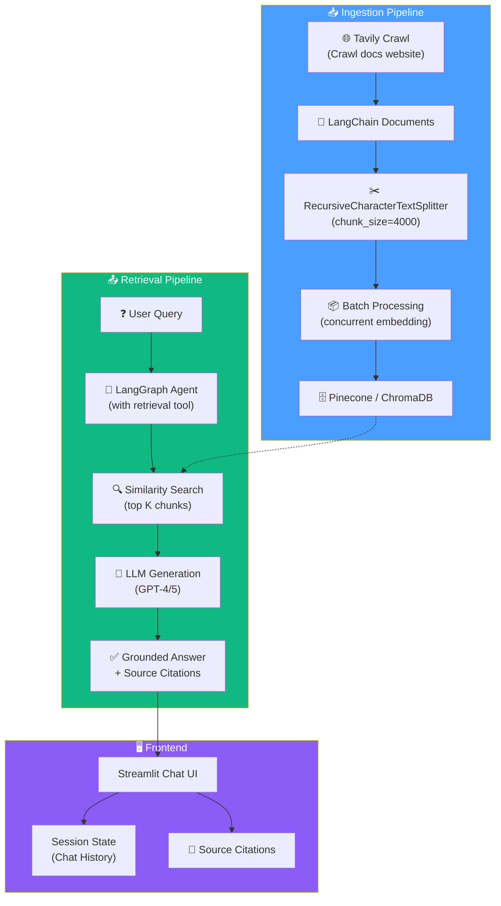

# 07. Building a Documentation Assistant (RAG)

## Overview

This section builds a **complete, production-oriented RAG application** end-to-end — from crawling live documentation, through ingestion and indexing, to retrieval with an agent, and finally a Streamlit-based chat UI. Unlike Section 06 (which used a single blog post), this project ingests an **entire documentation website** (LangChain's docs), demonstrating real-world scale challenges like rate limiting, batch processing, and concurrent API calls.

## Architecture

## Lesson Map

| # | Lesson | Focus |
|---|---|---|
| 1 | [What Are We Building?](01-what-are-we-building.md) | Project overview — documentation helper with RAG + Streamlit |
| 2 | [Pipenv vs uv](02-pipenv-vs-uv.md) | Quick note on package manager differences |
| 3 | [Environment Setup](03-environment-setup.md) | Clone, install, Pinecone index, API keys |
| 4 | [Ingestion Pipeline Intro](04-ingestion-pipeline-intro.md) | Architecture overview — Tavily for crawling, LangChain for indexing |
| 5 | [Imports & Initialization](05-imports.md) | All imports, SSL config, embeddings, vector store, rate limiting |
| 6 | [Tavily Crawl](06-tavily-crawling.md) | One-call crawling with `TavilyCrawl` — depth, instructions, filtering |
| 7 | [TavilyMap & TavilyExtract](07-tavilymap-tavilyextract.md) | Manual two-step crawling — map URLs then extract content |
| 8 | [Crawling Deep Dive](08-crawling-deep-dive.md) | Advanced: batch extraction, concurrent processing, error handling |
| 9 | [Recap](09-recap.md) | Transition from crawling to chunking and indexing |
| 10 | [Chunking & Text Splitting](10-chunking-text-splitting.md) | RecursiveCharacterTextSplitter, chunk size philosophy, RAG vs long context |
| 11 | [Batch Indexing](11-batch-indexing.md) | Concurrent vector store indexing, rate limit handling, ChromaDB alternative |
| 12 | [Retrieval Agent](12-retrieval-agent-implementation.md) | Agent with retrieval tool, `content_and_artifact`, `initChatModel`, source tracking |
| 13 | [Run, Debug, Trace](13-run-debug-trace-rag-agent.md) | Debug walkthrough, LangSmith trace analysis, artifact inspection |
| 14 | [Frontend with Streamlit](14-frontend-with-streamlit.md) | Chat UI, session state, message rendering, source citation display |
| 15 | [Production RAG](15-documentation-helper-in-production.md) | Chat LangChain — open-source production RAG with Agentic RAG + LangGraph |
| 16 | [RAG Architectures](16-rag-architecture.md) | Two-step vs Agent vs Hybrid RAG — comparison and production recommendations |

## Key Technologies

| Technology | Role |
|---|---|
| **Tavily** | Web crawling and content extraction (map, extract, crawl) |
| **LangChain** | Document loaders, text splitters, embeddings, vector stores, LCEL |
| **Pinecone** | Cloud-managed vector database |
| **ChromaDB** | Local open-source vector database alternative |
| **OpenAI** | Embeddings (`text-embedding-3-small`) + LLM (GPT-4/5) |
| **LangGraph** | Agent framework (via `create_agent`) |
| **Streamlit** | Python-based chat UI for prototyping |
| **LangSmith** | Tracing and observability |
