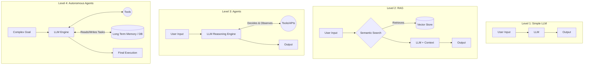

# 09.02 The LLM Application Development Landscape

The current landscape of Large Language Model applications can be classified into four distinct categories, ranging from basic pattern matching to fully autonomous reasoning engines. Understanding these tiers helps in choosing the right architecture for your specific business problem.

---

## Level 1: Simple LLM Calls

The foundational tier consists of applications that rely on a direct, single-prompt interaction with an LLM.

- **How it works:** The application takes user input, wraps it in a prompt template, sends it to the LLM, and displays the direct output to the user. There is no external memory or reasoning loop.
- **Use Case Example:** A children's story generator. The user provides a topic (e.g., "Space dinosaurs"), and the LLM returns a complete structured story.
- **Value:** While architecturally simple, these tools can provide immense value and execute incredibly fast.

---

## Level 2: Retrieval-Augmented Generation (RAG)

When an application needs to answer domain-specific questions based on proprietary data that the LLM wasn't trained on, developers introduce Vector Stores.

- **How it works:** Real-world documents (PDFs, Databases, Chat histories) are chunked, embedded, and stored in a vector database. When a user asks a question, the application performs a semantic search to fetch the relevant text chunks, prepends them to the LLM prompt, and asks the LLM to formulate an answer based *only* on that context.
- **Use Case Example:** **Quiver** (or "Second Brain" apps). You dump all your personal files into a repository, and you can then chat with your documents to extract insights seamlessly.

---

## Level 3: Agentic Workflows (Reasoning & Tools)

The complexity increases significantly when the LLM is no longer just answering questions, but dynamically deciding executing actions.

- **How it works:** The LLM is provided with a toolkit (e.g., Web Search, Calculator, API execution). Using a framework like LangGraph, it acts as a reasoning engine to analyze a problem, determine which tool to use, execute the tool, observe the results, and repeat until the task is solved.
- **Use Case Example:** **Torq's Socrates**. In cybersecurity, an agent monitors threat alerts, analyzes the specific context of the alert, and autonomously utilizes connected security tools to remediate the threat.

---

## Level 4: Autonomous Agents (Agents + RAG Memory)

The bleeding edge of the LLM landscape involves combining the reasoning tools of Level 3 with the vector stores of Level 2 to create agents with long-term memory.

- **How it works:** These applications can parse highly complex, abstract goals. They use semantic search (RAG) against their own past actions and extensive long-term memory banks to retrieve context, allowing them to mimic human-like behaviors, interact with other autonomous agents, and execute deeply nested workflows.
- **Use Case Explorations:** Projects like `AutoGPT`, `GPT Engineer`, and `BabyAGI` are pioneering this space, pushing the boundaries toward fully autonomous digital workers.

---

## Architecture Summary

### Conclusion

Whether you are building a simple text transformer or an autonomous security engineer, identifying where your application falls on this spectrum dictates the infrastructure (Vector Stores, LangGraph, LLM caching) required to build it successfully.