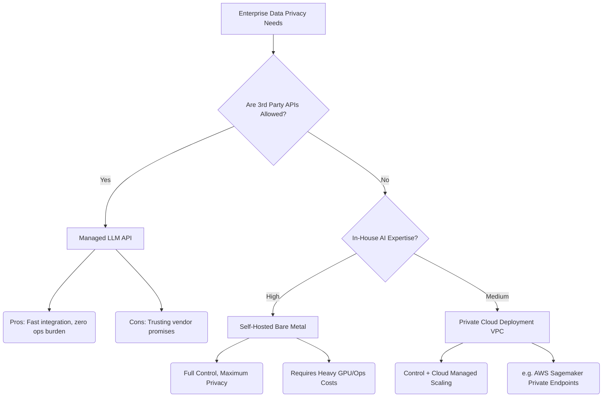

# 09.03 LLMs in Production: Privacy & Data Retention

Taking a Generative AI application to production—especially in an enterprise environment—introduces critical questions around data privacy, copyright, and retention. How long is your prompt saved? Is your proprietary data being used to train the next version of the model? 

> [!CAUTION]
> **Legal Disclaimer:** I am not a lawyer, and this document does not constitute legal advice. You must consult your organization's legal and privacy teams before integrating LLMs into production. Always thoroughly review the End User License Agreement (EULA) of your specific LLM vendor.

---

## B2B Cloud APIs vs. B2C Chatbots

The most vital distinction to make when assessing privacy is between **Direct-to-Consumer (B2C)** interfaces and **Enterprise (B2B) APIs**.

- **B2C Interfaces** (e.g., ChatGPT, Gemini web app, Claude.ai): By default, data entered into consumer interfaces is often logged and used to train future iterations of the model. 
- **B2B Cloud APIs** (e.g., OpenAI API, Google Cloud Vertex AI, AWS Bedrock): These are designed for enterprise integration and operate under entirely different, much stricter privacy agreements.

When discussing production applications, we are strictly referring to the **B2B Cloud APIs**.

---

## Concern 1: Is our data used for model training?

For enterprises, leaking proprietary code, financial data, or PII (Personally Identifiable Information) into a public model's training set is a catastrophic risk.

**The Standard Guarantee:** 
Major top-tier model providers (when using their enterprise APIs) guarantee that **they do not use your prompt inputs or generated outputs to train their models.** By default, your data remains yours. Opting-in to data sharing is completely voluntary. 

---

## Concern 2: How long is our data retained?

Even if the data isn't used for training, you must know how long the provider stores it on their servers.

- **Standard Retention (e.g., OpenAI API):** By default, requests and responses may be retained securely for a short period (e.g., **30 days**) strictly to identify abuse, misuse, or illegal activity. After 30 days, it is permanently deleted.
- **Zero Retention Policies:** Many vendors offer "Zero Retention" endpoints for enterprise clients. Under this policy, prompts and responses are completely ephemeral—processed purely in memory for serving the request and immediately discarded.

> [!TIP]
> Always verify the default retention settings of your vendor and proactively request Zero Data Retention if your application handles sensitive user data.

---

## The Open Source Alternative for Strict Regulations

For highly regulated industries (e.g., Banking, Healthcare, Defense), even the strict guarantees of managed API providers are unacceptable. These organizations simply cannot allow sensitive packets to leave their network boundaries.

For these use cases, the solution is **Self-Hosting Open Source Models** (like Llama 3 or Mistral).

### Deployment Strategies

**The Cost of Total Control:**
While deploying open-source models locally guarantees 100% data privacy, it shifts the operational burden entirely to your team. You become responsible for:
- GPU Provisioning and Cost Management
- Scaling (Availability and Durability)
- Security (Patching model vulnerabilities)

**The Middle Ground:**
Many enterprises opt to deploy open-source models within a **VPC (Virtual Private Cloud)** using their existing cloud provider. This keeps the data entirely within their network perimeter while offloading the hardware management to the cloud provider.