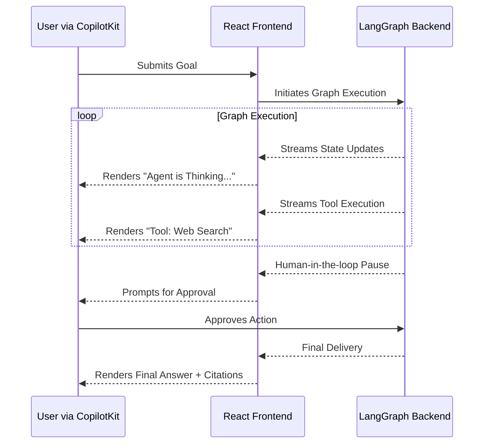

# 09.04 Generative UI/UX with CopilotKit

Building a sophisticated backend with agents, LangGraph, and specialized RAG architecture is a massive technical achievement. However, without a beautiful front-end and a thoughtfully designed User Experience (UX), your application will fail to gain user trust and adoption.

Generative AI applications are inherently non-deterministic and occasionally "flaky." Because users know the AI can hallucinate, the User Interface (UI) must work overtime to establish credibility.

---

## The Trust Deficit: Why Transparency is Key

To build trust, a Generative UI must prioritize **Radical Transparency**. The user should never be left wondering, *"How did the AI come up with this answer?"*

A highly-transparent UX should display:
1. **Source Grounding:** In a RAG application, always show the exact document snippets or citations used to generate the answer.
2. **Tool Execution:** If an agent is running, explicitly show the user which tools it chose to use (e.g., `Searching the web...` -> `Querying SQL Database...`).
3. **Reasoning Steps:** Expose intermediate calculations or the agent's internal "thought process" so the user can verify the logic.

By exposing the process, users are more forgiving of minor errors and can more easily verify accurate results.

---

## Enter CopilotKit

Building these transparent, streaming interfaces from scratch—especially when dealing with complex state machines like LangGraph—is an engineering nightmare. 

**CopilotKit** is an open-source framework specifically designed to solve this problem. It provides pre-built React components and hooks to rapidly develop highly transparent, production-ready Generative UIs.

> [!NOTE]
> *Disclaimer: We have no affiliation with CopilotKit. It is simply one of the most robust open-source tools currently pioneering the Generative UI space.*

### Key Features of CopilotKit

- **Drop-in Components:** Out-of-the-box chat interfaces, text-area autocompletes, and floating copilot buttons.
- **Frontend State Integration:** It allows the LLM to easily "see" the state of your React frontend (like what's currently on the screen) and take actions within your application.
- **Headless Hooks:** For developers who want complete custom styling, CopilotKit offers headless hooks (`useCopilotChat`) to handle the complex streaming logic while you build the CSS.

---

## The Chaos of LangGraph Frontends

Integrating a standard UI with a simple LLM call is easy. Integrating a UI with a **LangGraph** backend is incredibly difficult. 

A LangGraph agent has many complex moving parts:
- State is constantly mutating.
- Intermediate nodes are yielding partial results.
- Multiple nodes might execute in parallel.
- The graph might pause execution entirely to wait for a **Human-in-the-Loop** approval.

### CopilotKit "Co-Agents"

CopilotKit introduced **Co-Agents**, a feature that seamlessly integrates directly with LangGraph backends. It natively interprets LangGraph state streaming, meaning you can easily render intermediate Agent steps in the UI without writing complex websocket parsers.

### Summary
When moving an agent from the terminal to the browser, do not underestimate the complexity of state management. Leveraging tools like CopilotKit ensures your UX handles streaming, tool-calls, and human-in-the-loop pauses natively, allowing you to focus on the agent's logic.