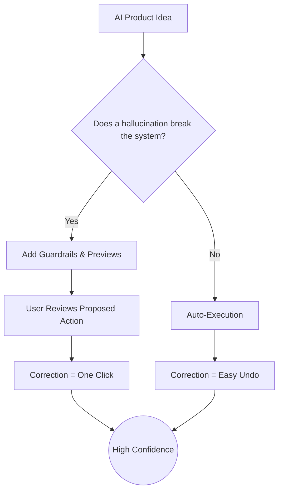

# 09.07 Confidence in AI Results

Why do some AI products achieve explosive viral adoption while others—even those backed by incredibly advanced underlying models—fail to gain traction? 

The secret sauce for AI adoption rarely has to do with the technical sophistication of the LLM. It has everything to do with **User Confidence** and how the product is designed to build trust.

---

## The Trust Formula

Building upon an excellent concept pioneered by modern AI product researchers (like Asaf and Harrison), user adoption is driven by the "Confidence Equation." 

User Confidence is essentially the value they gain from the AI, divided by the risks and the effort required to fix mistakes.

> **Confidence = Value / (Risk × Correction Effort)**

### The Three Pillars
1. **Value:** What does the user gain when the AI works correctly? (Saves time, saves money, creates something novel).
2. **Risk:** What is the blast radius if the AI hallucinates or fails? (Is it a minor annoyance, or does it drop a production database?)
3. **Correction Effort:** How much manual work is required by the user to undo the AI's mistake?

---

## Case Study 1: Cursor IDE (High Confidence Design)

Cursor, the AI-first code editor, has seen massive adoption. Let's run it through the formula.

- **Value:** Extremely High. It writes boilerplate, debugs errors, and saves developers hours of mental energy.
- **Risk:** Very Low. It suggests code in the editor locally. It does not automatically force `git commit` and push to your master branch.
- **Correction Effort:** Very Low. If the AI suggests bad code, you simply press `Escape` to ignore it, or `Backspace` to delete it.

Because $(Low \times Low)$ is a tiny denominator, the resulting **Confidence is Sky High**.

---

## Case Study 2: Monday.com Automations (The Design Fix)

Consider an AI feature in a project management tool like Monday.com that automatically updates board statuses and shifts schedules based on emails.

- **Value:** High. Saves project managers hours of busywork.
- **Risk:** Medium-to-High. If the AI hallucinates, it could change a critical project deadline, triggering a cascade of false notifications to the executive team.
- **Correction Effort:** High. If the AI messes up 10 tickets, the user has to comb through the board, find the incorrect tickets, trace the audit history, and manually revert them.

Because the denominator is $(High \times High)$, the **Confidence is Low**, and users will refuse to turn the feature on.

### The UI/UX Solution: Preview Mode
To fix this without changing a single line of the AI model's code, the product team can implement a **Preview Mode**. 

Instead of automatically applying the changes, the AI presents a temporary diff: *"Here are the 10 changes I am about to make. Click Approve or Reject."*
- This drops the **Risk** to Zero (changes haven't happened yet).
- This drops the **Correction** to Zero (just click Reject).

Suddenly, the feature has massive user confidence.

---

## The Product Design Mandate

The success of your Generative AI application relies heavily on UX design. Your job as a developer is not just to prompt the LLM, but to architect the application so that **Risk and Correction Effort are as close to zero as possible.** This is especially critical in high-stakes domains like finance, healthcare, and enterprise data.