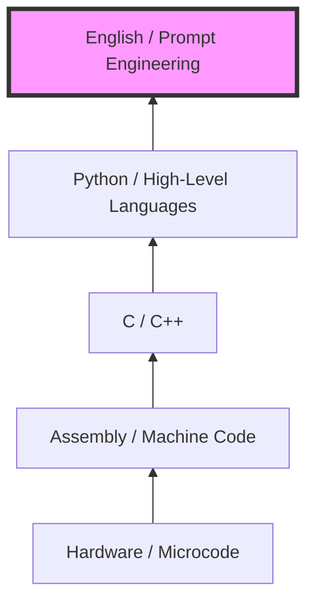

# 09.08 AI FOMO is the New Normal

If you have spent any time on tech X or LinkedIn recently, you have likely experienced an overwhelming sense of FOMO: **Fear Of Missing Out.**

The pace of AI development is relentless. Every single day, a new groundbreaking paper is published, a new open-source model drops, or a new agent framework is released. It is mathematically impossible to keep up.

Even Andrej Karpathy (former Director of AI at Tesla and founding member of OpenAI) wrote a profound blog post stating: *"I've never felt this much behind as a programmer."*

---

## The Paradigm Shift: From Coder to Orchestrator

The software engineering profession is undergoing a dramatic refactoring. The technical stack has fundamentally changed overnight. 

As Karpathy noted, we now have a massive new programmable layer to master:
> *Agents, sub-agents, prompts, context, memory, modes, tools, MCP, LSP, workflows...*

We no longer just write code. **We write prompts that generate code.** We design agents that invoke tools to execute code over which we then act as reviewers.

### The Team Lead Analogy
The day-to-day workflow of a software engineer is shifting to resemble the workflow of an Engineering Team Lead:
1. The Team Lead delegates tasks to Junior Engineers (Agents).
2. The Junior Engineers struggle, use tools, write drafts, and submit PRs.
3. The Team Lead reviews the work, provides feedback (Prompt adjustments), and sends it back.

Your job is shifting from "Typing the correct syntax" to "Architecting the orchestration."

---

## The Great Abstraction Ladder

Every major leap in computer science has been a step up the ladder of abstraction. AI is simply the next—and arguably largest—step.

### The Death of the "Regex Guy"
Consider Regular Expressions (Regex). In the past, writing perfect Regex was a highly coveted skill. Every engineering team had that "One Regex Guy" you would go to for complex string matching. 

Today, that skill is obsolete. It's like learning to use a paper map instead of Google Maps. You simply ask an LLM or use Cursor to generate your Regex. Many "good old-fashioned engineering" skills will follow this exact pattern.

---

## Surviving FOMO: What Still Matters?

Since syntax memory and algorithmic memorization are being commoditized by AI, what skills actually matter in this new era?

1. **Problem Solving:** The ability to decompose a massive, vague business problem into small, deterministic, solvable chunks.
2. **Curiosity:** The drive to constantly tinker with new tools, break them, and adapt to the newest layer of abstraction.

### Actionable Advice for the AI Era

This alien technology came with no instruction manual. The only way to learn the best practices of tomorrow is to invent them today.

- **Accept the FOMO:** It is here to stay. Accept that you will not read every paper or try every framework.
- **Distill the Noise:** Do not chase every shiny new tool announced on Twitter. 
- **Roll Up Your Sleeves:** When you find a specific problem you are genuinely interested in solving, stop scrolling. Open your IDE, get your hands dirty, and experiment. Deep, practical experimentation is the only cure for FOMO.