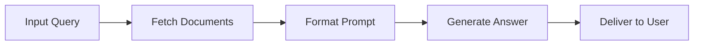
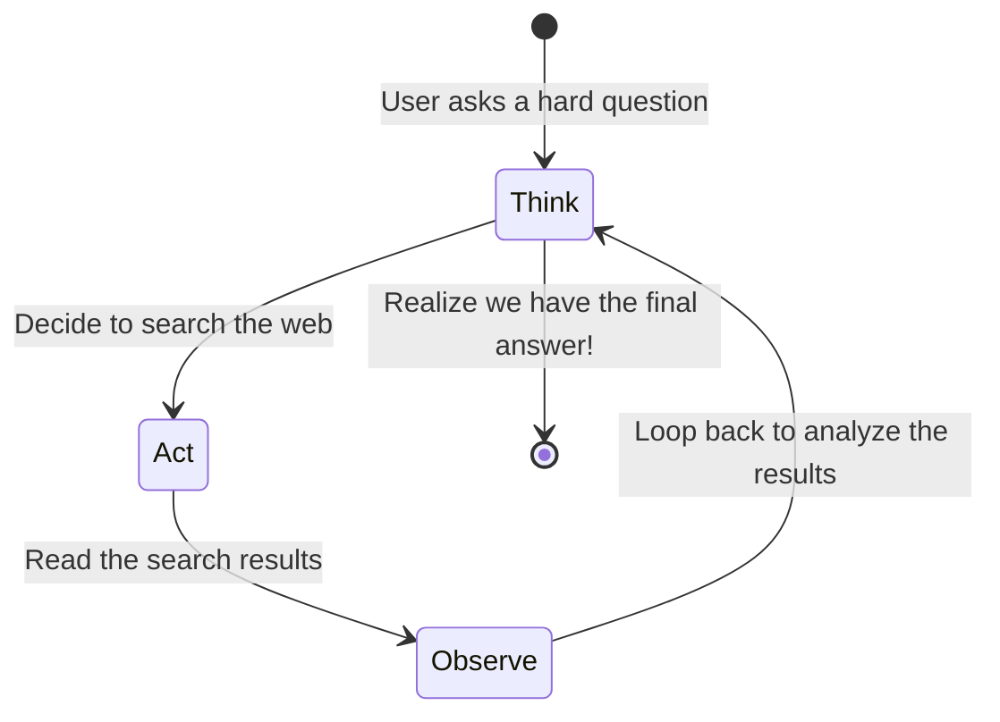

# 10.01 What is LangGraph?

Welcome to LangGraph! If you are new to the world of AI agents, this document will serve as your foundational guide. 

**LangGraph** is a specialized framework designed for building stateful, multi-step Large Language Model (LLM) agents. It allows you to create AI applications that don't just answer a single question, but can reason, take actions, observe results, and repeat the process until a complex task is completed.

---

> [!NOTE]
> **Beginner's Concept: What is an "Agent"?**
> When we say "LLM Agent", we mean an AI program that uses a Large Language Model as its "brain" to make decisions, combined with the ability to use external tools (like calculators, web searches, or databases) to gather information it doesn't know.

## The Problem: LangChain and the Linear Pipeline

Before LangGraph, developers widely used **LangChain** to build AI pipelines. LangChain is fantastic for creating linear, step-by-step processes.

In computer science, these linear pipelines are structured as **Directed Acyclic Graphs (DAGs)**. 
- **Directed:** The data flows in one specific direction.
- **Acyclic:** There are no loops (cycles).

### The Recipe Analogy (DAG)
Think of a DAG like a strict baking recipe. 
1. Mix flour and water (Input)
2. Knead the dough (Process)
3. Bake for 30 minutes (LLM execution)
4. Take out the bread (Output)

You go from step 1 to step 4, and you never go backwards. 



**The limitation:** What if the oven was too cold? In a DAG, the bread just comes out undercooked. The system cannot look at the bread, realize it's undercooked, and put it back in the oven. It lacks the ability to **loop**.

---

## The Solution: LangGraph and Cyclic Workflows

True intelligent behavior requires an iterative approach. A chef doesn't just blindly follow a recipe; they taste the sauce, realize it needs salt, add salt, stir, and taste again. This is a **cyclic** process.

**LangGraph was built specifically to allow loops (cycles) in AI workflows.**

### The "ReAct" Loop (Reason + Act)

The most common cyclic pattern for AI agents is the **ReAct** loop.

1. **Think (Reason):** Look at the problem and decide what to do.
2. **Act:** Use a tool (e.g., search the web).
3. **Observe:** Look at the result from the tool.
4. **Repeat:** Loop back to "Think" until the final answer is found.



Prior to LangGraph, building these loops was messy. Developers had to write clumsy `while` loops in Python that were hard to read, hard to pause, and hard to debug. 

```python
# How it used to look (Messy, pre-LangGraph code)
def run_agent(task):
    while not finished: # An unpredictable loop
        action = llm.decide(task)
        if action == "tool":
            run_tool()
        else:
            break
```

---

## The LangGraph Approach: Flow Engineering

LangGraph formalizes the agentic loop into a first-class programming model. It gives you an elegant, visualizable way to build complex AI behaviors.

### Core Concepts (The LangGraph Vocabulary)

When building an agent in LangGraph, you construct a system using three main pieces:

1. **Nodes (The "Workers"):** These are discrete steps where work gets done. For example, one Node might be "Ask the LLM", and another Node might be "Search Google".
2. **Edges (The "Paths"):** These are the connecting lines that dictate where the agent goes next. Should it go from Node A to Node B?
3. **State (The "Memory"):** This is a shared data folder (usually a Python dictionary). Every Node can read from the State, and every Node can write updates to the State.

### Why LangGraph Matters for Beginners

When you transition from writing simple chat scripts to building real-world AI applications, you will face errors. The AI will misinterpret a prompt, a web search will fail, or a database will timeout.

Because LangGraph uses **Nodes, Edges, and State**, it provides:
- **Fault Tolerance:** If a tool fails, the AI can loop back and try a different tool.
- **Memory Persistence:** The State automatically remembers the entire conversation history without you having to manage messy variables.
- **Human-in-the-loop:** You can easily pause a LangGraph agent, ask a human for approval (e.g., "Do you really want to send this email?"), and then resume execution exactly where it left off.

In summary: **LangChain simplifies building straight-line pipelines; LangGraph orchestrates reliable, iterative, and stateful agent loops.**
