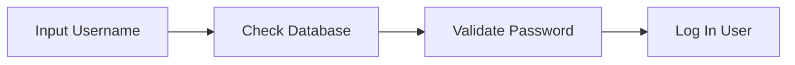
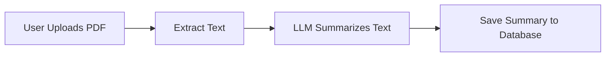
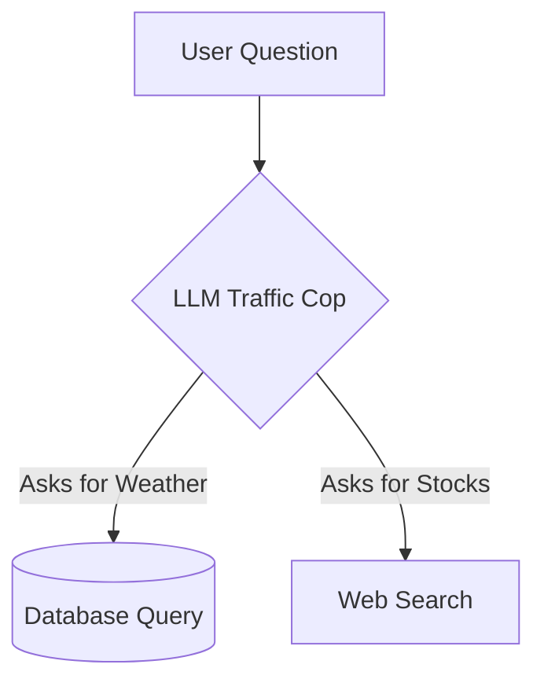
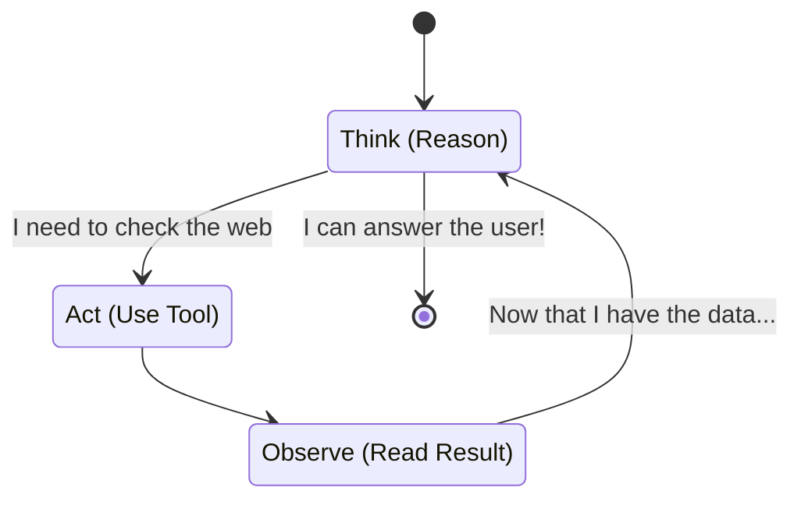
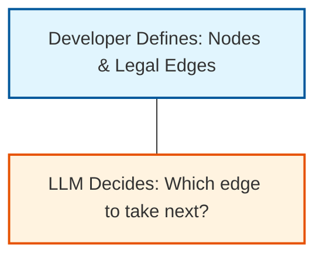

# 10.02 Why LangGraph?

Why wasn't LangChain enough? Why do we need an entirely new framework like LangGraph?

The creation of LangGraph stems from a fundamental engineering challenge in modern AI development: **How do you build AI systems that possess the flexibility of autonomous agents, yet retain the reliability and predictability required for production software?**

We need to dive into the core tension of AI development: the Autonomy Spectrum.

---

> [!TIP]
> **Beginner Analogy: The Transportation Spectrum**
> - **A train** goes exactly where the tracks are laid. It's completely deterministic and reliable, but it cannot steer around a fallen tree.
> - **A self-driving car** can go anywhere, avoid obstacles, and take detours. But without a map or clear rules, it might drive into danger.
> 
> AI development requires balancing the reliability of the train (Deterministic Software) with the adaptability of the self-driving car (Autonomous Agents).

---

## 1. The Autonomy Spectrum in AI Systems

### A. Fully Deterministic Software (The Train)

Traditional software architecture relies on deterministic (predictable) execution paths.

**Characteristics:**
- **Rigid:** Developers define every single step and outcome.
- **Reliable:** You always know exactly what will happen.
- **Drawback:** It cannot adapt. If a user asks a complex question it wasn't programmed for, it breaks.

### B. Fully Autonomous Agents (The Wild Self-Driving Car)

At the opposite extreme lies the fully autonomous agent. Projects like AutoGPT or BabyAGI demonstrated the raw power of LLMs by giving the AI total control.

**The Workflow:**
1. Give the AI an objective.
2. Let the AI plan its subtasks.
3. Let the AI write code, search the web, and evaluate its own work.
4. Let it run until it finishes.

While exciting on Twitter, these systems **fail in production**. Why? Because LLMs are fundamentally language models—they predict the most likely next word. When given total freedom, they often:
- Hallucinate fake tasks.
- Get stuck in infinite loops trying the same broken API call.
- Forget their original goal (Context Drift).

They are brilliant but easily distracted.

---

## 2. Bridging the Gap: Intermediate AI Architectures

Between "The Train" and the "Wild Self-Driving Car," we have a progression of architectures that slowly grant more power to the LLM.

### Level 1: Deterministic Code + Isolated LLM Call

The overall program is strict, but one step asks the LLM to process some text.

### Level 2: LLM Chaining (The Pipeline)

We pass the output of one process into the LLM, and take that output into another. The **Retrieval-Augmented Generation (RAG)** pipeline is the most famous example.

**RAG Pipeline:**
`User Question -> Search Knowledge Base -> Add Results to Prompt -> LLM Generates Answer`

This is still unidirectional. The data flows straight through, like water in a pipe.

### Level 3: LLM Router Patterns

Now we start giving the LLM control over the flow of the program. The LLM acts as a traffic cop.

The router is powerful, but it usually doesn't loop back around. It points left or right, and the program runs down that branch.

---

## 3. The Distinction: Chains vs. Agents

The defining characteristic of a true agent is **cyclic execution** (loops).

An agent doesn't just make a decision; it makes a decision, takes an action, observes the result of that action, and then makes *another* decision based on the new information.

- **Chains** are pipelines. Water flows down the pipe.
- **Agents** are cycles. The system loops back on itself.

Cycles are the core mechanism enabling reasoning, error correction, and multi-step planning. But cycles are dangerous if unconstrained.

---

> [!IMPORTANT]
> **The Engineering Goal of LangGraph: Controlled Autonomy**
> LangGraph aims to find the "sweet spot" on the Autonomy Spectrum. It provides a framework that is more flexible than strict code, but far more reliable than fully unconstrained agents.

## 4. LangGraph's Core Paradigm

LangGraph achieves "Controlled Autonomy" by modeling agent software as a **graph-based state machine**.

Instead of yielding total freedom to the AI, the developer (you) builds a walled garden (the graph).
- **You** define the permitted steps (Nodes).
- **You** define the rules for moving between steps (Edges).

The LLM is only granted **local autonomy**—it decides which allowed path to take next, but it cannot invent entirely new paths or run wild.

## Summary

LangGraph resolves the tension between reliability and autonomy. By forcing agent workflows into stateful, developer-constrained graphs, it provides the necessary infrastructure to deploy iterative reasoning systems safely into real-world applications. It prevents the self-driving car from driving off a cliff.
