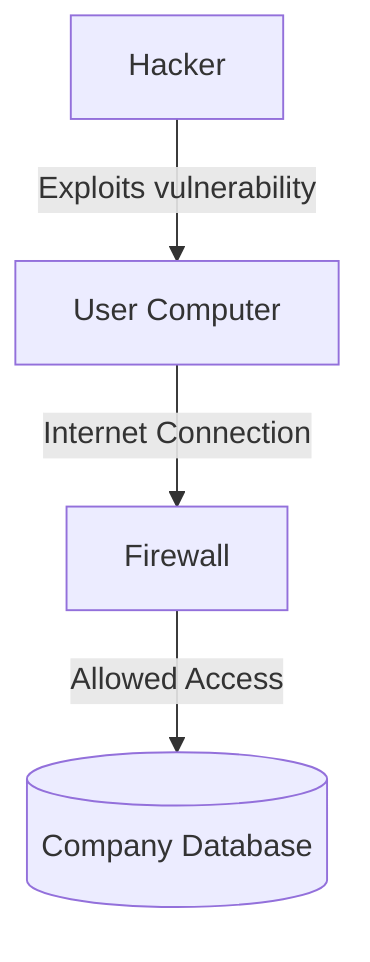
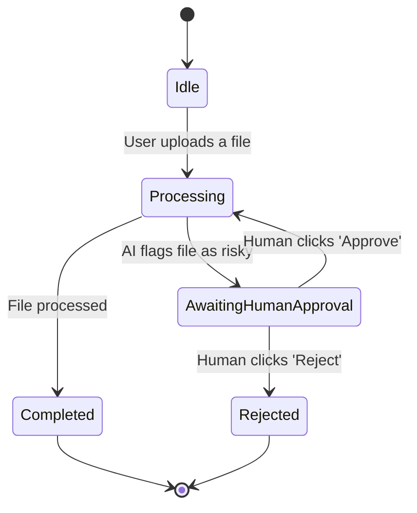
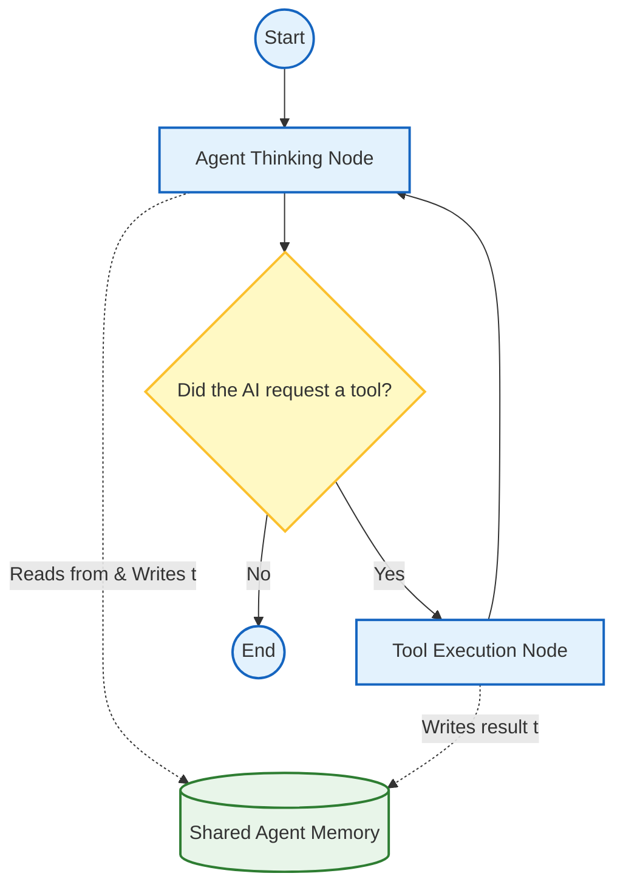

# 10.03 What are Graphs?

To master LangGraph, you need to understand two foundational computer science concepts: **Graphs** and **State Machines**. These concepts might sound intimidating, but they are actually very intuitive systems for organizing how a program behaves.

By shifting your mental model away from simple linear scripts towards these relational models, building complex AI agents becomes much easier.

---

> [!NOTE]
> **Beginner Analogy: The Board Game**
> Imagine playing a complex board game (like Monopoly). 
> - A **State Machine** is the rulebook that says "If you roll a 6, you move 6 spaces. If you land on Go to Jail, you go to Jail."
> - A **Graph** is the board itself—a map showing all the spaces you can land on and the paths connecting them.
> - The **State** is the scoreboard—how much money you have, what properties you own, and where your piece currently sits.

## 1. Graphs as a Data Structure

A **graph** is a way of mapping out relationships between different pieces of data.

Mathematically, a graph consists of two things:
1. **Nodes (or Vertices):** The individual items, places, or steps.
2. **Edges:** The lines connecting them, showing how you can move from one Node to another.

### Why Graphs Matter in Systems Engineering

Graphs run the modern digital world. They are the perfect way to model connectivity:
- **Social Networks:** You and your friends are Nodes. Your "friendships" are Edges.
- **Google Maps:** Cities are Nodes. The highways connecting them are Edges.
- **Cybersecurity:** Computers on a network are Nodes. A hacker moving from one computer to another follows an Edge.

In LangGraph, we use a graph to draw a visual map of **every possible step our AI agent can take**.

---

## 2. State Machines

A **State Machine** (specifically, a Finite State Machine) is a model used to design programs that move between distinct operational phases ("states") over time.

A state machine consists of:
1. A finite list of **States** (e.g., Idle, Thinking, Loading, Error).
2. A finite list of **Transitions** (rules for moving from one state to another).

### Why Do We Use State Machines?

State machines tame the chaos of code. Without them, developers often write massive files filled with `if/else` logic that becomes a nightmare to read. A state machine forces you to declare explicitly exactly what conditions must be met to move forward.

---

## 3. The Convergence: Graphs as State Machines

Here is the secret to LangGraph: **A state machine can be perfectly modeled as a graph!**
- The **States** become the **Nodes**.
- The **Transitions** become the **Edges**.

When building an AI agent, it flows through distinct phases. It reasons (a state), it acts using external tools (a state), and it returns answers (a state). This cyclical process is naturally represented as a state machine.

### How LangGraph Implements This

LangGraph provides a Python interface to build these board games for your AI:

1. **Nodes (`computation`)**: These are Python functions. Think of them as the spaces on the game board. When the AI lands on a Node, it executes the code inside that function (like calling OpenAI or querying a database).
2. **Edges (`routing`)**: These are the physical arrows on the board. They are Python rules dictating where the AI goes next. For example, "If the AI requested a Google Search, move its piece down the edge leading to the Search Tool Node."
3. **State (`memory`)**: This is the unified memory folder (often a Python dictionary). Every time the AI lands on a Node, that Node reads the State, performs its task, and updates the State (like updating your bank balance in Monopoly).

---

## Summary

The architectural philosophy behind LangGraph applies time-tested computer science rigor to the unpredictable nature of Large Language Models. 

- The **Graph** provides the structural map of where the AI is allowed to go.
- The **State Machine** enforces the rules of how the AI is allowed to travel along that map.

By modeling complex AI interactions as explicit graph-based state machines, you transform fragile, unpredictable prompts into powerful, modular, and controllable software systems.
