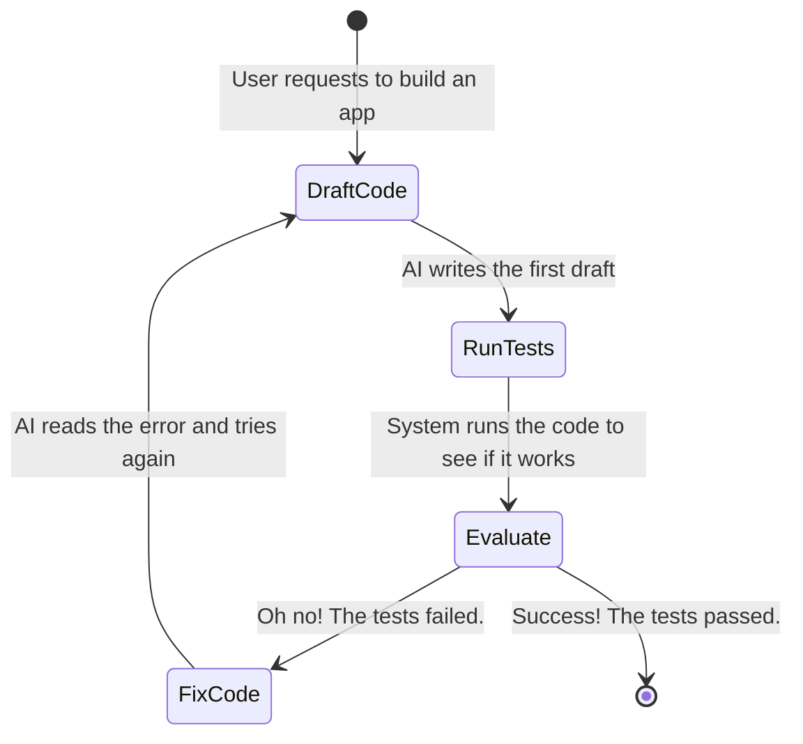

# 10.04 LangGraph & Flow Engineering

The emergence of **Flow Engineering** represents a massive shift in how we build AI applications. 

If early AI development was about "Prompt Engineering" (trying to write the perfect paragraph to trick the AI into doing everything right on the first try), Flow Engineering is about building a robust factory around the AI so it doesn't *have* to be perfect on the first try.

---

> [!TIP]
> **Beginner Analogy: The Factory Assembly Line**
> Imagine you want to build a perfect car.
> - **Prompt Engineering:** You give one mechanic a massive instruction manual (the prompt) and say, "Build the car perfectly in one go." It rarely works.
> - **Flow Engineering:** You build an assembly line (the flow). Station 1 builds the frame. Station 2 adds the engine. Station 3 inspects the car. If Station 3 finds a defect, it sends the car back to Station 2. 
> 
> The mechanic (the LLM) is still doing the smart work at each station, but the assembly line (LangGraph) guarantees the process is orderly, inspectable, and repeatable.

---

## 1. What Is Flow Engineering?

Flow engineering is the methodology of structuring AI applications as explicit, multi-step workflows.

Instead of writing one massive prompt asking an AI to "Search the web, format the data into a table, check for errors, and translate to French," a flow-engineered system breaks these responsibilities into discrete, manageable steps.

### Key Characteristics:
- **Modular Steps (The Stations):** Retrieval, text generation, evaluation, and tool usage are separated into distinct Nodes.
- **Controlled Transitions (The Conveyor Belts):** The developer explicitly authors how data moves between these Nodes using Edges.
- **Iterative Refinement (Quality Control):** You can cycle data through loops. If the "Evaluation" Node says the text is bad, it automatically routes back to the "Generation" Node to fix it.

---

## 2. The Fallacy of Pure Autonomy

Early attempts at AI agents (e.g., AutoGPT) attempted to delegate total control of the execution flow to the LLM. They gave the mechanic the keys to the entire factory and hoped for the best.

**The Autonomous Model (How it used to be):**
```text
Goal Received → AI Plans Steps → AI Executes Steps → AI Evaluates Progress → (Repeat until Done)
```

**Why it fails for beginners and experts alike:**
LLMs are exceptionally capable reasoning engines, but they are poor long-term structural planners. When burdened with simultaneous responsibility for planning, execution, and self-evaluation, they often:
- **Forget the goal:** Get distracted by a random search result.
- **Get stuck:** Endlessly repeat the same broken Python code.
- **Crash the app:** Fail to realize they are finished.

These systems are fascinating to watch on YouTube but terrifying to deploy to real users.

---

## 3. The Flow Engineering Paradigm

Flow engineering solves the autonomy problem via a crucial separation of concerns:

**You (the Developer) design the structure of the factory; the AI drives the execution within that structure.**

1. **Topology (The Map):** You define the permitted states and transitions. The AI cannot go "off the map".
2. **Navigation (The Driver):** The AI decides which permitted path to take based on the current context.

This results in a system that is deterministic in its boundaries, but adaptive in its logic.

---

## 4. Flow Engineering as a State Machine

Let's look at a flow-engineered system for writing code. Instead of expecting the AI to write perfect code on the first attempt, the system is designed to iterate:



The AI participates natively in this graph:
- **As a Worker:** In the `DraftCode` and `FixCode` nodes, writing or fixing code.
- **As an Evaluator:** In the `Evaluate` node, critiquing the output.
- **As a Router:** Determining if the tests passed or failed, thus driving the transition to the end.

---

## 5. Where LangGraph Fits

**LangGraph is the premier orchestration framework for implementing flow engineering in Python.**

LangGraph operationalizes flow engineering by translating your visual assembly line into real Python code.

- **Nodes = Workflow Steps**: Discrete Python functions mapping to stations in the flow.
- **Edges = Control Flow**: Conditional logic determining the next station.
- **State = Shared Memory**: A central data folder that moves down the conveyor belt.

Because graphs natively support cycles, LangGraph effortlessly handles the `DraftCode → Evaluate → FixCode → DraftCode` loops that make modern AI actually useful.

---

## 6. The Shift in Developer Effort

If you are learning this today, you are at an incredible advantage. Flow engineering fundamentally changes how you should spend your time building AI apps:

- **60% Architecture & Flow Engineering**: Designing the graph topology, figuring out what data needs to be in the State, and building fallback routes if the AI fails.
- **35% Model Optimization**: Feeding the AI better data (RAG) and evaluating its performance.
- **5% Prompt Engineering**: Writing basic instructions for individual nodes.

As AI models get smarter out-of-the-box, the competitive advantage is no longer *how well you can write a prompt*—it is *how robustly you can engineer the factory floor around the AI*.
