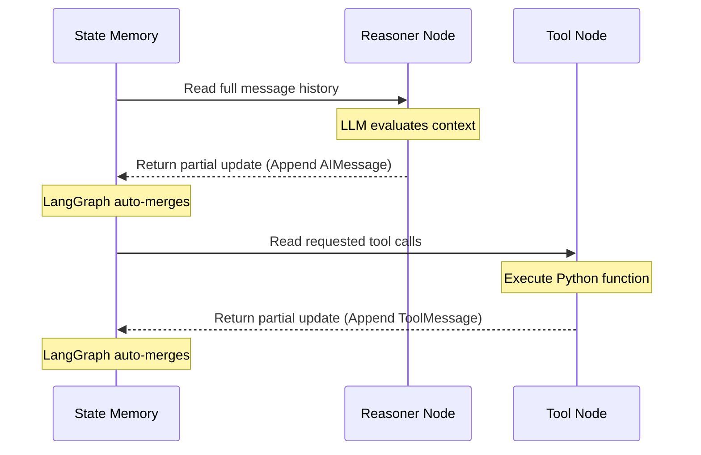
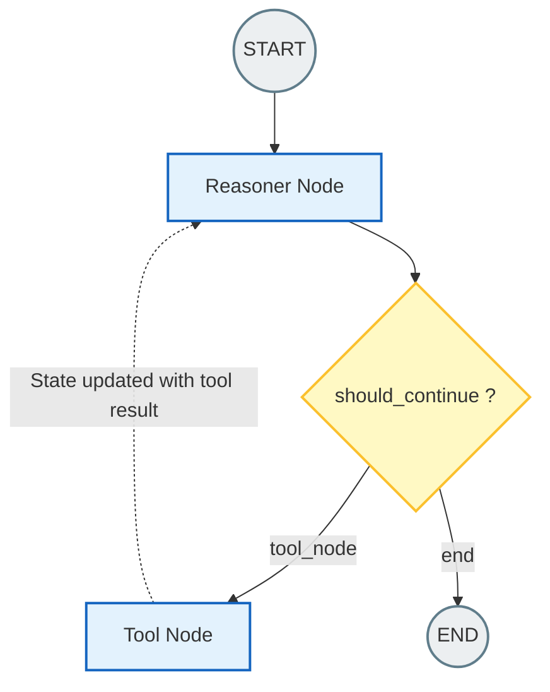

# 10.05 LangGraph Core Components

To translate the concepts of state machines and graph theory into executable Python code, LangGraph provides a minimal but immensely powerful set of foundational building blocks. 

Building a LangGraph application means you are no longer writing a top-to-bottom Python script. Instead, you are constructing a graphical map of your program using **Nodes**, **Edges**, **Conditional Edges**, and a unified **State**.

---

> [!NOTE]
> **Beginner's Cheat Sheet:**
> - **State:** The Agent's Memory (Usually a dictionary).
> - **Nodes:** The Agent's Actions (Python functions that do work).
> - **Edges:** The Agent's Paths (Rules that connect Nodes together).

## 1. The Core Primitives

### A. State: The Graph's Memory
The most critical concept in LangGraph is the **State**. 

In standard Python scripts, you might use global variables or pass dozens of arguments between functions. LangGraph enforces a much cleaner approach: a single, structured data object (the State) that is explicitly passed from Node to Node.

- **What is it?** Typically implemented as a Python `TypedDict` or a Pydantic `BaseModel`.
- **What does it do?** It retains the entire context of the execution—conversation history, intermediate extraction results, routing flags, and error logs.
- **How does it change?** Nodes do not return final answers; they return *updates* to the State. LangGraph's engine automatically merges these updates before passing the newly updated State to the next Node.

**Let's look at some basic code:**
```python
from typing import TypedDict, Annotated
import operator

# 1. We define the blueprint for our State
class AgentState(TypedDict):
    # 'Annotated' with 'operator.add' tells LangGraph:
    # "Don't overwrite the old messages, append new ones to the list!"
    messages: Annotated[list, operator.add]
    current_tool: str
    retry_count: int
```

**Visualizing the State Flow:**


### B. Nodes: Units of Computation
A **Node** is a discrete unit of work within the graph (like a station on an assembly line). In practice, a Node is simply a Python function that accepts the current `State` as its input and returns a dictionary containing State updates.

Nodes can execute anything:
- Calls to OpenAI/Anthropic APIs
- SQL queries to your database
- Math calculations or web searches

```python
# 2. We define a Node (A worker on our assembly line)
def reasoner_node(state: AgentState):
    """Invokes the LLM to decide the next action."""
    
    # We read from the current state memory
    prompt = "Read this history and reply: " + str(state['messages'])
    
    # We ask the LLM for a response
    response = llm.invoke(prompt)
    
    # IMPORTANT: We return an UPDATE to the state.
    # Because 'messages' has 'operator.add', this response is appended!
    return {"messages": [response]} 
```

### C. Edges: Deterministic Routing
**Edges** connect Nodes, defining the strict sequence of execution. If Node A has a standard edge to Node B, LangGraph will *always* transition to Node B once Node A completes.

- **Purpose:** Enforce rigid pipelines (the conveyor belt on the assembly line) where no AI decision is required.

### D. Conditional Edges: Dynamic Routing
**Conditional Edges** breathe life and intelligence into the agent. Instead of a hardcoded path, a conditional edge uses a standard Python function to evaluate the current State and decide which Node to go to next.

- **Purpose:** Allow the LLM's output (which we saved in the State) to dictate the flow. For example, if the LLM asked to use a specific tool, the conditional edge routes the flow to the Tool Node.

```python
def should_continue(state: AgentState) -> str:
    """This function acts as a traffic cop."""
    
    # Look at the very last message in the state
    last_message = state["messages"][-1]
    
    # If the LLM requested to use a tool...
    if "tool_calls" in last_message.additional_kwargs:
        return "tool_node" # ...send it to the tool node!
        
    # If not, the AI is done thinking. Send it to the end.
    return "end"
```

---

## 2. Special Boundary Nodes

LangGraph provides two reserved nodes that anchor the workflow. Think of them as the front door and back door of the building.

- **`START` Node:** The entry point. The initial input you type into the graph is routed from `START` to the very first active node.
- **`END` Node:** The termination point. When a node routes to `END`, execution halts completely, and the final State is returned back to you.

---

## 3. Putting It Together: Building the Graph

To construct the engine, these pieces are snapped together using the `StateGraph` object. This is where you actually "draw" the map in Python.

```python
from langgraph.graph import StateGraph, START, END

# 1. Initialize the graph, telling it to use our AgentState blueprint
workflow = StateGraph(AgentState)

# 2. Add our workers (Nodes) to the graph
workflow.add_node("reasoner", reasoner_node)
workflow.add_node("tool_node", execute_tools)

# 3. Define the Front Door: Start by going to the reasoner
workflow.add_edge(START, "reasoner")

# 4. Add the Traffic Cop (Conditional Routing)
# After the 'reasoner' runs, call 'should_continue' to decide where to go.
workflow.add_conditional_edges(
    "reasoner",
    should_continue,
    {
        "tool_node": "tool_node",
        "end": END
    }
)

# 5. Add a standard edge back to the reasoner (Creating the Loop!)
# Once the tool finishes, ALWAYS go back to the reasoner.
workflow.add_edge("tool_node", "reasoner")

# 6. Compile the graph into an executable application
app = workflow.compile()
```



---

## 4. Advanced System Capabilities for Beginners

Because we explicitly mapped out the graph (instead of hiding it in messy Python `while` loops), LangGraph unlocks incredible enterprise features that would otherwise take months to build:

### Persistence & Checkpointing (Save States)
By giving LangGraph a database (like SQLite or Postgres) when you compile the graph, it automatically "saves the game" after *every* node execution. 
- **Resiliency:** If an OpenAI API timeout crashes the program midway through, the graph can simply resume from the exact Node where it failed. It remembers all the previous State.
- **Human-in-the-Loop (HITL):** You can tell a Node, "Stop and wait for a human." The program sleeps and saves the State constraint to the database. A human can review the AI's requested action, click "Approve", and wake the graph back up!

### Time Travel
Because every state transition is logged, developers can retrieve historical "save states", rewind the graph to a previous node, manually fix a mistake the AI made (like fixing a typo in a tool argument), and resume execution from the past!

## Summary

The architectural brilliance of LangGraph is that it moves the complex logic *out of the AI prompts* and *into the software architecture*. 

- **Nodes constrain computation.**
- **Edges enforce paths.** 
- **The State acts as the unified memory bus.** 

Together, they allow the construction of cyclic, stateful LLM orchestrations that are infinitely more reliable and observable than naive loop-based scripting.
