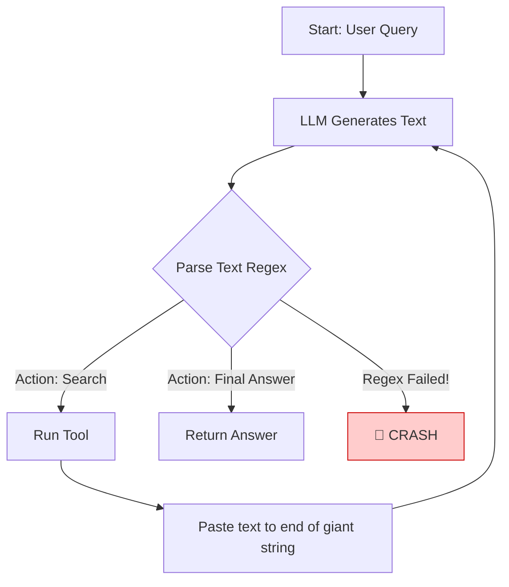
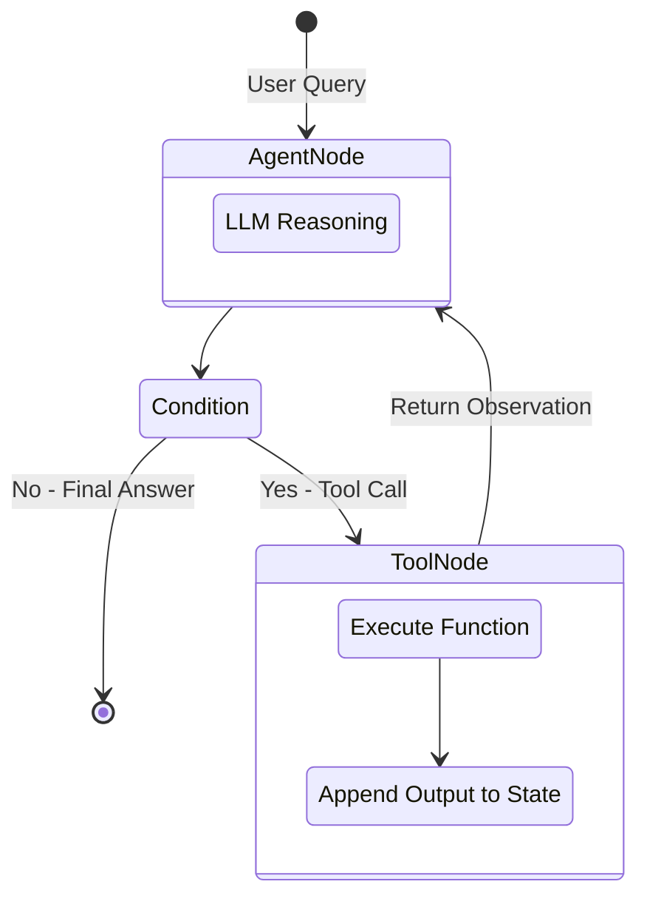

# 10.06 Implementing ReAct AgentExecutor with LangGraph

This section bridges the theory of LangGraph (graphs, nodes, and state) with practical implementation. Our goal is to architect the most common AI pattern in the world: a **ReAct (Reason + Act)** agent.

---

> [!NOTE]
> **Beginner's Concept: What is ReAct?**
> ReAct is simply a loop. When you give an AI a hard question, it shouldn't just guess the answer immediately. 
> 1. It should **Reason** ("I need to find the capital of France").
> 2. It should **Act** (Run a Google Search tool for "Capital of France").
> 3. It explores the result ("Paris"), and loops back to Reason again until it has enough info to answer the user.

---

## 1. The ReAct Architecture: Procedural vs. Graph-Based

Let's look at why building agents *used to* be so hard for beginners.

### The Procedural Approach (Pre-LangGraph)
Historically, the ReAct loop was implemented using messy Python `while` loops (like LangChain's old `AgentExecutor`). You had to write a script that essentially ran forever until the AI decided it was done.

```python
# Procedural ReAct Pseudo-code (The OLD way)
def run_agent(query):
    context = query
    while True: # Loop forever!
        action = llm.decide_action(context)
        
        # Did the AI say it's finished?
        if action.is_final(): 
            return action.answer # Break the loop
        
        # Otherwise, run the tool it asked for
        tool_result = execute_tool(action.tool_name, action.args)
        
        # Clunkily paste the text back together
        context += "\nObservation: " + tool_result 
```

**Visualizing the Procedural Flaw:**


**Why this was a nightmare:**
- **Opaque State:** The `context` string just kept getting longer and longer. It was a massive wall of text that was incredibly hard to read or debug.
- **Brittle Execution:** If an API failed or the AI hallucinated a tool name, the loop crashed entirely. You had to start over from the beginning.
- **Hidden Transitions:** The logic is buried inside a Python `while` loop, hiding the AI's actual decision pathway.

### The Graph-Based Approach (LangGraph)
LangGraph unrolls this messy `while` loop into an explicit, modular state machine (our board game).



By formalizing the loop as a graph, the workflow becomes inspectable step-by-step. If it fails, you know *exactly* which Node crashed.

---

## 2. Architecting the Graph

To build this ReAct executor, we must define the three core components: State, Nodes, and Edges.

### A. The State Schema
For a ReAct agent, the minimal memory we need is simply the history of the conversation. 

Modern LLMs (like GPT-4, Claude 3) natively understand a format called a "Message list" (e.g., `["Human: Hello", "AI: How can I help?"]`). Therefore, passing a list of messages inside our State is sufficient.

```python
from typing import Annotated
from typing_extensions import TypedDict
from langgraph.graph.message import add_messages

class AgentState(TypedDict):
    # 'add_messages' is a built-in LangGraph function that cleanly appends
    # new conversational messages to our list, rather than overwriting it entirely.
    messages: Annotated[list, add_messages]
```

### B. The Nodes
Our graph needs exactly two workers (nodes):

1. **The Reasoner (`agent`)**: Invokes the LLM to read the `messages` array. If the AI thinks it needs a tool, it generates a special message called a **ToolCall**. If it's finished, it generates standard text.
2. **The Tool Executor (`tools`)**: Scans to see what the AI asked for. It executes the matching Python functions and appends the results to the State so the AI can read them on the next pass.

*Note: Modern LangGraph provides a pre-built `ToolNode` precisely for this second step, so we don't have to write it ourselves!*

### C. The Edges (Routing)
The routing logic determines how the state machine advances.

- **Start to Agent:** Explicitly map `START -> agent`.
- **The Traffic Cop (Conditional Edge)**: We inspect the most recent message the AI placed into our State. If the message contains a request to use a tool (`tool_calls`), we route to the `tools` Node. Otherwise, we route to `END`.
- **Tools to Agent:** Explicitly map `tools -> agent`. This is the edge that completes the ReAct loop, sending the tool's output back to the AI for more reasoning.

---

## 3. The Power of Native Function Calling

What makes modern LangGraph implementations vastly superior to early ReAct agents is the reliance on model-native **Function Calling** rather than trying to parse messy text.

Early agents tried to force the AI to write text in a specific format:
> *"If you want to use a tool, reply in the exact format: `Action: Search, Args: [x]`"*

This was terrible because AIs would constantly misspell the formatting, breaking the script.

Now, we directly bind tools to the LLM. The AI provider (like OpenAI) guarantees they will return a perfectly formatted JSON object representing the tool request.

```python
# Tell the LLM exactly what tools it is allowed to use
llm_with_tools = llm.bind_tools([search_weather, multiply])
```

Because the output is 100% reliable JSON, our traffic cop (routing condition) simplifies drastically:

```python
def should_continue(state: AgentState):
    # Grab the very last message in the chat history
    last_message = state['messages'][-1]
    
    # If the LLM securely generated a structured tool call array, route to tools
    if last_message.tool_calls:
        return "tools"
        
    # Otherwise, it generated natural text. The AI is done!
    return "end"
```

## Summary

Implementing a ReAct AgentExecutor in LangGraph forces an incredible "Aha!" moment for beginners: we are no longer writing a script that loops an LLM blindly. 

We are defining a graph architecture—with explicit Reason and Act nodes—where the LLM's perfectly structured output dictates the movement of our State Memory across the board. This results in incredibly clean code, native tool execution, and an inherently observable reasoning loop.
