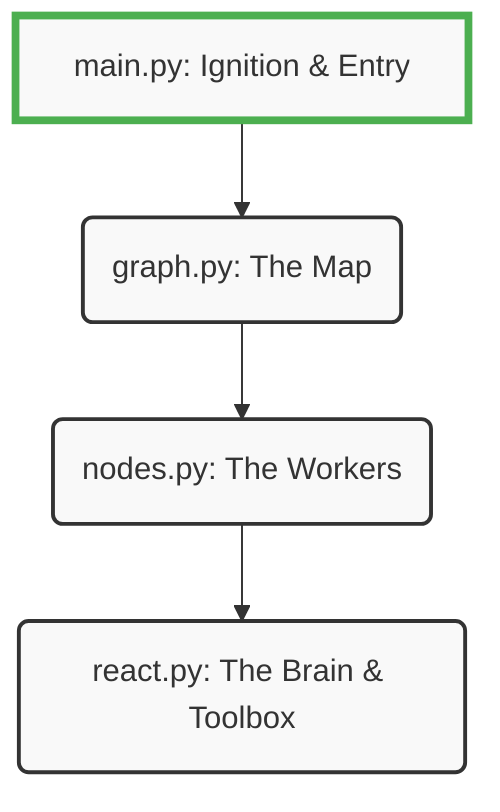

# 10.08 Setting Up a ReAct Agent Project

Before writing any LangGraph code, we need to set up a clean, secure project environment. Setting up your workspace correctly from Minute 1 is the difference between a project that works smoothly and one that fails with endless "Module Not Found" or "Invalid API Key" errors.

---

> [!TIP]
> **Beginner's Checklist: The Anatomy of an AI Project**
> Every AI agent project requires three things:
> 1. **Packages:** The necessary libraries (like `langgraph` or `openai`).
> 2. **Environment Variables:** Secret keys (like passwords) to talk to OpenAI or Google search.
> 3. **Structure:** The Python files organizing your graph.

---

## 1. Project Initialization & Packages

We will use `uv` (the fast, modern Python package manager) to install our dependencies.

1. **Create the Project:** Navigate to your project folder using your terminal or command prompt.
2. **Initialize:** Run `uv init` (this sets up a basic `pyproject.toml` file).
3. **Install Packages:** Run the following command:

```bash
uv add langgraph langchain-openai langchain-community python-dotenv
```

### What are these packages doing?
- **`langgraph`**: The orchestration framework to build our nodes and edges.
- **`langchain-openai`**: The unified connection module to talk to OpenAI's models (like GPT-4).
- **`langchain-community`**: A massive library of community-built tools (like Wikipedia search, calculcators, or Tavily web search).
- **`python-dotenv`**: A small utility that securely loads our secret API keys into our Python script.

*(Optional but recommended formatting tools: `uv add --dev black isort`)*

---

## 2. Managing API Keys (The `.env` File)

To use tools like OpenAI or web search, you need API keys. **Never paste API keys directly into your Python files!** If you commit them to GitHub by mistake, bots will find them and spend your money.

### Step-by-Step Security
1. Create a plain text file in the root of your project called `.env` (just `.env`, nothing before the dot).
2. Inside `.env`, add your keys like this:

```ini
# .env file
OPENAI_API_KEY=sk-proj-your-actual-key-here...
TAVILY_API_KEY=tvly-your-actual-key-here...

# Enable the LangSmith Debugging Dashboard!
LANGSMITH_TRACING=true
LANGSMITH_API_KEY=lsv2_your-actual-key-here...
LANGSMITH_PROJECT=MyFirstLangGraphAgent
```

3. Create exactly one more file called `.gitignore`. Add `.env` to it. This guarantees your secret keys will absolutely never be uploaded to GitHub.

---

## 3. Project Structure: Organizing the Code

For a LangGraph project, it is considered best practice to separate your agent's reasoning from its execution architecture. Don't put everything in one massive `main.py` file!

A beginner-friendly project structure looks like this:

```text
my-react-agent/
├── .env                  <-- Your secret keys
├── .gitignore            <-- Tells GitHub to ignore .env
├── pyproject.toml        <-- Installed packages list (built by 'uv')
│
├── react.py              <-- The Agent's "Brain" (The LLM + The Tools)
├── nodes.py              <-- The Graph's "Workers" (The Reasoning Node + Executer Node)
├── graph.py              <-- The Graph's "Map" (Connecting the nodes and edges)
└── main.py               <-- The "Ignition" (The entry point to run the app)
```

**Visualizing the File Architecture:**


## 4. The Entry Point (`main.py`)

To ensure everything is wired correctly, we usually start by writing a tiny script in `main.py` that simply loads our environment variables. 

```python
# main.py
from dotenv import load_dotenv
import os

# 1. Look for the .env file and securely load the keys!
load_dotenv()

# 2. Check to see if it worked
if not os.getenv("OPENAI_API_KEY"):
    print("WARNING: OpenAI API Key is missing. The agent will crash!")

# (Later, we will import our compiled 'graph' here and run it.)
```

## Summary
You have now properly initialized your environment. Your packages are installed, your API keys are secured in your `.env` file, and your workspace is structured logically. You are now ready to start coding the "brain" of the agent in `react.py`.
