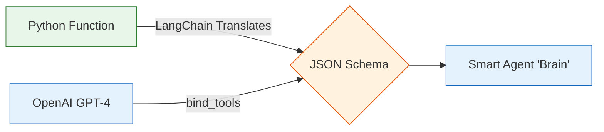

# 10.09 Coding the Agent's Brain (The `react.py` Module)

In this section, we build the "brain" of the agent inside `react.py`. 

Before we map out the workflow (the LangGraph), we first need to define two critical pieces of intelligence:
1. **The Tools:** What actions is the agent allowed to take?
2. **The LLM (The Brain):** The model that will decide *when* and *how* to use those tools.

---

> [!NOTE]
> **Beginner Analogy: Equipping the Handyman**
> Think of the LLM as a highly intelligent handyman you just hired. By default, he knows a lot of theory (he's read the manual on plumbing, electrical, and carpentry), but he arrived with empty hands. 
> 
> "Binding Tools" means you hand him a physical toolbox (a hammer, a wrench, a web search tool) and give him the *instruction manuals* for when to use them.

---

## 1. Defining the Tools

LangChain makes it incredibly easy to define a tool. You simply write a standard Python function and attach the `@tool` decorator above it.

### A Simple Custom Tool
```python
# react.py
from langchain_core.tools import tool

# The @tool decorator magically converts a basic Python function 
# into a structured JSON tool that an LLM can understand!
@tool
def triple(num: float) -> float:
    """
    Multiplies a provided number by 3.
    Use this tool whenever you need to 'triple' a quantity.
    """
    # The docstring above is REQUIRED! 
    # That is how the LLM knows *when* to use it.
    
    return 3.0 * float(num)
```

### Prebuilt Community Tools
You don't have to write everything yourself. LangChain has massive libraries of tools ready to use. For example, giving your agent real-time internet access using **Tavily**.

*(Tavily is a search engine built specifically for AI agents, rather than human browsers).*

```python
from langchain_community.tools.tavily_search import TavilySearchResults

# 1. Initialize the built-in search tool
search = TavilySearchResults(max_results=2)

# 2. Add both our custom tool and the prebuilt tool into a list (The Toolbox)
tools = [search, triple]
```

---

## 2. Setting Up the Language Model (The LLM)

Next, we establish the connection to OpenAI. The `ChatOpenAI` module handles the API calls securely. 

```python
from langchain_openai import ChatOpenAI

# Initialize the model. 
# It automatically looks for OPENAI_API_KEY in your .env file!
llm = ChatOpenAI(model="gpt-4o", temperature=0)
```

**Why `temperature=0`?** 
Temperature controls randomness. For creative writing, a high temperature (like `0.8`) is good. For an agent tasked with routing logic, calling math tools, and analyzing data, you want maximum predictability and logic, hence `0`.

---

## 3. Binding the Tools (The Critical Step!)

Right now, we have an empty-handed handyman (`llm`) and a full toolbox (`tools`). They are completely disconnected. The LLM has no idea the tools exist yet!

To fuse them together, we use the `bind_tools()` function.

```python
# We "bind" the tools to the LLM. 
# This means: "Whenever I ask you a question, remember you hold these tools."
llm_with_tools = llm.bind_tools(tools)
```

### What `bind_tools()` actually does under the hood

**Visualizing the Tool Binding Process:**


When you run `bind_tools`, LangChain automatically reads the source code and docstrings of every function inside your `tools` list. It translates them into strict **JSON Schemas**.

When you send a message to OpenAI, it silently attaches those JSON schemas.

The API payload to OpenAI looks something like this (conceptually):
```json
{
  "messages": [{"role": "user", "content": "What is the temperature in Tokyo, and triple it?"}],
  "tools": [
    {
       "type": "function",
       "function": {
           "name": "triple",
           "description": "Multiplies a provided number by 3...",
           "parameters": {
               "type": "object",
               "properties": {
                   "num": {"type": "number"}
               }
           }
       }
    }
  ]
}
```

Because the LLM is natively trained to recognize these incoming `tools`, it doesn't just reply with English text. If it needs the tool, it replies with a strictly formatted JSON array asking to execute `triple` with the argument `15`. 

## Summary
Inside `react.py`, we defined our capabilities (tools) and wired them directly into the intelligence engine (the LLM). Our "brain" (`llm_with_tools`) is now fully prepped. 

However, it is currently sitting idle. To actually execute this intelligence and loop it around, we must place this brain inside a LangGraph Node, which we will do next in `nodes.py`.
