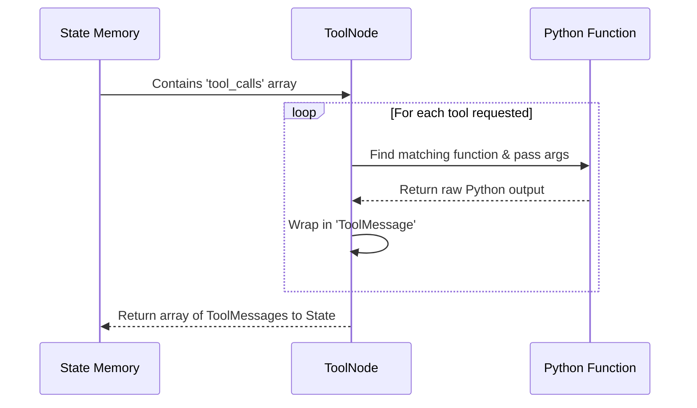

# 10.10 Defining Agent Nodes in LangGraph

We have our State (the memory) and we have our Brain (`llm_with_tools`). Now we need to put them inside the LangGraph engine. 

In LangGraph, work is done by **Nodes**. A ReAct agent requires two nodes:
1. **The Reasoner Node:** Where the LLM thinks.
2. **The Tool Node:** Where Python functions are executed.

Let's write these nodes inside a new file called `nodes.py`.

---

## 1. The Reasoner Node

A Node is simply a standard Python function. It always takes the `State` as an input, and it always returns a dictionary of *updates* to that State.

```python
# nodes.py
from langgraph.graph import MessagesState
from react import llm_with_tools # Importing our "Brain"

# 1. Define the system instructions 
# (Telling the LLM who it is and how to behave)
system_message = """
You are a helpful AI assistant. 
You have access to tools. Use them if you need them.
"""

# 2. Define the Node function
def agent_node(state: MessagesState):
    """
    This is the 'Thinking' station on our assembly line.
    """
    
    # Step A: Collect the context
    # We combine our system instructions with the entire conversation history stored in the State.
    messages_to_process = [
        {"role": "system", "content": system_message}
    ] + state["messages"]
    
    # Step B: Call the LLM
    # We hand the full history to our Brain and wait for it to generate a response.
    response = llm_with_tools.invoke(messages_to_process)
    
    # Step C: Update the State
    # Because our State is set up to *append* messages (using add_messages),
    # returning this dictionary simply adds the LLM's response to the bottom of the chat history.
    return {"messages": [response]}
```

### Beginner Check: What did the LLM just return?
The `response` from the LLM will be an `AIMessage`. 
- If the LLM realized it knows the answer, `response.content` will have text like *"Hello! I can help."*
- If the LLM realized it needs a tool, `response.tool_calls` will contain a JSON request like `[{name: "search", args: {"query": "weather"}}]`. 

Our next nodes will figure out what to do with that outcome!

---

## 2. The Tool Node

If the LLM asked to use a tool, we need a Node to actually run the Python code for that tool. 

Thankfully, executing tool functions, parsing their results into text, and appending them back into the State is such a common requirement that LangGraph provides a pre-built node to do it automatically: the `ToolNode`.

```python
from langgraph.prebuilt import ToolNode
from react import tools # Importing our Toolbox list (search, triple)

# The prebuilt ToolNode automatically:
# 1. Reads the LLM's 'tool_calls' request from the State.
# 2. Finds the matching Python function in our 'tools' list.
# 3. Runs the Python function with the LLM's arguments.
# 4. Appends a new 'ToolMessage' to the State with the results.
tool_node = ToolNode(tools)
```

### Under the Hood: What is `ToolNode` doing?
If you were to write the `ToolNode` yourself, it would look like this messy code. (You **do not** need to write this, but this is what happens behind the scenes!)

```python
# CONCEPTUAL: How ToolNode works
def manual_tool_node(state: MessagesState):
    # Get the LLM's request
    last_message = state["messages"][-1]
    results = []
    
    # For every tool the LLM asked to use...
    for tool_call in last_message.tool_calls:
        # 1. Find the tool function
        tool_func = tools_dict[tool_call["name"]]
        # 2. Run the function
        observation = tool_func.invoke(tool_call["args"])
        # 3. Format the result
        results.append(ToolMessage(content=str(observation), tool_call_id=tool_call["id"]))
        
    # Return the new messages to the State!
    return {"messages": results}
```

**Visualizing the ToolNode Execution:**


## Summary
We now have our two workers:
- `agent_node`: Does the thinking.
- `tool_node`: Does the acting.

These workers exist in isolation. In the next chapter, we will open `graph.py` and draw the map that perfectly connects these two nodes into an infinite, intelligent ReAct loop!
