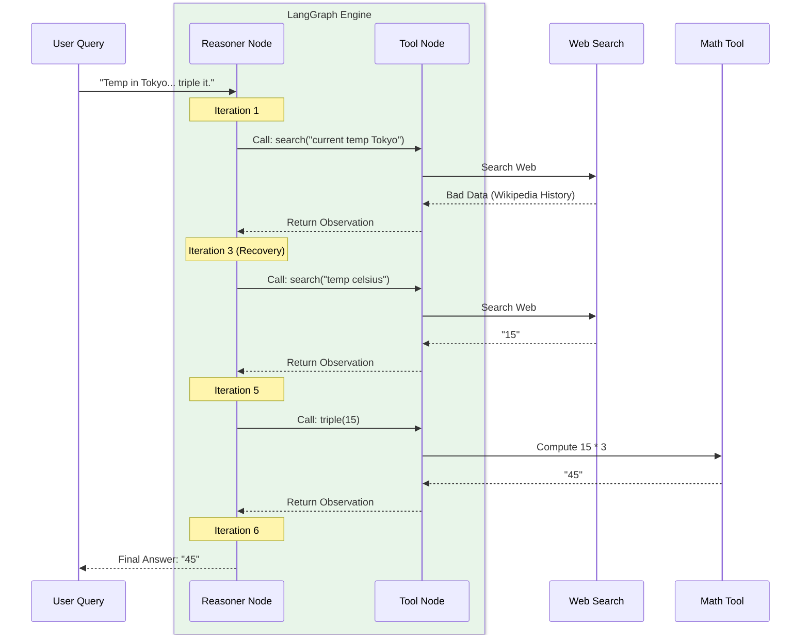

# 10.12 Running LangGraph ReAct Agent

Our graph is built and compiled into the `app` object. Now, we finally start the engine and test it with a real, complex user query that requires multiple steps!

---

## 1. Invoking the Application

To start the agent, we call the `.invoke()` method. 

Because we designed our `MessagesState` blueprint to expect a list of messages, we must wrap our user's question inside a `HumanMessage` object and pass it in as a dictionary.

```python
# main.py
from langchain_core.messages import HumanMessage
from graph import app # Import our compiled graph

# Let's ask a complex question:
user_query = "What is the temperature in Tokyo? Extract just the number and then triple it."

print("Starting agent...")

# Start the conveyor belt!
result_state = app.invoke({
    "messages": [HumanMessage(content=user_query)]
})

# Read the final output from the State memory
final_ai_message = result_state["messages"][-1]
print("\nFinal Answer:", final_ai_message.content)
```

## 2. Debugging and Tracing (The LangSmith Dashboard)

If you just look at the final printed text, it might say: `The temperature is 15C, tripled is 45C.` It looks like magic. But as a developer, you need to see exactly what happened under the hood.

Because we set `LANGSMITH_TRACING=true` in our `.env` file, this entire execution was silently logged to our LangSmith dashboard. Let's look at the **Trace**.

### The ReAct Loop Step-by-Step Trace

**Visualizing the LangSmith Execution Trace:**


Here is exactly what the LangGraph engine did in the background while `.invoke()` was running:

#### Iteration 1: Initial Reasoning
1. **Current Node:** `agent_reason`
2. **LLM Thinking:** "I need to find the weather in Tokyo. I will use my search tool."
3. **State Change:** LLM appends an `AIMessage` with `tool_calls=[{"name": "search", "args": {"query": "current temperature Tokyo"}}]`.
4. **Traffic Cop (`should_continue`):** Sees the `tool_calls`, routes to the `act` node.

#### Iteration 2: Tool Execution (A Failure!)
1. **Current Node:** `act` (ToolNode)
2. **Action:** Python executes the web search.
3. **Observation:** The search engine returns a Wikipedia article about Tokyo history instead of the weather.
4. **State Change:** `ToolMessage` appended to State with the bad data.
5. **Routing:** Unconditionally routes back to `agent_reason`.

> [!TIP]
> **Beginner's Goldmine: Error Recovery!**
> If this was a linear script (a DAG), the program would crash here, or tell the user "I couldn't find the weather." But because LangGraph allows loops, the AI gets a second chance automatically.

#### Iteration 3: Error Recovery Reasoning
1. **Current Node:** `agent_reason`
2. **LLM Thinking:** Reads the history. "Ah, my first search failed. I need to write a better search query that specifically asks for the Celsius number."
3. **State Change:** LLM appends a *new* tool request: `[{"name": "search", "args": {"query": "weather Tokyo current temp celsius"}}]`.
4. **Traffic Cop:** Routes back to `act`.

#### Iteration 4: Second Tool Execution
1. **Current Node:** `act`
2. **Action:** Python executes the better web search.
3. **Observation:** Returns the number `15`. Routes back to `agent_reason`.

#### Iteration 5: Tripling the Number
1. **Current Node:** `agent_reason`
2. **LLM Thinking:** "I have 15. The user asked me to triple it. I will use my Triple tool."
3. **State Change:** `tool_calls=[{"name": "triple", "args": {"num": 15}}]`. Routes to `act`.

#### Iteration 6: Finalizing
1. **Current Node:** `act` -> executes `triple(15)` -> returns `45`. Routes back to `agent_reason`.
2. **Current Node:** `agent_reason`. 
3. **LLM Thinking:** "I have all the information necessary. I will format the final response for the user in conversational text."
4. **State Change:** Appends an `AIMessage` containing: *"The current temperature in Tokyo is 15°C. Tripled, that is 45."* (Notice: NO tool calls this time!)
5. **Traffic Cop:** Sees no tool calls. Routes to `END`.

---

## Conclusion

This trace reveals the absolute brilliance of the ReAct pattern orchestrated through LangGraph. 

The AI wasn't a rigid script; it was a reasoning entity navigating a maze. It made a mistake (a bad search query), realized its mistake by observing the State, corrected its behavior, and systematically worked through a multi-tool sequence to achieve the goal. And the LangGraph engine managed the transitions flawlessly without crashing.
