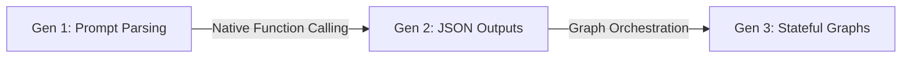

# 10.13 Building Modern LLM Agents: An Architectural Evolution

Now that you've built a LangGraph agent, the concepts might still feel a bit abstract. It's helpful to quickly understand the historical journey of "AI Agents" to fully appreciate why LangGraph exists today.

This section traces that evolution from fragile text-parsing prototypes (Generation 1) into robust, graph-orchestrated state machines (Generation 3).

---

## 1. Generation 1: The Prompting Era (2022-2023)

When ChatGPT first launched, the LLMs had no native concept of "tools". They were just extremely smart autocomplete engines. 

Developers realized that if they yelled loud enough in the system prompt, they could force the AI to simulate an agent loop.

**The Legacy Pattern (The "ReAct Prompt"):**
```text
SYSTEM INSTRUCTION:
You have access to the following tools: Search, Calculator
If you want to use a tool, you MUST reply using EXACTLY this format:
Thought: <your secret internal reasoning>
Action: <the tool name>
Action Input: <the arguments you need>
Observation: <the result will go here later>
```

LangChain built an early system where a Python script would send this prompt to OpenAI, wait for the AI to print the word `Action: Search`, and then run a Regex text parser to literally scrape the word "Search" out of the response.

### The Critical Flaw: The Text Parsing Crash
If the AI accidentally typed `Actions:` instead of `Action:`, the Python script crashed. If it missed a space, it crashed. This approach was essentially trying to build a rocket engine using duct tape.

---

## 2. Generation 2: Native Function Calling (Mid-2023)

The ecosystem took a massive leap forward when OpenAI (followed quickly by others) introduced **Native Function Calling** at the actual API level.

Instead of writing frantic rules in the prompt about formatting, developers could pass a rigid **JSON Schema** directly to the API, declaring exactly what tools were available. The AI model itself was fine-tuned specifically to return structured JSON when it wanted a tool.

> [!NOTE]
> **Beginner's Win:**
> Instead of scraping a text block for `Action: Search`, developers suddenly got an unmistakable JSON array back: `[{function: "search", query: "weather Tokyo"}]`. This killed the parsing errors overnight.

There was only one problem left. 

The structure of the agent—the *loops*—were still hidden inside messy, unreadable Python `while` loops (like the old `AgentExecutor`). You couldn't visualize the loop, you couldn't pause the loop in the middle, and if a tool failed, the entire Python file still crashed.

---

## 3. Generation 3: State-Machine Graph Orchestration (2024 - Present: LangGraph)

The final architectural leap was abandoning the Python `while` loop entirely. 

Instead of hiding the control flow of the agent, developers realized they needed to pull it out into the open and model it as an explicit **graph-based state machine**.



### Why Graph Orchestration Won
By externalizing the loop into a LangGraph `StateGraph`, the architecture gained "enterprise" capabilities:
1. **Modularity:** Nodes can be rebuilt, swapped, or swapped for entirely different AI models independently.
2. **Observability:** If an agent acts stupid, you can look at the LangSmith map and immediately see *which Node* failed.
3. **Resilience & Checkpointing (Save Games):** The graph can save its memory (the State) to a database after every node finishes. If your internet disconnects midway, the graph sleeps and resumes when you run it again.
4. **Human-in-the-Loop:** A conditional edge can pause the graph immediately before the `tool_node` and send an SMS to a human asking "Should I execute this code?"

---

## The Modern Developer Experience

LangGraph provides a few ways to build these graphs depending on your skill level:

1. **The Core Engine (What we just built):** Defining custom nodes, conditional edges, and typing state. This offers maximum control.
2. **The Express Lane (`create_react_agent`):** For standard use cases, LangGraph provides a single pre-compiled function that builds the exact ReAct architecture we just spent 6 chapters building—in exactly two lines of code!

```python
from langgraph.prebuilt import create_react_agent

# Build the entire ReAct Agent graph in one swoop!
agent_app = create_react_agent(llm_with_tools, tools)
```

## Conclusion

The history of LLM agents is a story of shifting the burden from *Prompt Engineering* (typing really hard into ChatGPT) to *Systems Engineering* (building robust, stateful factories). 

By using LangGraph, you stop trying to force the AI to do everything simultaneously. Instead, you build a structured, observable environment where the AI can safely exercise its intelligence, step-by-step. Welcome to Generation 3!
