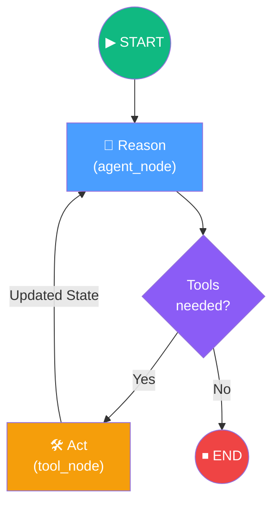

# 10. Introduction to LangGraph

## Overview

Welcome to the **Introduction to LangGraph**. This chapter establishes the foundational paradigm shift from linear LLM pipelines to **stateful, cyclic, graph-orchestrated agents**. It starts by defining why graphs and state machines are essential for building reliable conversational agents, breaking down the core concepts of Nodes, Edges, and State. 

By the end of this module, you will have built a complete **ReAct** (Reason + Act) agent from scratch, wired it together into a LangGraph `StateGraph`, bound custom external tools to an LLM via native function calling, and watched it recover from errors autonomously to deliver final answers.

## Architecture at a Glance

## Lesson Map

| # | Lesson | Focus |
|---|---|---|
| 1 | [What is LangGraph?](01-what-is-langgraph.md) | Introduction to the framework, DAGs vs. Cyclic Workflows |
| 2 | [Why LangGraph?](02-why-langgraph.md) | The Autonomy Spectrum: balancing deterministic logic with LLM freedom |
| 3 | [What are Graphs?](03-what-are-graphs.md) | Fundamentals of computer science graphs and state machines |
| 4 | [LangGraph & Flow Engineering](04-langgraph-and-flow-engineering.md) | From prompt engineering to structured, inspectable workflow design |
| 5 | [LangGraph Core Components](05-langgraph-core-components.md) | Nodes, Edges, Conditional Edges, and State (MessageState) |
| 6 | [Implementing ReAct AgentExecutor with LangGraph](06-implementing-react-agentexecutor-with-langgraph.md) | Procedural vs Graph-based ReAct loops |
| 7 | [Poetry vs uv](07-poetry-vs-uv.md) | Brief aside on Python dependency and environment management |
| 8 | [Setting Up ReAct Agent Project](08-setting-up-react-agent-project.md) | Project initialization, `.env` hygiene, and directory structure |
| 9 | [Coding the Agent's Brain](09-coding-the-agent-s-brain.md) | Binding tools to the LLM via tool/function calling inside `react.py` |
| 10 | [Defining Agent Nodes in LangGraph](10-defining-agent-nodes-in-langgraph.md) | Creating the `agent_node` and `tool_node` within `nodes.py` |
| 11 | [Connecting Nodes into a Graph](11-connecting-nodes-into-a-graph.md) | The `StateGraph`, the traffic cop logic, and compiling inside `graph.py` |
| 12 | [Running LangGraph ReAct Agent with Function Calling](12-running-langgraph-react-agent-with-function-calling.md) | Executing the graph, reading execution traces in LangSmith |
| 13 | [Building Modern LLM Agents](13-building-modern-llm-agents.md) | The historical evolution from text parsing to state-machine orchestration |

## Key Technologies

| Technology | Role |
|---|---|
| **LangGraph** | The core framework defining Nodes, Edges, and shared State |
| **LangChain (Core/Community)** | Tool definitions and standard message formats |
| **LangChain-OpenAI** | Integration module exposing standard and structured output Chat models |
| **OpenAI GPT-4o** | The intelligence engine orchestrating tools via native function calling |
| **Python Typing (`TypedDict`)** | Enforcing the graph's memory structure (State) |
| **Tavily** | Real-time web search engine optimized for AI data retrieval |
| **LangSmith** | Critical observability dashboard used to trace complex agent loops |
